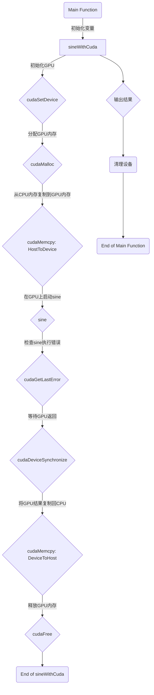
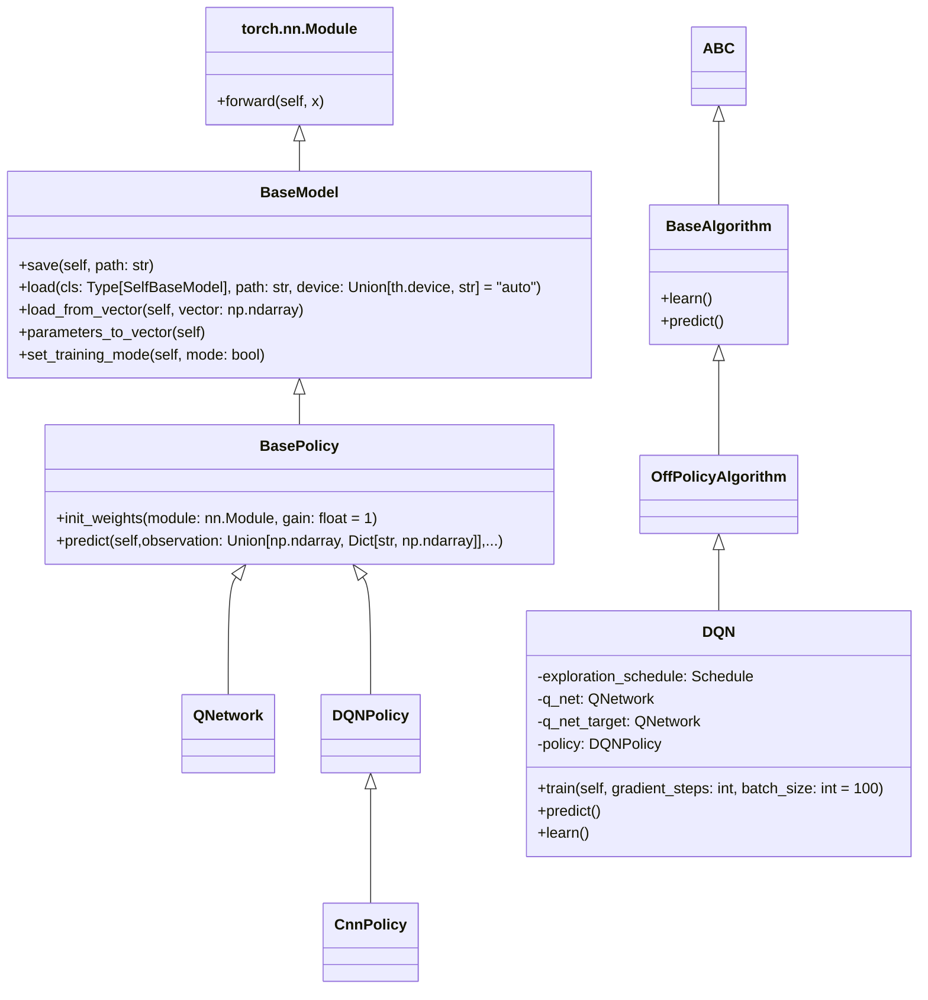
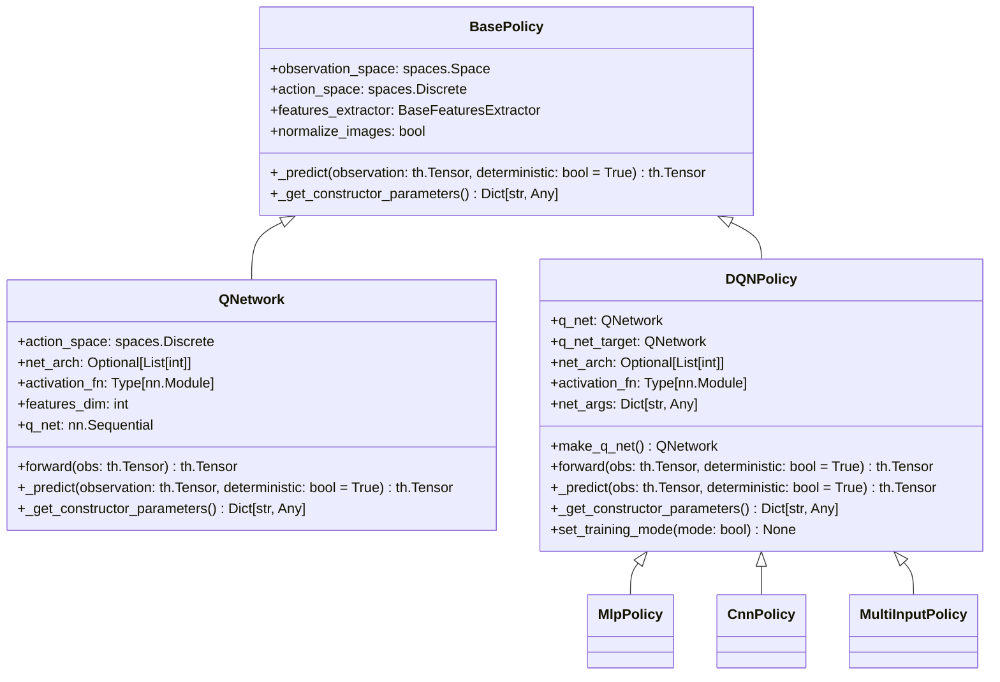
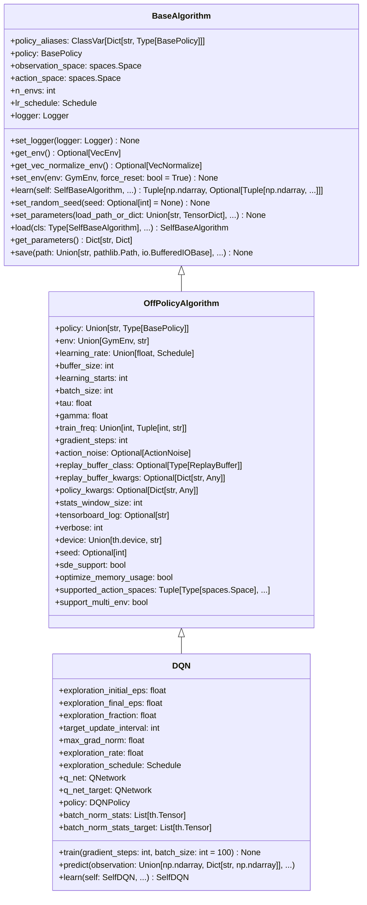
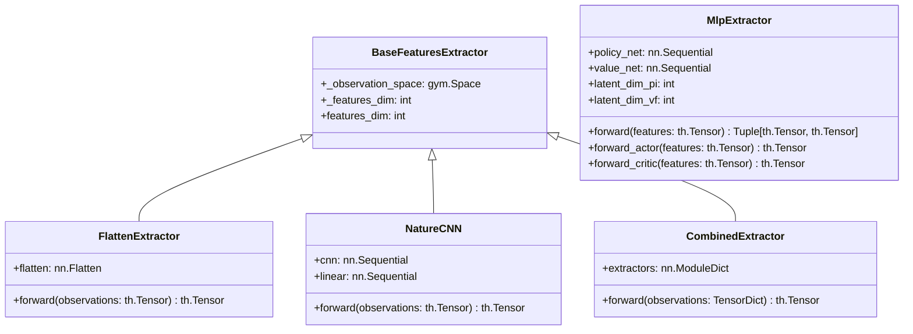

# 人工智能学习手册

## 第一章 机器学习如何快速入门

### 1.1 机器学习书籍的不可能三角

作为书籍作者，开篇想跟读者讲一些心里话。

首先，读者不管以前有没有学过或者看过一些机器学习的书籍，都要有一个心理准备，就是机器学习是不容易学习的。

南京大学周志华教授在《机器学习理论导引》前言中说：“机器学习理论内容学之不易，且不像机器学习技术工具那样可以立即付诸应用，学习过程难免有焦躁感，自学尤易陷入困局，读者务须有充分的心理准备”。

机器学习理论难学的主要原因有三点：
- 广度：机器学习以实用为第一原则，不看出身，管用就行。所以它是各种流派的大杂烩。这些流派的发展水平不一：有的理论体系完善，有的跟炼金术一样原理还不是特别清楚；有的发展很快，有的遇到瓶颈多年没有进展；有的效果很好，有的还不尽如人意。
- 深度：机器学习本质上是应用统计学，需要掌握扎实的数学知识。另外，对于编程能力也有比较高的要求。算法的细节特别多。
- 变异：机器学习发展并不是线性的，而是像病毒一样是演化发展的。知识更新速度非常快，但是新的知识并不能取代旧知识，知识总量不断爆炸式增加。

一般来说，一本好书应该是兼顾全面性、准确性和易读性三者的。但是，这三者是一个不可能三角。既全面又准确，那么肯定就难读；既全面又易读，就不能写得太精确；既准确又易读，那么就要舍弃不重要的内容和细节。
针对纸质书，这个不可能三角还要增加一个难度，就是篇幅，它们一起构成一个不可能四面体。以我的经验，一本书不费力读完，篇幅一般在200页到300页之间。太少的话，内容全面性妥协太多；过多的话，读者多半是放在家里当字典。

以周志华老师的经典教材《机器学习》为例，周老师能将内容压缩到400页左右已经是相当见功力了。周老师的书作为教材，首要顾及全面性。所以，公式的推导部分进行了简化，这就导致了《机器学习公式详解》一书的诞生。《机器学习公式详解》因为是辅助书，不必体系完整，所以专注于公式推导，易用性和准确性都可以做得比较好，篇幅也在200页以内就搞定了。周老师自己不过瘾，又写了一本《机器学习理论导引》来讲解更深的理论部分，因为难度相对较高，所以周老师非常克制将篇幅控制在200页以内。

国内另一本经典机器学习著作，李航老师的《统计学习方法》第一版，篇幅也在200多页，所以果断放弃全面性，非监督学习都不要了。

说了这么多，其实就是想让读者能够理解作者的限制，有些需要读者从书中读出书中没写的东西。

其次，机器学习书还有一个特点，就是要想学会必须要结合编程。可以运行的代码可以大大增加对于算法的可理解性。但是，代码的引入，又引入了一个新的不可能三角。即代码的可运行性、兼容性和易读性。

可运行的代码效果最好，读者可以直接运行，还可以在此基础上进行修改。但是，可运行的代码往往有大量的细节，不易于理解。而且，代码运行环境和框架等经常升级，跟读者练习时的环境很可能不一样。
所以很多算法书都使用了伪代码，这样可以保证逻辑的清晰，但是读者不能直接运行，也不能直接修改。这对于初学者来说，也并不友好。

最后，我想说一下针对上面问题，本书给出的参考答案。

- 第一，先突破重点。机器学习的知识虽然庞杂，但是确实是有快速入门的方法的。当初我也是看了很多书和网上教程不得其门而入，后来谢志辉老师给我讲了四节课，因为工作繁忙还没听全，但是一下子就像打通任督二脉一样开窍了。每个人只要找到自己的突破点，入门并不难。
- 第二，先完成后完善。为了易学性，一开始讲解时对于概念的准确性一定是有所简化的。大家不要过在意某一句话的准确性，不要陷入到抠字眼中影响学习的进度。如果有不理解的可以先跳过。
- 第三，学以致用。在实际工作中创造价值，形成正反馈，这样学习的动力会更大。
- 第四，以修炼的心态学习。既然学习机器学习不像听相声一样简单，不妨借机会沉下心来，不但学习机器学习，还修炼自己的学习方法。


### 1.2 学习机器快速入门的方法

学习是人类生存的重要本能。人类从出生开始就一直不停地学习，学习走路、学习说话、学习写字、学习开车、学习工作、学习生活。学习是人类的天性，也是人类的优势。人类之所以能够在地球上生存了这么久，就是因为人类能够不断地学习，不断地适应环境的变化。
但是有编程经验的人都知道，程序是一旦写好了，功能就确定了，不会再变化。而且程序的功能是由程序员来确定的，而不是由程序自己来学习的。为了解决这个问题，人们就想出了机器学习的方法。机器学习是一种让计算机能够从数据中学习的方法。机器学习的目标是让计算机能够自己从数据中学习，而不是由程序员来确定功能。这样，计算机就可以根据数据的变化来自动调整自己的功能，从而适应环境的变化。

诚实地讲，机器学习并不是一个非常容易学习的学科。它涉及到很多数学知识，比如概率论、统计学、线性代数、微积分等。而且它还涉及到很多编程知识，比如Python语言、NumPy库、Scikit-Learn库等。但是，随着深度学习、大规模预训练模型的出现，机器学习的能力指数级增强，但是学习门槛却大大降低。而且，深度学习并没有给机器学习理论带来太多的变化，体系仍然是原来的体系，学会的知识在未来相当长时间内都可以继续发挥作用。

机器学习因为涉及的知识点多，而且知识点之间的关系复杂，所以学习机器学习最忌一开始就陷入到各种细节中去。
我们应该先找到机器学习理论的主线，然后再去学习细节。

机器学习的主线是什么呢？其实非常简单，机器学习的主线就是三大学习：监督学习、非监督学习、强化学习。
- 监督学习是指我们给机器学习算法提供了带有标签的数据，让算法学习如何预测新的数据。
- 非监督学习是指我们给机器学习算法提供没有标签的数据，让算法自己发现数据之间的模式和关系。
- 强化学习是指我们给机器学习算法提供一个环境，让算法自己去探索环境，从而学会如何做出最优的决策。

上面这个分类，并不是机器学习的全部，但是在初学的时候我们就抓住这个主线。在开始学习的时候，千万不要分散精力，我们先把这三个概念理解。

比如深度学习是监督学习的一种。深度强化学习是深度学习和强化学习的组合。

监督学习类似于有老师指导的学习过程。"老师"提供带有正确答案(标签)的示例数据，学生(模型)通过这些示例来学习正确的决策规则。


监督学习是机器学习中最大的一类，它包括了数值预测和分类预测两大类。数值预测，也称为回归，是指我们要预测一个数值，比如预测股价、预测房价等。分类预测是指我们要预测一个类别，比如预测猫和狗、预测垃圾邮件和正常邮件等。


非监督学习则是在没有老师的情况下，自己来进行分类。比如说我们收了晾干的衣服，根据衣服的不同性质叠放在衣柜里。我们不需要知道每件衣服的种类，只需要知道它们之间的相似性就可以了。


而强化学习的核心是通过反复试错来学习。智能体通过执行行动并观察结果来学习哪些行动会导致更好的结果。

概念清楚了之后，我们举一些例子来巩固下。

机器学习所使用的最主要的库叫做Scikit-Learn。请大家猜想一下，这个库的算法API是如何设计的呢？

没错，它就是按照监督学习、非监督学习两大类来设计的。


可见，半监督学习归属于监督学习。除了受限玻尔兹曼机之外的其它的神经网络模型都是监督学习。集成方法属于监督学习。

### 1.3 如何跟上机器学习的发展

机器学习与其他计算机学科，比如操作系统、数据库等非常不同。从2012年AlexNet开创深度学习时代以来，短短十几年时间就经历了几次技术革命。而对于计算机编程语言来说，几十年都没有什么大的变化。

所以就要求我们学习机器学习时有一种完全不同的思路。

首先，打牢基础知识仍然是根本。通过本书的学习，就可以很容易地学会如何调用库来实现机器学习算法。但是，库和技术的变化都是非常快的，这样的知识会在很短的时间就过时。而机器学习背后的基础知识，却保持了相当的稳定性。所以，学习基础知识，尤其是数学和统计学的知识，是一笔非常划算的投资。

其次，要勤于动手实践。机器学习的实践其实也是并不容易的，涉及到的细节问题非常多。而且，技术不断升级变化带来的挑战也非常大。所以要做好这样的思想准备。即使是大师的经典著作，也只代表了当时的技术发展，所以要随时结合最新的技术，结合书上的原理，在实践中学习。

第三，要多交流多跟老师学习。机器学习的知识就像汪洋大海，我们只能看到一小部分。而老师们则是在这个海洋中航行多年的船长，多拜老师，多跟前辈学习可以少走很多弯路。

第四，要结合自己的工作，勇于创新。机器学习技术的快速变化，既是巨大的挑战，也提供了巨大的潜在机会。将最新的技术吃透，结合自己的工作，创造出更多的价值，形成正反馈，才能让投入在机器学习上投入获得回报和奖励，从而形成良性的循环。

第五，要重视数据的重要性。算法虽然复杂，但是往往学习起来比较成体系。而数据工作琐碎且繁重。但是，数据的质量和数量对于机器学习的效果有着至关重要的作用。所以，要重视数据工作，多花时间在数据上，才能让机器学习的效果更好。


## 第二章 机器学习的一些基本概念

### 2.1 概率与统计基础

很多读者学习机器学习遇到的第一只拦路虎，往往并非机器学习本身，而是概率论和数理统计的知识不扎实。导致在机器学习中一遇到公式就容易害怕。尤其是很多老师的书中对于公式推导经常跳步，使想学习的同学们也望而却步。
不管是完全不管机器学习的公式只学编程实现，还是对于认为读者应该自己去推导公式，对于初学者来说都不是好消息，还不如扎扎实实地对于基础理论花足够的时间去理解。
其实，概率统计的知识点主要是多且庞杂，深度并不太深，也不需要太高的智商和想象力。主要是知识点不系统，容易忘记，不适合突击式的连续性学习，需要复习。

### 2.2 模型评估的基本方法

前面我们介绍了，监督学习分为数值预测和分类预测两大类。针对这两种预测，我们有不同的评估方法。

#### 数值预测的评估方法

数值预测的评估方法主要有均方误差、平均绝对误差、R方等。

均方误差 (Mean Squared Error, MSE)：预测值与实际值之差的平方的平均值，用于衡量预测的准确性。

均方根误差 (Root Mean Squared Error, RMSE)：MSE的平方根，以与原数据相同的单位衡量误差。

平均绝对误差 (Mean Absolute Error, MAE)：预测值与实际值之差的绝对值的平均值，直观地表示了预测的平均误差量。

R方 (R-squared, R2)：用于衡量模型对数据的拟合程度，取值范围为[0,1]，越接近1表示拟合程度越好。

#### 分类预测的评估方法

分类预测的评估方法主要有准确率、精确率、召回率、F1值等。

首先我们讨论一下最简单的情况，二分类问题。在二分类问题中，通常将预测结果分为正例和负例两类。在这种情况下，我们可以定义四种情况：

- 真正例（True Positive, TP）：实际为正例的样本被预测为正例。
- 真负例（True Negative, TN）：实际为负例的样本被预测为负例。
- 假正例（False Positive, FP）：实际为负例的样本被预测为正例。
- 假负例（False Negative, FN）：实际为正例的样本被预测为负例。

假正例也假阳性，占比指标称为误报率（False Positive Rate, FPR），假负例也称为假阴性，占比指标称为漏报率（False Negative Rate, FNR）。

举个例子来说明，假设有一个二分类模型用于预测某种疾病的患病情况，正例表示患病，负例表示健康。在这种情况下：

假阴性：模型将一个实际上患病的人错误地预测为健康，即将病人错判为健康。
假阳性：模型将一个实际上健康的人错误地预测为患病，即将健康人错判为患病。
假阴性和假阳性是模型预测错误的两种情况，它们的出现可能会对模型的性能和可靠性产生影响。在不同的应用场景中，对于假阴性和假阳性的重视程度可能有所不同，需要根据具体情况进行权衡和调整。

下面我们就可以定义三个重要的评估指标：

- 准确率 (Accuracy)：分类正确的样本数占总样本数的比例，用于衡量分类器的整体性能。
- 精确率 (Precision)：精确率是指在所有被模型预测为正例的样本中，实际为正例的比例。它衡量了模型预测为正例的准确性。精确率的计算公式为：精确率 = 真正例数TP / (真正例数TP + 假正例数FP)。想要提升精确率，就要减少误报的数量。
- 召回率 (Recall)：召回率是指在所有实际为正例的样本中，被模型正确预测为正例的比例。它衡量了模型对正例的识别能力。召回率的计算公式为：召回率 = 真正例数 / (真正例数 + 假阴性数)。想要提升召回率，就要减少漏报的数量。

在这里，请大家合上书思考一下，精确率和召回率的关系是什么？

在实际应用中，精确率和召回率往往是相互矛盾的，提高精确率可能会降低召回率，提高召回率可能会降低精确率。也就是说，关注误报就可能会漏报，关注漏报就可能会误报。为了综合考虑精确率和召回率，我们引入了F1值。

- F1值 (F1-score)：它结合了模型的精确率（precision）和召回率（recall）两个指标，以综合评估模型的性能表现。F1值的计算公式为：F1 = 2 * 精确率 * 召回率 / (精确率 + 召回率)。F1值的取值范围为[0,1]，越接近1表示模型的性能越好。

在实际应用中，我们往往会绘制P-R曲线和ROC曲线来综合评估模型的性能。
- P-R曲线 (Precision-Recall curve)：以召回率为横轴，精确率为纵轴绘制的曲线，用于衡量分类器的性能。
- ROC曲线 (Receiver Operating Characteristic curve)：以假正例率为横轴，真正例率为纵轴绘制的曲线，用于衡量分类器的性能。

## 第三章 机器学习编程基础

### 3.1 Python语言编程简介

在机器学习领域，使用最多的是Python语言。
Python语言于1989年由吉多·范罗苏姆（Guido van Rossum）创立，于1991年正式发布。
Python语言的主要特点有：
- 代码表达能力强，简洁、可读性好。比如Python使用缩进来代表代码块，不用像C语言一样使用大括号
- 跨平台：Python对于Windows, MacOS和Linux都有良好的支持。而且针对深度学习还有像Anaconda一样的集成包
- 支持多种编程范式：既可以用面向对象的方法来编写，也可以采用命令式或函数式
- 最完整的人工智能生态：从机器学习、到深度学习、一直到最新的预训练大模型，基本上都是以Python为第一开发语言
- 开源免费：虽然功能非常强大，但是不像Matlab等软件一样需要付费。而且生态软件也一样基本都是开源免费的，使用和扩展都非常方便
- 学术界偏好：学术研究的论文基本都使用Python，使用Python便于复现最新的进展

### 3.2 NumPy科学计算基础

NumPy是Numeric Python的缩写，它是一个开源的Python库，主要用于矩阵上的科学计算。Python本身是一种解释型的语言，不适合于数学计算等对于性能要求比较高的情况，而NumPy就是用C++语言实现的高性能的矩阵计算库的集大成者。NumPy包的核心是多维矩阵的支持。
NumPy不仅本身功能强大，它也是后面要介绍的sklearn等框架的基础，也是TensorFlow, PyTorch和JAX等深度学习框架实现时的标准。像JAX就可以理解成是在GPU加速的NumPy. 

NumPy的核心是多维数据结构ndarray，它是一个N维数组对象，是一个快速而灵活的大数据集容器。

我们可以通过numpy.array()函数来创建一个ndarray对象，这个函数接受一个列表或者元组作为参数，返回一个新的ndarray对象。

例：
```python
a3 = np.array([[1,0],[0,1]])
```
会生成这样一个多维数组对象
```
array([[1, 0],
       [0, 1]])
```
如果直接使用数组麻烦的话，还可以使用一些内置的函数来生成ndarray对象。

可以通过arange函数来生成指定开始值，结束值和步长值的一维数组。请注意，结束值并不包含在序列中，也就是说结束值是开区间。

```python
In [25]: a4 = np.arange(1,10,1)

In [26]: a4
Out[26]: array([1, 2, 3, 4, 5, 6, 7, 8, 9])
```

与arange类似，linspace通过给定初值、终值和元素个数来生成序列。是否包含终值可以通过endpoint属性来设置。

例：
```python
In [37]: a8 = np.linspace(1,10,10,endpoint=True)

In [38]: a8
Out[38]: array([  1.,   2.,   3.,   4.,   5.,   6.,   7.,   8.,   9.,  10.])
```

除了线性的等差数列，我们也可以通过等比数列的方式来生成一维数组。
默认是以10的n次方为参数，比如logspace(0,4,3)的意思是，初值为10的0次方，即1，终值是10的4次方，即100，一共生成3个值。

例，生成[1,100,10000]
```python
In [47]: a9 = np.logspace(0,4,3)

In [48]: a9
Out[48]: array([  1.00000000e+00,   1.00000000e+02,   1.00000000e+04])
```

我们当然也可以修改基数，比如改成3：
```python
In [53]: a10 = np.logspace(1,5,3,base=3)

In [54]: a10
Out[54]: array([   3.,   27.,  243.])
```

#### 多维数组的形状

多维数组中，维度是一个重要的概念。维度是指数组中轴的个数，也就是说，一维数组有一个维度，二维数组有两个维度，三维数组有三个维度，以此类推。一维数组我们通常称为向量，二维数组我们通常称为矩阵，三维以上的数组我们通常称为张量。

NumPy的多维数组的形状是通过shape属性来表示的。shape属性是一个元组，元组的长度表示数组的维度，元组的每个元素表示数组在该维度上的大小。

如果有一个一维数组要转为多维数组，可以通过修改shape属性来实现。

我们可以先将数据存在一维数组中，可以用列表或者元组来生成一维数组，它们是等价的：
例：
```
In [2]: a1 = np.array([1,2,3,4])

In [3]: a1
Out[3]: array([1, 2, 3, 4])

In [4]: a2 = np.array((1,0,0,1))

In [5]: a2
Out[5]: array([1, 0, 0, 1])
```
我们通过shape属性来查看一个数组的形状：
```python
In [14]: a1.shape
Out[14]: (4,)

In [15]: a2.shape
Out[15]: (4,)
```
shape属性是可以直接修改的，比如我们想把上面的a1改成2 x 2的矩阵，就直接改shape值就是了：
```python
In [16]: a1.shape = 2,2

In [17]: a1
Out[17]: 
array([[1, 2],
       [3, 4]])
```
如果能确定一个轴，另一个可以赋-1让系统自己去算。
例：
```python
In [18]: a2.shape= 2,-1

In [19]: a2
Out[19]: 
array([[1, 0],
       [0, 1]])
```

如果想保持这个数组不变，生成一个形状改变的新数组，可以调用reshape方法。
例：我们将一个25个元素的数组生成一个5x5的新数组
```python
In [59]: a11 = np.linspace(1,100,25)

In [60]: a11
Out[60]: 
array([   1.   ,    5.125,    9.25 ,   13.375,   17.5  ,   21.625,
         25.75 ,   29.875,   34.   ,   38.125,   42.25 ,   46.375,
         50.5  ,   54.625,   58.75 ,   62.875,   67.   ,   71.125,
         75.25 ,   79.375,   83.5  ,   87.625,   91.75 ,   95.875,  100.   ])

In [61]: a12 = a11.reshape(5,-1)

In [62]: a12
Out[62]: 
array([[   1.   ,    5.125,    9.25 ,   13.375,   17.5  ],
       [  21.625,   25.75 ,   29.875,   34.   ,   38.125],
       [  42.25 ,   46.375,   50.5  ,   54.625,   58.75 ],
       [  62.875,   67.   ,   71.125,   75.25 ,   79.375],
       [  83.5  ,   87.625,   91.75 ,   95.875,  100.   ]])
```

#### 生成带有数据的多维数组

我们在数据处理中，经常要生成一些特殊的数组，比如全是0的数组，全是1的数组，对角线是1的数组等。NumPy提供了一些函数来生成这些特殊的数组。

zeros函数用于生成全是0的数组，第一个参数是shape：

例：
```python
In [65]: np.zeros((10,10))
Out[65]: 
array([[ 0.,  0.,  0.,  0.,  0.,  0.,  0.,  0.,  0.,  0.],
       [ 0.,  0.,  0.,  0.,  0.,  0.,  0.,  0.,  0.,  0.],
       [ 0.,  0.,  0.,  0.,  0.,  0.,  0.,  0.,  0.,  0.],
       [ 0.,  0.,  0.,  0.,  0.,  0.,  0.,  0.,  0.,  0.],
       [ 0.,  0.,  0.,  0.,  0.,  0.,  0.,  0.,  0.,  0.],
       [ 0.,  0.,  0.,  0.,  0.,  0.,  0.,  0.,  0.,  0.],
       [ 0.,  0.,  0.,  0.,  0.,  0.,  0.,  0.,  0.,  0.],
       [ 0.,  0.,  0.,  0.,  0.,  0.,  0.,  0.,  0.,  0.],
       [ 0.,  0.,  0.,  0.,  0.,  0.,  0.,  0.,  0.,  0.],
       [ 0.,  0.,  0.,  0.,  0.,  0.,  0.,  0.,  0.,  0.]])
```

与zeros类似，ones函数用于生成全是1的数组。

例：
```python
In [66]: np.ones((5,5))
Out[66]: 
array([[ 1.,  1.,  1.,  1.,  1.],
       [ 1.,  1.,  1.,  1.,  1.],
       [ 1.,  1.,  1.,  1.,  1.],
       [ 1.,  1.,  1.,  1.,  1.],
       [ 1.,  1.,  1.,  1.,  1.]])
```

如果要生成对角线矩阵，可以使用eye函数。

例：
```python
a4 = np.eye(10)
print(a4)
```

结果如下：
```
[[1. 0. 0. 0. 0. 0. 0. 0. 0. 0.]
 [0. 1. 0. 0. 0. 0. 0. 0. 0. 0.]
 [0. 0. 1. 0. 0. 0. 0. 0. 0. 0.]
 [0. 0. 0. 1. 0. 0. 0. 0. 0. 0.]
 [0. 0. 0. 0. 1. 0. 0. 0. 0. 0.]
 [0. 0. 0. 0. 0. 1. 0. 0. 0. 0.]
 [0. 0. 0. 0. 0. 0. 1. 0. 0. 0.]
 [0. 0. 0. 0. 0. 0. 0. 1. 0. 0.]
 [0. 0. 0. 0. 0. 0. 0. 0. 1. 0.]
 [0. 0. 0. 0. 0. 0. 0. 0. 0. 1.]]
 ```

如果没有特殊要求，可以使用empty函数来生成一个数组，这个数组的值是随机的。

例：
```python
In [67]: np.empty((3,3))
Out[67]: 
array([[  1.   ,   2.125,   3.25 ],
       [  4.375,   5.5  ,   6.625],
       [  7.75 ,   8.875,  10.   ]])
```

通过fromfunction函数可以通过一个函数来生成想要的数组。

例，生成九九乘法表：
```python
In [125]: def mul2(x,y):
     ...:     return (x+1)*(y+1)
     ...: 

In [126]: np.fromfunction(mul2,(9,9))
Out[126]: 
array([[  1.,   2.,   3.,   4.,   5.,   6.,   7.,   8.,   9.],
       [  2.,   4.,   6.,   8.,  10.,  12.,  14.,  16.,  18.],
       [  3.,   6.,   9.,  12.,  15.,  18.,  21.,  24.,  27.],
       [  4.,   8.,  12.,  16.,  20.,  24.,  28.,  32.,  36.],
       [  5.,  10.,  15.,  20.,  25.,  30.,  35.,  40.,  45.],
       [  6.,  12.,  18.,  24.,  30.,  36.,  42.,  48.,  54.],
       [  7.,  14.,  21.,  28.,  35.,  42.,  49.,  56.,  63.],
       [  8.,  16.,  24.,  32.,  40.,  48.,  56.,  64.,  72.],
       [  9.,  18.,  27.,  36.,  45.,  54.,  63.,  72.,  81.]])
```

#### 访问元素

NumPy中使用[]方括号来访问元素。如果是一维数组，就用下标数字，例如a[1]，如果是多维数组，就在方括号中使用元组tuple，例如a[(2,3,4)]

例：
```python
In [1]: import numpy as np

In [2]: a20 = np.linspace(1,100,27)

In [3]: a20
Out[3]: 
array([   1.        ,    4.80769231,    8.61538462,   12.42307692,
         16.23076923,   20.03846154,   23.84615385,   27.65384615,
         31.46153846,   35.26923077,   39.07692308,   42.88461538,
         46.69230769,   50.5       ,   54.30769231,   58.11538462,
         61.92307692,   65.73076923,   69.53846154,   73.34615385,
         77.15384615,   80.96153846,   84.76923077,   88.57692308,
         92.38461538,   96.19230769,  100.        ])

In [4]: a21 = a20.reshape(3,3,3)

In [5]: a21
Out[5]: 
array([[[   1.        ,    4.80769231,    8.61538462],
        [  12.42307692,   16.23076923,   20.03846154],
        [  23.84615385,   27.65384615,   31.46153846]],

       [[  35.26923077,   39.07692308,   42.88461538],
        [  46.69230769,   50.5       ,   54.30769231],
        [  58.11538462,   61.92307692,   65.73076923]],

       [[  69.53846154,   73.34615385,   77.15384615],
        [  80.96153846,   84.76923077,   88.57692308],
        [  92.38461538,   96.19230769,  100.        ]]])

In [6]: print(a21[(1,1,1)])
50.5
```

#### 切片

用一个值采用方括号下标方式引用，而如果想要引用多个值的话，可以考虑做一个切片。比如s[1:3]就是由s[1]和s[2]组成的列表。


例：
```python
In [10]: a22 = np.linspace(1,10,5)

In [11]: a22
Out[11]: array([  1.  ,   3.25,   5.5 ,   7.75,  10.  ])

In [12]: print(a22[2:4])
[ 5.5   7.75]
```

多维的切片也是同理，比如我们从一个3x3x3的立方体中切出一个2x2x2的小立方体：
```python
In [5]: a21
Out[5]: 
array([[[   1.        ,    4.80769231,    8.61538462],
        [  12.42307692,   16.23076923,   20.03846154],
        [  23.84615385,   27.65384615,   31.46153846]],

       [[  35.26923077,   39.07692308,   42.88461538],
        [  46.69230769,   50.5       ,   54.30769231],
        [  58.11538462,   61.92307692,   65.73076923]],

       [[  69.53846154,   73.34615385,   77.15384615],
        [  80.96153846,   84.76923077,   88.57692308],
        [  92.38461538,   96.19230769,  100.        ]]])

In [8]: slice1 = a21[1:3,1:3,1:3]

In [9]: slice1
Out[9]: 
array([[[  50.5       ,   54.30769231],
        [  61.92307692,   65.73076923]],

       [[  84.76923077,   88.57692308],
        [  96.19230769,  100.        ]]])
```

请注意，切片的语法不用元组，直接在方括号里切就好了。

另外，切片可以使用负数做下标，-1就是右数第一个元素。最左和最右都可以不写，比如从1到最右，可以写成a[1:]

例：
```python
In [11]: a22
Out[11]: array([  1.  ,   3.25,   5.5 ,   7.75,  10.  ])

In [12]: print(a22[2:4])
[ 5.5   7.75]

In [13]: a22[1:]
Out[13]: array([  3.25,   5.5 ,   7.75,  10.  ])

In [14]: a22[1:-1]
Out[14]: array([ 3.25,  5.5 ,  7.75])
```

#### 多维数组的数据类型

在前面的学习中，我们并不在意数据类型，一样也可以使用多维数组。但是，有了类型之后，数组可以更方便和更快速的操作。
我们前面所学习的生成数组的方法，其实都可以默认带一个dtype参数。
类型值常用的有int32, int64, uint32, uint64, float32, float64, complex64, complex128等。因为NumPy是个数学库，精确的类型对于提高计算速度是很有益的。

例：
```python
In [18]: a23 = np.logspace(1,10,5,base=2,dtype=np.float64)

In [19]: a23
Out[19]: 
array([    2.        ,     9.51365692,    45.254834  ,   215.2694823 ,
        1024.        ])
```

#### 对数组的每个元素都进行计算

数据只有可以计算才有价值。我们学会了生成数组，访问数组，下一步就是如何对数组进行计算。
NumPy提供了大量的针对数组进行运算的函数，比如X是一个数组，np.sin(X)可以对数组中每一个元素都进行sin运算。
例：
```python
In [20]: a24 = np.linspace(0, np.pi/2, 10, dtype=np.float64)

In [21]: a24
Out[21]: 
array([ 0.        ,  0.17453293,  0.34906585,  0.52359878,  0.6981317 ,
        0.87266463,  1.04719755,  1.22173048,  1.3962634 ,  1.57079633])

In [22]: a25 = np.sin(a24)

In [23]: a25
Out[23]: 
array([ 0.        ,  0.17364818,  0.34202014,  0.5       ,  0.64278761,
        0.76604444,  0.8660254 ,  0.93969262,  0.98480775,  1.        ])
```

这是一行的，多行的也照样管用，我们看个例子：
```python
In [24]: a26 = np.linspace(0, np.pi*2, 16, dtype=np.float32)

In [25]: a26
Out[25]: 
array([ 0.        ,  0.41887903,  0.83775806,  1.2566371 ,  1.67551613,
        2.09439516,  2.51327419,  2.93215322,  3.35103226,  3.76991129,
        4.18879032,  4.60766935,  5.02654839,  5.44542742,  5.86430645,
        6.28318548], dtype=float32)

In [27]: a27 = np.sin(a26.reshape(4,4))

In [28]: a27
Out[28]: 
array([[  0.00000000e+00,   4.06736642e-01,   7.43144870e-01,
          9.51056540e-01],
       [  9.94521916e-01,   8.66025388e-01,   5.87785184e-01,
          2.07911611e-01],
       [ -2.07911789e-01,  -5.87785363e-01,  -8.66025448e-01,
         -9.94521916e-01],
       [ -9.51056480e-01,  -7.43144751e-01,  -4.06736493e-01,
          1.74845553e-07]], dtype=float32)
```

数组之间支持加减乘除，乘方，取余。

例：给一个数组的每个元素都乘以2
```python
In [31]: a28 = np.array([1,2,3,4]).reshape(2,-1)

In [32]: a28
Out[32]: 
array([[1, 2],
       [3, 4]])

In [33]: a28*2
Out[33]: 
array([[2, 4],
       [6, 8]])
```

两个数组之间做加法：
```python
In [35]: a29 = np.ones((2,2))

In [36]: a29
Out[36]: 
array([[ 1.,  1.],
       [ 1.,  1.]])

In [37]: a28+a29
Out[37]: 
array([[ 2.,  3.],
       [ 4.,  5.]])
```

不但算术运算可以做，也可以针对整个数组做比较大小运算。

例：
```python
In [38]: a29>a28
Out[38]: 
array([[False, False],
       [False, False]], dtype=bool)
```

#### 汇总类的运算

除了对每个元素进行计算，我们还可以对这些元素进行汇总，比如求和sum，求平均值mean等。

例：
```python
In [40]: np.sum(a28)
Out[40]: 10

In [41]: np.mean(a28)
Out[41]: 2.5
```

#### 矩阵matrix

除了前面所讲的多维数组，NumPy还提供了矩阵类matrix. matrix的默认运算都是矩阵运算。
例:
```python
In [45]: a30 = np.matrix(np.linspace(1,10,9,dtype=np.float64).reshape(3,-1))

In [46]: a30
Out[46]: 
matrix([[  1.   ,   2.125,   3.25 ],
        [  4.375,   5.5  ,   6.625],
        [  7.75 ,   8.875,  10.   ]])
In [48]: a31 = np.matrix(np.ones((3,3)))

In [49]: a31
Out[49]: 
matrix([[ 1.,  1.,  1.],
        [ 1.,  1.,  1.],
        [ 1.,  1.,  1.]])

In [50]: np.dot(a30,a31)
Out[50]: 
matrix([[  6.375,   6.375,   6.375],
        [ 16.5  ,  16.5  ,  16.5  ],
        [ 26.625,  26.625,  26.625]])
```

矩阵的逆阵，就可以直接用X**-1来表示。

例：
```python
In [52]: a30 ** -1
Out[52]: 
matrix([[  9.38565300e+14,  -1.87713060e+15,   9.38565300e+14],
        [ -1.87713060e+15,   3.75426120e+15,  -1.87713060e+15],
        [  9.38565300e+14,  -1.87713060e+15,   9.38565300e+14]])

In [53]: a30
Out[53]: 
matrix([[  1.   ,   2.125,   3.25 ],
        [  4.375,   5.5  ,   6.625],
        [  7.75 ,   8.875,  10.   ]])

In [54]: a30 * (a30 ** -1)
Out[54]: 
matrix([[ 0.8125 , -0.125  ,  0.     ],
        [ 0.15625, -1.0625 ,  1.     ],
        [ 0.     ,  0.     ,  2.     ]])
```

### 3.3 NumPy的GPU和TPU加速

#### 矩阵

NumPy最为核心的功能就是多维矩阵的支持。

我们可以通过`pip install numpy`的方式来安装NumPy，然后在Python中通过`import numpy as np`的方式来引入NumPy库。
但是，NumPy不能支持GPU和TPU加速，对于我们将来要处理的计算来说不太实用，所以我们这里引入JAX库。


JAX的安装文档请见[JAX官方文档](https://github.com/google/jax#installation)

之前我们多次使用CUDA来进行GPU加速了，这里我们不妨来看看TPU的加速效果。
TPU只有Google一家有，我们只能买到TPU的云服务，不过，我们可以使用Google Colab来使用TPU。

在Colab上，已经安装好了JAX和TPU的运行时。我们运行下面的代码即可激活TPU:

```python
import jax.tools.colab_tpu
jax.tools.colab_tpu.setup_tpu()
```

我们来看看有多少个TPU设备可以使用:

```python
print(jax.device_count())
print(jax.local_device_count())
print(jax.devices())
```

输出结果如下：
```
8
8
[TpuDevice(id=0, process_index=0, coords=(0,0,0), core_on_chip=0), TpuDevice(id=1, process_index=0, coords=(0,0,0), core_on_chip=1), TpuDevice(id=2, process_index=0, coords=(1,0,0), core_on_chip=0), TpuDevice(id=3, process_index=0, coords=(1,0,0), core_on_chip=1), TpuDevice(id=4, process_index=0, coords=(0,1,0), core_on_chip=0), TpuDevice(id=5, process_index=0, coords=(0,1,0), core_on_chip=1), TpuDevice(id=6, process_index=0, coords=(1,1,0), core_on_chip=0), TpuDevice(id=7, process_index=0, coords=(1,1,0), core_on_chip=1)]
```

说明我们有8个TPU设备可以用。


下面我们就用jax.numpy来代替numpy来使用。

NumPy最重要的功能就是多维矩阵的支持。我们可以通过`np.array`来创建一个多维矩阵。

我们先从一维的向量开始：

```python
import jax.numpy as jnp
a1 = jnp.array([1,2,3])
print(a1)
```

然后我们可以使用二维数组来创建一个矩阵：

```python
a2 = jnp.array([[1,2],[0,4]])
print(a2)
```

矩阵可以统一赋初值。zeros函数可以创建一个全0的矩阵，ones函数可以创建一个全1的矩阵，full函数可以创建一个全是某个值的矩阵。

比如给10行10列的矩阵全赋0值，我们可以这样写：
```python
a3 = jnp.zeros((10,10))
print(a3)
```

全1的矩阵：
```python
a4 = jnp.ones((10,10))
```

全赋100的：
```python
a5 = jnp.full((10,10),100)
```

另外，我们还可以通过linspace函数生成一个序列。linpsace函数的第一个参数是序列的起始值，第二个参数是序列的结束值，第三个参数是序列的长度。比如我们可以生成一个从1到100的序列，长度为100：

```python
a7 = jnp.linspace(1,100,100) # 从1到100，生成100个数
a7.reshape(10,10)
print(a7)
```

最后，JAX给矩阵生成随机值的方式跟NumPy并不一样，并没有jnp.random这样的包。我们可以使用jax.random来生成随机值。JAX的随机数生成函数都需要一个显式的随机状态作为第一个参数，这个状态由两个无符号32位整数组成，称为一个key。用一个key不会修改它，所以重复使用同一个key会得到相同的结果。如果需要新的随机数，可以使用jax.random.split()来生成新的子key。

```python
from jax import random
key = random.PRNGKey(0) # a random key
key, subkey = random.split(key) # split a key into two subkeys
a8 = random.uniform(subkey,shape=(10,10)) # a random number using subkey
print(a8)
```

#### 范数

范数（Norm）是一个数学概念，用于测量向量空间中向量的“大小”。范数需要满足以下性质：

- 非负性：所有向量的范数都大于或等于零，只有零向量的范数为零。
- 齐次性：对任意实数λ和任意向量v，有||λv|| = |λ| ||v||。
- 三角不等式：对任意向量u和v，有||u + v|| ≤ ||u|| + ||v||。
在实际应用中，范数通常用于衡量向量或矩阵的大小，比如在机器学习中，范数常用于正则化项的计算。

常见的范数有：

- L0范数：向量中非零元素的个数。
- L1范数：向量中各个元素绝对值之和，也被称为曼哈顿距离。
- L2范数：向量中各个元素的平方和然后开方，也被称为欧几里得距离。
- 无穷范数：向量中各个元素绝对值的最大值。
需要注意的是，L0范数并不是严格意义上的范数，因为它违反了齐次性。但是在机器学习中，L0范数常用于衡量向量中非零元素的个数，因此也被称为“伪范数”。

我们先从计算一个一维向量的L1范数开始，不要L1范数这个名字给吓到，其实就是绝对值之和：
```python
norm10_1 = jnp.linalg.norm(a10,ord=1)
print(norm10_1)
```

结果不出所料就是6.

下面我们再看L2范数，也就是欧几里得距离，也就是平方和开方：

```python
a10 = jnp.array([1, 2, 3])
norm10 = jnp.linalg.norm(a10)
print(norm10)
```

根据L2范数的定义，我们可以手动计算一下：norm10 = jnp.sort(1 + 2*2 + 3*3) = 3.7416573.

我们可以看到，上面的norm10的值跟我们手动计算的是一样的。

下面我们来计算无穷范数，其实就是最大值：
```python
norm10_inf = jnp.linalg.norm(a10, ord = jnp.inf)
print(norm10_inf)
```

结果为3.

我们来算一个大点的巩固一下：

```python
a10 = jnp.linspace(1,100,100) # 从1到100，生成100个数
n10 = jnp.linalg.norm(a10,ord=2)
print(n10)
```

这个结果为581.67865.

#### 逆矩阵

对角线是1，其它全是0的方阵，我们称为单位矩阵。在NumPy和JAX中，我们用eye函数来生成单位矩阵。

既然是方阵，就不用跟行和列两个值了，只需要一个值就可以了，这个值就是矩阵的行数和列数。用这一个值赋给eye函数的第一个参数，就可以生成一个单位矩阵。

下面我们来复习一下矩阵乘法是如何计算的。

对于矩阵A的每一行，我们需要与矩阵B的每一列相乘。这里的“相乘”意味着取A的一行和B的一列，然后将它们的对应元素相乘，然后将这些乘积相加。这个和就是结果矩阵中相应位置的元素。

举个例子，假设我们有两个2x2的矩阵A和B：

```
A = 1 2     B = 4 5
    3 4         6 7
```

我们可以这样计算矩阵A和矩阵B的乘积：

```
(1*4 + 2*6) (1*5 + 2*7)     16 19
(3*4 + 4*6) (3*5 + 4*7) =  34 43
```

我们用JAX来计算一下：
```python
ma1 = jnp.array([[1,2],[3,4]])
ma2 = jnp.array([[4,5],[6,7]])
ma3 = jnp.dot(ma1,ma2)
print(ma1)
print(ma2)
print(ma3)
```

输出为：
```
[[1 2]
 [3 4]]
[[4 5]
 [6 7]]
[[16 19]
 [36 43]]
```

如果A*B=I，I为单位矩阵，那么我们称B是A的逆矩阵。

我们可以用inv函数来计算矩阵的逆矩阵。

```python
ma1 = jnp.array([[1,2],[3,4]])
inv1 = jnp.linalg.inv(ma1)
print(inv1)
```

输出的结果为：
```
[[-2.0000002   1.0000001 ]
 [ 1.5000001  -0.50000006]]
 ```

#### 导数与梯度

导数是一个函数在某点处的变化率，用于描述函数在该点处的变化率。导数可以表示函数在该点处的斜率，即函数在该点处的陡峭程度。

梯度(gradient)是一个向量，表示函数在该点处的方向导数沿着该方向取得最大值。梯度可以表示函数在该点处的变化最快和变化率最大的方向。在单变量的实值函数中，梯度可以简单理解为导数。

JAX作为支持深度学习的框架，对于梯度的支持是被优先考虑的。我们可以使用jax.grad函数来计算梯度。针对一个一元函数，梯度就是导数。我们可以用下面的代码来计算sin函数在x=1.0处的梯度：

```python
import jax
import jax.numpy as jnp

def f(x):
    return jnp.sin(x)

# 计算 f 在 x=1.0 处的梯度
grad_f = jax.grad(f)
print(grad_f(1.0))
```

我们如果每次都沿着梯度方向前进，那么我们就可以找到函数的极值。这种采用梯度方向前进的方法，就是梯度下降法。梯度下降法是一种常用的优化算法，它的核心思想是：如果一个函数在某点的梯度值为正，那么函数在该点沿着梯度方向下降的速度最快；如果一个函数在某点的梯度值为负，那么函数在该点沿着梯度方向上升的速度最快。因此，我们可以通过不断地沿着梯度方向前进，来找到函数的极值。

那么，梯度下降法有什么作用呢？我们可以用梯度下降法来求解函数的最小值。我们可以用下面的代码来求解函数$f(x)=x^2$的最小值：

```python
import jax
import jax.numpy as jnp

def f(x):
    return x ** 2

grad_f = jax.grad(f)

x = 2.0  # 初始点
learning_rate = 0.1  # 学习率
num_steps = 100  # 迭代步数

for i in range(num_steps):
    grad = grad_f(x)  # 计算梯度
    x = x - learning_rate * grad  # 按负梯度方向更新 x

print(x)  # 打印最终的 x 值，应接近 0（函数的最小值）
```

我这一次运行的结果是4.0740736e-10. 也就是说，我们用梯度下降法求解函数$f(x)=x^2$的最小值，最终得到的x值接近于0，也就是函数的最小值。

其中，学习率（或称为步长）是一个正数，用于控制每一步更新的幅度。学习率需要仔细选择，过大可能导致算法不收敛，过小可能导致收敛速度过慢。

#### 概率

唤醒完线性代数和高等数学的一些记忆之后，最后我们来回顾一下概率论。

我们还是从扔硬币说起。我们知道，假设一枚硬币是均匀的，那么只要扔的次数足够多，正面朝上的次数就会接近于总次数的一半。

这种只有两种可能结果的随机试验，我们给它起个高大上的名字叫做伯努利试验(Bernoulli trial)。

下面我们就用JAX的伯努利分布来模拟一下扔硬币的过程。

```python
import jax
import time
from jax import random

# 生成一个形状为 (10, ) 的随机矩阵，元素取值为 0 或 1，概率为 0.5
key = random.PRNGKey(int(time.time()))
rand_matrix = random.bernoulli(key, p=0.5, shape=(10, ))
print(rand_matrix)
mean_x = jnp.mean(rand_matrix)
print(mean_x)
```

mean函数用来求平均值，也叫做数学期望。

打印的结果可能是0.5，也可能是0.3，0.8等等。这是因为我们只扔了10次硬币，扔的次数太少了，所以正面朝上的次数不一定接近于总次数的一半。

这是其中一次0.6的结果：
```
[ True  True  True  True False False  True False False  True]
0.6
```

多跑几次，出现0.1，0.9都不稀奇：
```
[False False False False False False False False False  True]
0.1
```

当我们把shape改成100，1000，10000等更大的数之后，这个结果就离0.5越来越近了。

下面再复习下表示偏差的两个值：
- 方差（Variance）：方差是度量数据点偏离平均值的程度的一种方式。换句话说，它描述了数据点与平均值之间的平均距离的平方。
- 标准差（Standard Deviation）：标准差是方差的平方根。因为方差是在平均偏差的基础上平方得到的，所以它的量纲（单位）与原数据不同。为了解决这个问题，我们引入了标准差的概念。标准差与原数据有相同的量纲，更便于解释。

这两个统计量都反映了数据分布的离散程度。方差和标准差越大，数据点就越分散；反之，方差和标准差越小，数据点就越集中。

我们可以用JAX的var函数来计算方差，用std函数来计算标准差。

```python
import jax
import time
from jax import random

# 生成一个形状为 (1000, ) 的随机矩阵，元素取值为 0 或 1，概率为 0.5
key = random.PRNGKey(int(time.time()))
rand_matrix = random.bernoulli(key, p=0.5, shape=(1000, ))
#print(rand_matrix)
mean_x = jnp.mean(rand_matrix)
print(mean_x)
var_x = jnp.var(rand_matrix)
print(var_x)
std_x = jnp.std(rand_matrix)
print(std_x)
```

最后我们来复习一下之前讲到的信息量。我们来思考一个问题，如何能让伯努利分布的平均信息量最大？

我们先构造两个特殊情况，比如如果p=0，那么我们就永远不会得到正面朝上的结果，这个时候我们就知道了结果，信息量为0。如果p=1，那么我们就永远不会得到反面朝上的结果，这个时候我们也知道了结果，信息量也为0。

如果p=0.01，能给我们带来的平均信息量仍然不大，因为基本上我们可以盲猜结果是背面朝上的，偶然出现的正面朝上的结果，虽然带来了较大的单次信息量，但是出现的概率太低了，所以平均信息量仍然不大。

而如果p=0.5，我们就完全猜不到结果是正面朝上还是背面朝上，这个时候我们得到的平均信息量最大。

当然，这只是定性的分析，我们还需要给出一个定量的公式：

$$
H(X) = - \sum_{x \in X} p(x) \log_2 p(x)
$$


```python
import jax.numpy as jnp

# 计算离散型随机变量 X 的平均信息量
def avg_information(p):
    p = jnp.maximum(p, 1e-10)
    return jnp.negative(jnp.sum(jnp.multiply(p, jnp.log2(p))))

# 计算随机变量 X 取值为 0 和 1 的概率分别为 0.3 和 0.7 时的平均信息量
p = jnp.array([0.3, 0.7])
avg_info = avg_information(p)
print(avg_info)
```

我们试几次计算可以得到，当p为0.3时，平均信息量是0.8812325;当p为0.01时，平均信息量为0.08079329；当p为0.5时，平均信息量为1.0，达到最大。

如果嫌使用Python函数的计算慢，我们可以调用JAX的jit函数来加速。我们只需要在函数定义的前面加上@jit即可。

```python
import jax.numpy as jnp
from jax import jit

# 计算离散型随机变量 X 的平均信息量
@jit
def avg_information(p):
    p = jnp.maximum(p, 1e-10)
    return jnp.negative(jnp.sum(jnp.multiply(p, jnp.log2(p))))

# 计算随机变量 X 取值为 0 和 1 的概率分别为 0.3 和 0.7 时的平均信息量
p = jnp.array([0.01, 0.99])
avg_info = avg_information(p)
print(avg_info)
```

### 3.4 Scikit-Learn框架基础

Scikit-Learn，简称sklearn，是在NumPy基础上发展起来的机器学习框架，实现了主要的机器学习的算法。

### 3.5 PyTorch框架基础

### 3.6 在网页里运行机器学习的框架 - TensorFlow.js

Python确实在机器学习和深度学习领域有着不可替代的生态优势，不过，放到浏览器端和手机端，Python的生态优势好像就发挥不出来了。不管是Android手机还是iOS手机，默认都没有Python运行环境，也写不了Python应用。浏览器里和小程序里，就更没Python什么事儿了。

在浏览器里，可以直接使用TensorFlow.js库，尽管可能会有性能的问题，但是至少是从0到1的突破。


我们看个例子：
```html
<!DOCTYPE html>
<html>
    <head>
        <meta encoding="UTF-8"/>
        <script src="https://cdn.jsdelivr.net/npm/@tensorflow/tfjs@3.6.0/dist/tf.min.js"></script>
    </head>
    <body>
        <div id="tf-display"></div>
        <script>
            let a = tf.tensor1d([1.0]);
            let d1 = document.getElementById("tf-display");
            d1.innerText = a;
        </script>
    </body>
</html>
```

可以看到，在浏览器里显示了一个值为1.0的张量的值。我们的第一个TensorFlow.js(以下简称tf.js)应用就算是跑通了。通过引用tf.js的库，我们就可以调用tf下面的函数。

下面我们修改一下，看看tf.js是靠什么技术在运行的。我们通过tf.getBackend()函数来查看支持tf.js

```html
<!DOCTYPE html>
<html>
    <head>
        <meta encoding="UTF-8"/>
        <script src="https://cdn.jsdelivr.net/npm/@tensorflow/tfjs@3.6.0/dist/tf.min.js"></script>
    </head>
    <body>
        <div id="tf-display"></div>
        <div id="tf-backend"></div>
        <script>
            let a = tf.tensor1d([1.0,2.0,3.0]);
            let d1 = document.getElementById("tf-display");
            d1.innerText = a;

            let backend = tf.getBackend();
            let div_backend = document.getElementById("tf-backend");
            div_backend.innerText = backend;
        </script>
    </body>
</html>
```

在我的浏览器里，tf.js是使用webgl来进行计算的。

#### 运行在node里的tfjs

作为一个js库，tf.js当然也可以运行在node环境里。我们可以通过
```
npm install @tensorflow/tfjs
```
来安装tf.js库。

然后把上面网页里面的代码移值过来：
```js
const tf = require('@tensorflow/tfjs');

let a = tf.tensor1d([1.0,2.0,3.0]);
console.log(a);

console.log(tf.getBackend());
```

在我的电脑里执行，这个getBackend()返回的是'cpu'. 
tf.js还会给tfjs-node做个广告：
```
============================
Hi there 👋. Looks like you are running TensorFlow.js in Node.js. To speed things up dramatically, install our node backend, which binds to TensorFlow C++, by running npm i @tensorflow/tfjs-node, or npm i @tensorflow/tfjs-node-gpu if you have CUDA. Then call require('@tensorflow/tfjs-node'); (-gpu suffix for CUDA) at the start of your program. Visit https://github.com/tensorflow/tfjs-node for more details.
============================
```

听人劝吃饱饭，那我们就换成tfjs-node吧：

```js
const tf = require('@tensorflow/tfjs-node');

let a = tf.tensor1d([1.0,2.0,3.0]);
console.log(a);

console.log(tf.getBackend());
```

记得要
```
npm install @tensorflow/tfjs-node
```

现在，后端从cpu换成了tensorflow。

还有更凶残的，我们还可以换成tfjs-node-gpu来使用GPU：
```js
const tf = require('@tensorflow/tfjs-node-gpu');

let a = tf.tensor1d([1.0,2.0,3.0]);
console.log(a);

console.log(tf.getBackend());
```
在没有GPU的机器上，会使用CPU版的tensorflow作为后端，不会报错。

#### JavaScript的数组操作

js是一门动态语言，js的数组是动态数组，没有定长数组越界这一说法的。

比如说我们要给一个空数组的第2个元素赋值，这是没有任何问题的：
```javascript
let a1 = [];
a1[2] = 3;
console.log(a1);
```
输出结果为：
```
[ <2 empty items>, 3 ]
```

我们可以毫无压力地用这样的数组去生成张量：
```js
let a1_t = tf.tensor1d(a1);
a1_t.print();
```

tf.js会给我们甩出两个NaN出来：
```
Tensor
    [NaN, NaN, 3]
```

不但是空数组随便添加元素，我们用new Array生成一个长度的数组后，仍然可以说话不算话，随意给赋值。比如我们new 5个元素的Array，给第9个赋值：
```js
let a2 = new Array(5);
a2[9] = 10;
console.log(a2);


let a2_t = tf.tensor1d(a2);
a2_t.print();
```

tf.js照例给我们补9个NaN出来：
```
[ <9 empty items>, 10 ]
Tensor
    [NaN, NaN, NaN, NaN, NaN, NaN, NaN, NaN, NaN, 10]
```

如果懒得数一共多少个元素，就想在数组的末尾添加新元素，可以使用push方法，参数个数不限，push几个元素都可以：
```js
let a3 = new Array();
a3.push(1,2,3);
a3.push(4,5);

let a3_t = tf.tensor1d(a3);
a3_t.print();
```

输出为：
```
Tensor
    [1, 2, 3, 4, 5]
```

如果想从头添加新元素，可以使用unshift方法：
```js
let a3 = new Array();
a3.push(1,2,3);
a3.push(4,5);
a3.unshift(6);

let a3_t = tf.tensor1d(a3);
a3_t.print();
```

输出为：
```
Tensor
    [6, 1, 2, 3, 4, 5]
```

同时我们复习一下，与push相对的，删除最后一个元素的是pop方法；而与unshift相对的是shift方法。

比如我们对上面的a3进行pop：
```javascript
let a4 = a3;
let a00 = a3.pop();
console.log(a00);
console.log(a4);
```

所得结果为：
```
5
[ 6, 1, 2, 3, 4 ]
```

最后，我们还有强大的splice方法，可以在任意位置添加与删除。

splice方法的第一个参数是起始位置，第二个参数是要删除的个数。
我们来看个例子，我们先生成10个元素的数组，然后把前5个空元素都删掉：

```js
let a5 = []
a5.length = 10;
a5[5] = 100;
console.log(a5);
a5.splice(0,5);
console.log(a5);
```

输出结果为：
```
[ <5 empty items>, 100, <4 empty items> ]
[ 100, <4 empty items> ]
```

如果不删除，想要添加元素的话，我们可以给第二个参数置0，然后后面是要添加的元素。比如我们给上面的a5在100后面增加三个新元素1.5, 2.5, 3.5：

```js
a5.splice(1,0,1.5,2.5,3.5);
console.log(a5);
```

输出如下：

```
[ 100, 1.5, 2.5, 3.5, <4 empty items> ]
```

记住是要给元素值，而不是给个数组啊，否则的话就变成二维数组了：

```js
a5.splice(1,0,[1.5,2.5,3.5]);
console.log(a5);
```

结果为：
```
[ 100, [ 1.5, 2.5, 3.5 ], 1.5, 2.5, 3.5, <4 empty items> ]
```

好，复习至此，我们来看tf.js中的张量

#### tf.js中的张量


##### 一维张量

tfjs支持从1d到6d一共6维张量构造函数，当然7维以上没有专用函数了还是可以reshape出来。

最简单的张量是一维的，我们可以用tf.tensor1d：
```js
let t1d = tf.tensor1d([1, 2, 3]);
t1d.print();
```

输出为：
```
Tensor
    [1, 2, 3]
```

当然，还可以指定数据类型：
```js
const t1d_f = tf.tensor1d([1.0,2.0,3.0],'float32')
t1d_f.print();
```

输出结果为：
```
Tensor
    [1, 2, 3]
```

数据类型可用值为：
- 'float32'
- 'int32'
- 'bool'
- 'complex64'
- 'string'

可以通过linspace函数来生成一维序列，其原型为：
```js
tf.linspace (start, stop, num)
```
其中
- start为起始值
- end为结束值
- num为生成的序列的元素个数

例： 
```js
tf.linspace(1, 10, 10).print();
```

输出结果为：
```
Tensor
    [1, 2, 3, 4, 5, 6, 7, 8, 9, 10]
```

如果想用指定步长的方式来生成，可以使用range函数：
```
tf.range(start, stop, step?, dtype?)
```

我们来看个例子：
```js
tf.range(0, 9, 2).print();
```

输出结果为：
```
Tensor
    [0, 2, 4, 6, 8]
```

##### 二维张量


二维张量可以用二维数组来定义：
```js
let t2d = tf.tensor2d([[0,0],[0,1]]);
t2d.print();
```

不过tf.js的二维张量必须是矩阵，而js的二维数组是可以不等长的，这点尤其要注意。

因为二维张量主要用于存放矩阵，有生成矩阵的方法可供调用。

比如我们可以使用tf.eye来生成单位矩阵：
```js
const t_eye = tf.eye(4);
t_eye.print();
```
 
输出结果为：
```
Tensor
    [[1, 0, 0, 0],
     [0, 1, 0, 0],
     [0, 0, 1, 0],
     [0, 0, 0, 1]]
```

我们也可以将一维向量转化为以其为对角向量的二维向量：
```js
const x1 = tf.tensor1d([1, 2, 3, 4, 5, 6, 7, 8]);
tf.diag(x1).print();
```

输出结果为：
```
Tensor
    [[1, 0, 0, 0, 0, 0, 0, 0],
     [0, 2, 0, 0, 0, 0, 0, 0],
     [0, 0, 3, 0, 0, 0, 0, 0],
     [0, 0, 0, 4, 0, 0, 0, 0],
     [0, 0, 0, 0, 5, 0, 0, 0],
     [0, 0, 0, 0, 0, 6, 0, 0],
     [0, 0, 0, 0, 0, 0, 7, 0],
     [0, 0, 0, 0, 0, 0, 0, 8]]
```

从二维张量开始，我们可以指定张量的形状了。

比如我们用一维数组给定值，然后指定[2,2]的形状：
```js
let t2d2 = tf.tensor2d([1,2,3,4],[2,2],'float32');
t2d2.print();
```

输出结果如下：
```
Tensor
    [[1, 2],
     [3, 4]]
```

##### 高维向量


从三维开始，用高维数组来表示张量值的可读性就越来越差了。比如：
```js
tf.tensor3d([[[1], [2]], [[3], [4]]]).print();
```

输出结果为：
```
Tensor
    [[[1],
      [2]],

     [[3],
      [4]]]
```

我们可以还是先指定一维数组，然后再指定形状：
```js
tf.tensor3d([1,2,3,4,5,6,7,8],[2,2,2],'int32').print();
```

输出如下：
```
Tensor
    [[[1, 2],
      [3, 4]],

     [[5, 6],
      [7, 8]]]
```

我们向4，5，6维挺进：
```js
tf.tensor4d([[[[1], [2]], [[3], [4]]]]).print();
tf.tensor5d([[[[[1],[2]],[[3],[4]]],[[[5],[6]],[[7],[8]]]]]).print();
tf.tensor6d([[[[[[1],[2]],[[3],[4]]],[[[5],[6]],[[7],[8]]]]]]).print();
```

输出如下：
```
Tensor
    [[[[1],
       [2]],

      [[3],
       [4]]]]
Tensor
    [[[[[1],
        [2]],

       [[3],
        [4]]],


      [[[5],
        [6]],

       [[7],
        [8]]]]]
Tensor
    [[[[[[1],
         [2]],

        [[3],
         [4]]],


       [[[5],
         [6]],

        [[7],
         [8]]]]]]
```

此时，指定形状的优势就更加明显了。

我们可以用tf.zeros函数生成全是0的任意维的张量：
```js
tf.zeros([2,2,2,2,2,2]).print();
```

也可以通过tf.ones将所有值置为1:
```js
tf.ones([3,3,3]).print();
```

还可以通过tf.fill函数生成为指定值的张量：
```js
tf.fill([4,4,4],255).print();
```

比起序列值和固定值，生成符合正态分布的随机值可能是更常用的场景。其原型为：
```js
tf.truncatedNormal(shape, mean?, stdDev?, dtype?, seed?)
```
其中：
- shape是张量形状
- mean是平均值
- stdDev是标准差
- dtype是数据类型，整形和浮点形在此差别可能很大
- seed是随机数种子

我们看个例子：
```js
tf.truncatedNormal([3,3,3],1,1,"float32",123).print();
tf.truncatedNormal([2,2,2],1,1,"int32",99).print();
```

输出如下：
```
Tensor
    [[[0.9669023 , 0.2715541 , 0.6810297 ],
      [-0.8329115, -0.7022814, 1.4331075 ],
      [1.8136243 , 1.8001028 , -0.3285823]],

     [[1.381816  , 1.1050107 , 0.7487067 ],
      [1.9785664 , 0.9248876 , -0.9470147],
      [0.0489896 , 0.3297685 , 0.8626058 ]],

     [[0.3341007 , 1.1067212 , 0.4879217 ],
      [2.1620302 , 1.3034405 , 0.2832415 ],
      [1.3012471 , 1.0853187 , 1.9235317 ]]]
Tensor
    [[[0, 1],
      [1, 0]],

     [[0, 0],
      [1, 2]]]
```

####  将张量转换成js数组


前面我们学习了很多种张量的生成方法。但是，不知道你意识到了没有，很多时候还是转回到js数组更容易进行一些高阶的操作。

将张量转换成为数组有两种方式，一种是按照原形状转换成数组。异步的可以使用Tensor.array()方法，同步的可以使用Tensor.arraySync()方法。

我们来将上节生成的随机数的向量转回成js的数组：
```js
let t7 = tf.truncatedNormal([2,2,2],1,1,"int32",99);
let a7 = t7.arraySync();
console.log(a7);
```

输出结果为：
```
[ [ [ 0, 1 ], [ 1, 0 ] ], [ [ 0, 0 ], [ 1, 2 ] ] ]
```

记得这是一个高维数组啊，每个元素都是数组。
比如：
```js
a7.forEach(
    (x) => { console.log(x);}
);
```

输出将是两个数组元素：
```
[ [ 0, 1 ], [ 1, 0 ] ]
[ [ 0, 0 ], [ 1, 2 ] ]
```

如果不想要形状，可以用data()或者dataSync()方法将张量转换成TypedArray.

```js
let t5 = tf.truncatedNormal([2,2,2],1,1,"int32",99);
let a5 = t5.dataSync();
console.log(a5);
```

输出结果如下：
```
Int32Array(8) [
  0, 1, 1, 0,
  0, 0, 1, 2
]
```

如果对TypedArray进行forEach操作：
```js
a5.forEach(
    (x) => { console.log(x);}
);
```
获取的结果就是线性的了：
```
0
1
1
0
0
0
1
2
```

拍平成一维的之后，我们就可以用every和some等来进行元素的判断了。
比如我们看a5是不是所有元素都是0，是不是有元素为0：
```js
console.log(a5.every((x) => { return(x===0)}));
console.log(a5.some((x) => { return(x===0)}));
```

因为不全为0，所以every的值为假，而some为真。

### 3.7 Hugging Face框架基础

这一节我们来学习下预训练模型的封装库，Hugging Face的Transformers库的使用。Hugging Face的库非常活跃，比如支持LLaDA大规型的类，是在本文开始写作的前一天发布的。
库新到这种程度，而且相应配套的库也在不停修改中，这个时候进入这个领域一定要做好要花时间完善还不成熟的功能，尤其是花较多时间debug问题的思想准备。

另外，还是再提醒大家，大模型算法不是普通编程。模型规模和思维链仍然非常重要。


#### Pipeline编程

Pipeline是transformers库中面向任务的编程方式。比如我们最常用的任务就是文本生成。

我们只需要指定"text-generation"任务，再选择一种模型，就可以了。比如下面这样，我们选择使用gpt2来进行文本生成：

```python
text_generator = pipeline("text-generation", model="gpt2")
```

我们来个完整版，除去引用包和设置一个结束符，基本上就是两句话，一句生成pipeline，一句打印结果。

```python
from transformers import pipeline

text_generator = pipeline("text-generation", model="gpt2", max_new_tokens=250)

text_generator.model.config.pad_token_id = text_generator.model.config.eos_token_id

text = text_generator("I have a dream ")[0]["generated_text"]

print(text)
```

这是其中一次我运行的结果：
```
I have a dream "

The young man's lips parted under a wave of laughter. "My dream!"

Bagel said that "My dream!"

The young man jumped back the moment he got off the train. "Good, good!"

On the other hand, the boy had gotten off. "My dream!"

There he was again in that black and white moment that his soul couldn't shake.

In this youth, the only thing that could stop him from reaching his dream was this.

"Dad, we're here now!"

Bagel didn't know how to react, at his level of maturity, he had to show up before the others to ask him something, if that wasn't his right, then his first duty had always been to save Gung-hye's life. But even so, he didn't understand why Bamboo was being so careful and so slow to respond to him. It turned out that she hadn't sent him one word to the authorities, she had simply told them not to respond.

Of course they wouldn't listen to the question, it was even worse after realizing it, Bamboo had to understand when his next
```

GPT2是openai的第二代GPT模型。我们可以看到在你个人目录下的.cache\huggingface\hub\models--gpt2目录下面，会有500多M的数据，这就是gpt2模型的大小。

如果觉得gpt2的效果不够好，我们可以换一个更大的gpt-large模型：
```python
text_generator = pipeline("text-generation", model="gpt2-large", max_new_tokens=250)

text_generator.model.config.pad_token_id = text_generator.model.config.eos_token_id

text = text_generator("I have a dream ")[0]["generated_text"]

print(text)
```

.cache\huggingface\hub\models--gpt2-large这个大小就有3G多了。

还不过瘾的话可以使用gpt2-xl，这下子模型大小就有6个G了。

如果C盘空间有限，可以通过指定TRANSFORMERS_CACHE环境变量将其指向D盘或者其它盘。

除了文本生成之外，pipeline支持很多其它的基于文本、语音、图像等任务。
虽然不推荐，不指定模型的时候，系统其实也会给我们默认配一个模型。

比如我们写一个情感分析的pipeline: 
```python
from transformers import pipeline

pipe = pipeline("text-classification")
result = pipe("这个游戏不错")
print(result)
```

系统就默认给我们找了distilbert-base-uncased-finetuned-sst-2-english模型。


同样，我们也可以搞一个对话的pipeline。唯一的区别是我们需要用Conversation把输入信息包装一下，获取的结果也从Conversation对象中读取。
比如我们使用facebook的blenderbot模型：

```python
from transformers import pipeline, Conversation

pipe = pipeline('conversational', model='facebook/blenderbot-1B-distill')

conversation_1 = Conversation("What's your favorite moive?") # 创建一个对话对象
pipe([conversation_1]) # 传入一个对话对象列表，得到模型的回复
print(conversation_1.generated_responses) # 打印模型的回复
conversation_1.add_user_input("Avatar") # 添加用户的输入
pipe([conversation_1]) # 再次传入对话对象列表，得到模型的回复
print(conversation_1.generated_responses) # 打印模型的回复
```

#### 使用分词器和模型

除了使用pipeline之外，我们有更传统一点的用法，就是显示使用分词器和模型的方法。

语言字符串，尤其是像中文和日文这样不使用拉丁字母或者西里尔字母的语言，不方便直接被语言模型所使用，所以我们要先用分词器Tokenizer来编码字符串，推理完成后再用分词器来进行解码。
一般来说，我们不需要指定分词器的类型，通过AutoTokenizer就可以了：

```
tokenizer = AutoTokenizer.from_pretrained("gpt2")
```

我们来个例子来看一下：

```python
import torch
from transformers import GPT2LMHeadModel, AutoTokenizer

# 加载预训练模型及对应的分词器
tokenizer = AutoTokenizer.from_pretrained("gpt2")
model = GPT2LMHeadModel.from_pretrained("gpt2")

# 使用分词器将文本转换为tokens
input_tokens = tokenizer.encode("I have a dream ", return_tensors="pt")

model.config.pad_token_id = model.config.eos_token_id

# 使用模型生成文本
output = model.generate(input_tokens, max_length=250,
                        num_return_sequences=1, no_repeat_ngram_size=2)

# 将生成的tokens转换回文本
generated_text = tokenizer.decode(output[0], skip_special_tokens=True)

print(generated_text)
```

我们还可以更抽象一下，使用语言模型的通用抽象类AutoModelForCausalLM：

```python
import torch
from transformers import AutoModelForCausalLM, AutoTokenizer
model = AutoModelForCausalLM.from_pretrained("gpt2")

# 加载预训练模型及对应的分词器
tokenizer = AutoTokenizer.from_pretrained("gpt2", cache_dir='e:/xulun/models/')
tokenizer.pad_token_id = tokenizer.eos_token_id
model = AutoModelForCausalLM.from_pretrained("gpt2", cache_dir='e:/xulun/models/')

# 使用分词器将文本转换为tokens
input_tokens = tokenizer.encode("I have a dream ", return_tensors="pt")

# 使用模型生成文本
output = model.generate(input_tokens, max_length=250,
                        num_return_sequences=1, no_repeat_ngram_size=2)

# 将生成的tokens转换回文本
generated_text = tokenizer.decode(output[0], skip_special_tokens=True)

print(generated_text)
```

有了上面的抽象层，我们使用其他大模型就可以照方抓药了。
不过，LlaMA的模型目前还没有完全能支持，比如LlamaTokenizerFast还处于测试阶段。将来随着更新，我再回来更新本文吧。

```python
from transformers import LlamaTokenizerFast

tokenizer = LlamaTokenizerFast.from_pretrained("hf-internal-testing/llama-tokenizer")
print(tokenizer.encode("Hello this is a test"))
```

#### 执行其它任务的大模型

有了上面的框架之后，我们只要知道有什么模型可以用，我们得来介绍一些预训练模型。

首先第一个肯定是我们已经多次熟悉过的GPT模型了，gpt2我们刚学习过，gpt3的API我们在第二篇中openai API部分介绍过。

第二个值得一提的是Google的T5模型。它的核心思想是基于迁移学习，能够将各种文本任务统一起来。我们可以看下表了解T5在各个子任务上取得的成果。

另外，T5的训练已经使用了1024和TPU v3的加速器。

我们使用large的T5 1.1模型来尝试去写个摘要：

```python
from transformers import T5Tokenizer, T5ForConditionalGeneration

tokenizer = T5Tokenizer.from_pretrained("google/t5-v1_1-large")
model = T5ForConditionalGeneration.from_pretrained("google/t5-v1_1-base",max_length=250)

str1 = """
Summarize:
We have explored chain-of-thought prompting as a simple and broadly applicable method for enhancing
reasoning in language models. Through experiments on arithmetic, symbolic, and commonsense
reasoning, we find that chain-of-thought reasoning is an emergent property of model scale that allows
sufficiently large language models to perform reasoning tasks that otherwise have flat scaling curves.
Broadening the range of reasoning tasks that language models can perform will hopefully inspire
further work on language-based approaches to reasoning.
"""

input_ids = tokenizer(str1, return_tensors="pt").input_ids
outputs = model.generate(input_ids)
print(tokenizer.decode(outputs[0], skip_special_tokens=True))
```

GPT来自openai，BERT来自Google. Facebook的团队尝试集合二者之所长，推出了BART模型。


BART的预训练过程包括两个步骤：（1）使用任意的去噪函数对文本进行损坏，例如随机打乱句子顺序或用掩码符号替换文本片段；（2）学习一个模型来重建原始文本。BART使用了一个标准的基于Transformer的神经机器翻译架构，它可以看作是泛化了BERT（由于双向编码器）、GPT（由于左到右解码器）和其他更多最近的预训练方案。

下面我们来个用bart-large-cnn来写摘要的例子：

```python
from transformers import AutoTokenizer, BartForConditionalGeneration

model = BartForConditionalGeneration.from_pretrained("facebook/bart-large-cnn")
tokenizer = AutoTokenizer.from_pretrained("facebook/bart-large-cnn")

ARTICLE_TO_SUMMARIZE = (
    """
    We have explored chain-of-thought prompting as a simple and broadly applicable method for enhancing
reasoning in language models. Through experiments on arithmetic, symbolic, and commonsense
reasoning, we find that chain-of-thought reasoning is an emergent property of model scale that allows
sufficiently large language models to perform reasoning tasks that otherwise have flat scaling curves.
Broadening the range of reasoning tasks that language models can perform will hopefully inspire
further work on language-based approaches to reasoning.
    """
)
inputs = tokenizer([ARTICLE_TO_SUMMARIZE],
                   max_length=1024, return_tensors="pt")

# Generate Summary
summary_ids = model.generate(
    inputs["input_ids"], num_beams=2, min_length=0, max_length=100)
print(tokenizer.batch_decode(summary_ids, skip_special_tokens=True,
      clean_up_tokenization_spaces=False)[0])
```

生成的结果如下：
```
We find that chain-of-thought reasoning is an emergent property of model scale that allows large language models to perform reasoning tasks. Broadening the range of reasoning tasks that language models can perform will hopefully inspire further work.
```

## 第四章 监督学习：数值预测

机器学习的主要问题包括两大类：数值预测和分类预测。
我们先来看数值预测，也就是根据已有的数据去预测未知的数据。被举烂了的例子就是预测房价。

### 4.1 线性回归

最简单的数值预测方法就是用一条直线来拟合现有的数据。

我们举个例子，预测2024年开年的上证指数收盘价。我们先把1月初几天的数据输入进来：

```python
import numpy as np
import matplotlib.pyplot as plt

plt.rcParams['font.sans-serif'] = ['SimHei']
plt.rcParams['axes.unicode_minus'] = False

X = np.array([[20240102],[20240103],[20240104],[20240105],[20240108],[20240109]]).reshape(-1,1)
y = [2962.28,2967.25,2954.35,2929.18,2887.54,2893.25]

plt.figure()
plt.title('2024年1月上证指数走势图')
plt.xlabel('日期')
plt.ylabel('收盘价')
plt.plot(X,y,'o',c='r')
plt.grid(True)
plt.show()
```


matplotlib默认不支持中文字体，所以我们使用下面两条语句来显示中文：
plt.rcParams['font.sans-serif'] = ['SimHei']
设置 matplotlib 图表的默认字体为 SimHei。这是因为 matplotlib 默认不支持中文，设置中文字体是为了在图表中显示中文标签。

plt.rcParams['axes.unicode_minus'] = False
解决在图表中显示负号时出现的问题。在默认情况下，matplotlib 会使用 Unicode 字符来显示负号，这可能导致显示问题。

上面的红点就是现有的股价的点，我们可以看到，基本上是一条向下跌落的直线。我们不用什么复杂的模型，就用一条直线来预测后一天的股价就可以了。

我们下面使用线性回归方法来预测2024年1月10日的股价，代码如下：

```python
from sklearn.linear_model import LinearRegression
model = LinearRegression()
model.fit(X,y)
date1 = np.array([[20240110]])
predicted_price = model.predict(date1)[0]
print('20240108收盘价: %.2f' % predicted_price)
```

最后得到的结果是：
```
20240110收盘价: 2873.51
```

实际2024年1月10日的收盘价是多少呢？答案是2877.70。准确度还是相当不错的。当然了，我们是赶上下降趋势没有反弹了。

下面我们使用sklearn自带的数据生成功能，来生成一些数据，然后用线性回归来拟合。

```python
from sklearn.datasets import make_regression

X, y = make_regression(n_samples=20, n_features=5, noise=1, random_state=42)
```

上面的代码中，我们生成了20个样本，每个样本有5个特征，噪声为1。我们可以看一下生成的数据：

```python
array([[ 0.33126343,  0.93128012,  0.97554513, -0.83921752, -0.30921238],
       [ 1.56464366,  0.36139561, -2.6197451 ,  1.53803657, -0.03582604],
       [ 0.34361829, -0.71984421, -1.76304016, -0.46063877,  1.05712223],
       [-1.05771093, -0.60170661,  0.82254491,  1.85227818, -0.01349722],
       [ 0.09176078,  0.8219025 , -1.98756891,  0.08704707, -0.29900735],
       [-1.91328024, -0.46341769, -1.72491783, -0.46572975,  0.24196227],
       [-0.32766215,  0.09707755, -0.39210815,  0.96864499, -0.70205309],
       [-1.32818605, -1.22084365,  0.19686124,  0.2088636 , -1.95967012],
       [-1.19620662, -0.47917424,  0.81252582, -0.18565898, -1.10633497],
       [-0.3011037 ,  0.73846658, -1.47852199,  0.17136828, -0.11564828],
       [ 1.52302986,  0.49671415, -0.23415337, -0.1382643 ,  0.64768854],
       [ 0.00511346, -1.46351495, -0.23458713,  0.29612028,  0.26105527],
       [ 0.36163603,  1.35624003, -0.64511975, -0.07201012,  1.0035329 ],
       [-0.5297602 , -0.50175704,  0.51326743,  0.91540212,  0.32875111],
       [-0.46947439, -0.23413696,  0.54256004,  1.57921282,  0.76743473],
       [-0.90802408, -0.56228753, -1.4123037 , -1.01283112,  0.31424733],
       [-1.42474819,  1.46564877, -0.54438272, -0.2257763 ,  0.0675282 ],
       [-0.60063869,  0.11092259, -0.29169375, -1.15099358,  0.37569802],
       [-0.51827022, -0.21967189, -0.8084936 ,  0.35711257,  1.47789404],
       [ 0.61167629,  0.32408397,  1.03099952, -0.38508228, -0.676922  ]]),
array([ 119.69958473, -145.95166014, -182.6773034 ,   56.63896461,
       -152.0768812 , -254.96997319,  -30.11603227,  -97.08191688,
         -0.6801637 , -116.23023453,   54.98216813,  -74.47911599,
         18.16181852,   33.83208816,   67.78733098, -204.61933136,
        -42.47803285,  -65.88718206,  -76.91418018,  114.0665755 ])
```

生成好数据之后，我们调用线性回归模型来拟合数据：

```python
from sklearn.linear_model import LinearRegression
model = LinearRegression()
model.fit(X,y)
```

然后我们可以看一下拟合的结果：

```python
print(model.predict([[0,0,0,0,0]]))
```

## 第五章 监督学习：分类

### 5.1 逻辑回归

### 5.2 决策树

决策树的编程与逻辑回归类似，我们只需要调用DecisionTreeClassifier去fit数据就可以了。

```python
clf = DecisionTreeClassifier().fit(X, y)
```

我们还是以鸢尾花数据集为例，来看一下决策树的分类效果，首先我们加载Iris数据集：

```python
from sklearn.datasets import load_iris

iris = load_iris()
```

然后我们用决策树来拟合数据：

```python
import matplotlib.pyplot as plt
import numpy as np

from sklearn.datasets import load_iris
from sklearn.inspection import DecisionBoundaryDisplay
from sklearn.tree import DecisionTreeClassifier

# Parameters
n_classes = 3
plot_colors = "ryb"
plot_step = 0.02


for pairidx, pair in enumerate([[0, 1], [0, 2], [0, 3], [1, 2], [1, 3], [2, 3]]):
    # We only take the two corresponding features
    X = iris.data[:, pair]
    y = iris.target

    # Train
    clf = DecisionTreeClassifier().fit(X, y)

    # Plot the decision boundary
    ax = plt.subplot(2, 3, pairidx + 1)
    plt.tight_layout(h_pad=0.5, w_pad=0.5, pad=2.5)
    DecisionBoundaryDisplay.from_estimator(
        clf,
        X,
        cmap=plt.cm.RdYlBu,
        response_method="predict",
        ax=ax,
        xlabel=iris.feature_names[pair[0]],
        ylabel=iris.feature_names[pair[1]],
    )

    # Plot the training points
    for i, color in zip(range(n_classes), plot_colors):
        idx = np.where(y == i)
        plt.scatter(
            X[idx, 0],
            X[idx, 1],
            c=color,
            label=iris.target_names[i],
            cmap=plt.cm.RdYlBu,
            edgecolor="black",
            s=15,
        )

plt.suptitle("Decision surface of decision trees trained on pairs of features")
plt.legend(loc="lower right", borderpad=0, handletextpad=0)
_ = plt.axis("tight")
```


我们可以看到决策树划分的效果：


我们还可以查看决策树决策过程的结构：

```python
from sklearn.tree import plot_tree
from sklearn.tree import DecisionTreeClassifier

plt.figure()
clf = DecisionTreeClassifier().fit(iris.data, iris.target)
plot_tree(clf, filled=True)
plt.title("鸢尾花数据集上决策树的训练过程：",fontproperties=zhfont)
plt.show()
```


## 第六章 非监督学习

在监督学习中，我们给算法提供了许多带有标签的例子，这些标签告诉算法每个例子是什么，帮助它学习如何识别新的数据。而在非监督学习中，我们给算法的数据没有标签，算法需要自己找出数据之间的模式和关系。比如，我们有一堆动物的图片，但是我们不知道它们属于哪种动物，我们就可以让非监督学习算法帮我们把相似的动物归为一类。

非监督学习可以帮助我们发现数据中的新信息和模式，从而提供更全面的数据分析和决策支持。它可以帮助我们发现新的见解和发现，而不仅仅是根据已有的标签进行预测。

### 6.1 聚类

我们在日常生活中，经常会给周围的事物进行分类。比如我们会把人群分为高个子的人和矮个子的人，具体标准是多少，完全看这个群体的情况，而不是订一个标准，高于这个标准的算高个子，而低于这个标准的算矮个子。同样，我们说学生成绩好的和成绩不好的，也是根据学生成绩的分布来讨论的。

这样的分类工作，可以由人来做，也可以通过算法来实现。这样的算法就称之为聚类算法。


#### 6.1.1 K均值(K-Means)算法

聚类算法中最著名的是K均值算法，也叫做K-Means算法。KMeans算法可以理解为将数据分成最适合的群组，通过计算数据点与中心之间的距离来确定数据点所属的群组。

形式化地讲，K均值是给定样本集$D={x_1,x_2,...,x_m}$,对于聚类所得簇划分$C={C_1,C_2,...,C_k}$最小化平方误差准则：

$E=\sum_{i=1}^k\sum_{x\in C_i}||x-\mu_i||_2^2$

其中$\mu_i$是簇$C_i$的均值向量。

在编程使用时，我们只要指定分成几个簇就可以了。下面是一个简单的例子，用于分析鸢尾花数据集。

```python
from sklearn import datasets
from sklearn.cluster import KMeans

iris = datasets.load_iris()
X = iris.data
y = iris.target

estimator = KMeans(n_clusters=3)
estimator.fit(X)

labels = estimator.labels_

print(X)
print(y)

print(labels)
```

下面的结果中，第一部分是系统给定的正确值，第二部分是我们聚类所得到的结果：

```
[0 0 0 0 0 0 0 0 0 0 0 0 0 0 0 0 0 0 0 0 0 0 0 0 0 0 0 0 0 0 0 0 0 0 0 0 0
 0 0 0 0 0 0 0 0 0 0 0 0 0 1 1 1 1 1 1 1 1 1 1 1 1 1 1 1 1 1 1 1 1 1 1 1 1
 1 1 1 1 1 1 1 1 1 1 1 1 1 1 1 1 1 1 1 1 1 1 1 1 1 1 2 2 2 2 2 2 2 2 2 2 2
 2 2 2 2 2 2 2 2 2 2 2 2 2 2 2 2 2 2 2 2 2 2 2 2 2 2 2 2 2 2 2 2 2 2 2 2 2
 2 2]
[1 1 1 1 1 1 1 1 1 1 1 1 1 1 1 1 1 1 1 1 1 1 1 1 1 1 1 1 1 1 1 1 1 1 1 1 1
 1 1 1 1 1 1 1 1 1 1 1 1 1 0 0 2 0 0 0 0 0 0 0 0 0 0 0 0 0 0 0 0 0 0 0 0 0
 0 0 0 2 0 0 0 0 0 0 0 0 0 0 0 0 0 0 0 0 0 0 0 0 0 0 2 0 2 2 2 2 0 2 2 2 2
 2 2 0 0 2 2 2 2 0 2 0 2 0 2 2 0 0 2 2 2 2 2 0 2 2 2 2 0 2 2 2 0 2 2 2 0 2
 2 0]
```

从中可以看到，仅仅是简单聚类所获得的结果已经相当不错了。

#### 6.1.2 DBSCAN算法

DBSCAN是一种基于密度的聚类算法，它能够将密集的数据点群组成一个簇，并识别出噪声点。

比如你在一个大型的户外音乐节，人们聚在一起听音乐，而且通常跟志趣相投的人站得更近。DBSCAN算法就像是一个观察者，试图找出哪些人是一群朋友（即一个簇），哪些人可能只是偶尔走过的路人（即噪声）。

DBSCAN算法有两个参数：邻域大小（eps）和最小点数（MinPts）。

邻域大小（eps）可以看作是你伸出手臂的长度，只有在你手臂范围内的人，你才能轻易与他们交谈。
最小点数（MinPts）是决定一个小组是否足够大以至于被称为“朋友圈”的最少人数。

然后下面我们要做的事情就是从人群中找出所有“核心点”。一个人如果在他的手臂长度内（eps范围内）有至少MinPts个人（包括他自己），那么这个人就是一个核心点。

从一个核心点开始，找到所有能通过核心点直接或间接连接的点（即这些点都可以在连续的手臂长度内互相到达）。将这些点合并成一个簇。

在这个过程中，一些点可能既不是核心点，也不足以与任何核心点连接，这些点被视为噪声点。

最后，你会看到几个大的朋友群聚在一起，它们是通过共同的兴趣或位置紧密相连的，而那些孤立的人就像是噪声点，没有加入任何朋友圈。

我们来看一个例子。我们先随机生成5堆数据：

```python
from sklearn.datasets import make_blobs
from sklearn.preprocessing import StandardScaler

centers = [[0, 4], [-4, -0], [4, 0], [0, -4],[0,0]]
X, labels_true = make_blobs(
    n_samples=2000, centers=centers, cluster_std=0.4, random_state=0
)

X = StandardScaler().fit_transform(X)
```

效果如下面所示：


然后我们设置一下邻域大小为0.3，最小点数为10：

```python
import numpy as np

from sklearn import metrics
from sklearn.cluster import DBSCAN

db = DBSCAN(eps=0.3, min_samples=10).fit(X)
labels = db.labels_
```

最后分类出来的效果如下：


黑色的点就是噪声点。

如果距离太近的话，有可能会导致误判。我们可以调整下参数来尝试改进。

需要注意的是，邻域的大小对于聚类的效果有很大的影响。我们来看一个例子：

。

我们可以看到，下面的中图邻域大小为0.5，而最右边的图邻域大小为2.0，这导致的聚类的效果完全不同。

为了自动寻找邻域大小，我们可以使用OPTICS算法。

```python
clust = OPTICS(min_samples=50, xi=0.05, min_cluster_size=0.05)

clust.fit(X)
```

#### 6.1.3 亲和传播算法

亲和传播（AffinityPropagation）通过在样本对之间发送消息直到收敛来创建聚类。然后，使用少量的代表样本来描述数据集，这些代表样本被确定为最能代表其他样本的样本。样本对之间发送的消息表示一个样本成为另一个样本的代表的适合程度，这些消息会根据其他样本对的值进行更新。这种更新是迭代进行的，直到收敛为止，此时选择最终的代表样本，从而得到最终的聚类结果。

我们还是以上面的5堆数据为例：

```python
import numpy as np

from sklearn import metrics
from sklearn.cluster import AffinityPropagation
from sklearn.datasets import make_blobs

centers = [[0, 4], [-4, -0], [4, 0], [0, -4],[0,0]]
X, labels_true = make_blobs(
    n_samples=500, centers=centers, cluster_std=0.4, random_state=0
)
```

下面我们调用AffinityPropagation算法：

```python
af = AffinityPropagation(preference=-50, random_state=0).fit(X)
cluster_centers_indices = af.cluster_centers_indices_
labels = af.labels_
```

然后我们将获取的中心点画出来：

```python
import matplotlib.pyplot as plt

plt.close("all")
plt.figure(1)
plt.clf()

colors = plt.cycler("color", plt.cm.viridis(np.linspace(0, 1, 6)))

for k, col in zip(range(n_clusters_), colors):
    class_members = labels == k
    cluster_center = X[cluster_centers_indices[k]]
    plt.scatter(
        X[class_members, 0], X[class_members, 1], color=col["color"], marker="."
    )
    plt.scatter(
        cluster_center[0], cluster_center[1], s=14, color=col["color"], marker="o"
    )
    for x in X[class_members]:
        plt.plot(
            [cluster_center[0], x[0]], [cluster_center[1], x[1]], color=col["color"]
        )

plt.title("Estimated number of clusters: %d" % n_clusters_)
plt.show()
```


#### 6.1.x 聚类算法的局限性

在sklearn库的加持下，我们调用聚类算法非常简单。但是，我们不能把聚类算法当成强人工智能。我们来看一下主要的聚类算法在同样的几个数据集上的表现：


## 第七章 集成学习

## 第八章 机器学习优化

深度学习从一开始就跟GPU有不解之缘，因为算力是深度学习不可或缺的一部分。

时至今日，虽然多任务编程早已经深入人心，但是很多同学还没有接触过CPU上的SIMD指令，更不用说GPGPU的编程。这一篇我们先给SIMD和GPU编程扫个盲，让大家以后用到的时候有个感性认识。

### 8.1 CPU上的多任务编程


#### 8.1.1 从多线程说起

曾经的编程语言是不支持多线程的，需要操作系统和库来提供多线程能力，比如pthread库。时至今日，默认不支持多线程的平台还是有的，比如wasm。
1995年问世的Java语言从1.0开始就支持多线程，虽然一直到5.0版本才对多线程有重大改进。C++语言从C++11开始语言支持多线程了。

我们来看一个用C++多线程来实现矩阵乘法的例子：

```cpp
#include <mutex>
#include <thread>

        // 矩阵维度
        const int width = 4;

        // 矩阵
        int A[width][width] = {
            {1, 2, 3, 4},
            {5, 6, 7, 8},
            {9, 10, 11, 12},
            {13, 14, 15, 16}
        };
        int B[width][width] = {
            {1, 0, 0, 0},
            {0, 1, 0, 0},
            {0, 0, 1, 0},
            {0, 0, 0, 1}
        };
        int C[width][width] = {0};

        // 互斥锁
        std::mutex mtx;

        // 计算线程
        void calculate(int row) {
            for (int col = 0; col < width; col++) {
                if (row < width && col < width) {
                    mtx.lock();
                    C[row][col] = A[row][col] + B[row][col];
                    mtx.unlock();
                }
            }
        }

        int main() {
            // 创建线程
            std::thread t1(calculate, 0);
            std::thread t2(calculate, 1);
            std::thread t3(calculate, 2);
            std::thread t4(calculate, 3);

            // 等待线程结束
            t1.join();
            t2.join();
            t3.join();
            t4.join();

            // 打印结果
            for (int i = 0; i < width; i++) {
                for (int j = 0; j < width; j++) {
                    printf("%d ", C[i][j]);
                }
                printf("\n");
            }
        }
```

我们给它配上一个CMakeLists.txt:
```cmake
cmake_minimum_required(VERSION 3.10)

# Set the project name
project(MatrixAddO)

# Set the C++ standard
set(CMAKE_CXX_STANDARD 11)
set(CMAKE_CXX_STANDARD_REQUIRED True)

# Add the executable
add_executable(matrix_add matadd.cpp)
```

这个代码大家应该都比较熟悉，就不多解释了。现在支持C++11以上已经是标配了。

#### 8.1.2 OpenMP

早在线程写进C++11标准之前，就有很多并发编程的框架了，比如MPI和OpenMP.

OpenMP是一套支持跨平台共享内存方式的多线程并发的编程API，使用C, C++和Fortran语言，可以在多种处理器体系和操作系统中运行。它由OpenMP Architecture Review Board (ARB)牵头提出，并由多家计算机硬件和软件厂商共同定义和管理。

OpenMP最早是1997年发布的，当时只支持Fortran语言。1998年开始支持C/C++. 


我们来看看用OpenMP如何实现矩阵的并发计算：

```cpp
#include <iostream>
#include <omp.h>
#include <vector>

std::vector<std::vector<int>>
matrixAdd(const std::vector<std::vector<int>> &A,
          const std::vector<std::vector<int>> &B) {
  int rows = A.size();
  int cols = A[0].size();

  std::vector<std::vector<int>> C(rows, std::vector<int>(cols));

#pragma omp parallel for collapse(2)
  for (int i = 0; i < rows; i++) {
    for (int j = 0; j < cols; j++) {
      C[i][j] = A[i][j] + B[i][j];
    }
  }

  return C;
}

int main() {
  std::vector<std::vector<int>> A = {{1, 2, 3}, {4, 5, 6}, {7, 8, 9}};

  std::vector<std::vector<int>> B = {{9, 8, 7}, {6, 5, 4}, {3, 2, 1}};

  std::vector<std::vector<int>> C = matrixAdd(A, B);

  for (const auto &row : C) {
    for (int val : row) {
      std::cout << val << " ";
    }
    std::cout << std::endl;
  }

  return 0;
}                                 
```

`#pragma omp parallel for collapse(2)` 是一个 OpenMP 编译指令，用于表示一个并行区域，其中嵌套的循环将并行执行。让我们详细解释这个指令的各个部分：

`#pragma omp`：这是一个编译指令，表示接下来的代码将使用 OpenMP 进行并行化。

`parallel for`：这是一个组合指令，表示接下来的 for 循环将在多个线程上并行执行。每个线程将处理循环的一部分，从而加速整个循环的执行。

`collapse(2)`：这是一个可选子句，用于指示嵌套循环的并行化。在这个例子中，collapse(2) 表示将两层嵌套的循环（即外层和内层循环）合并为一个并行循环。这样可以更好地利用多核处理器的性能，因为并行度增加了。

在我们的矩阵加法示例中，`#pragma omp parallel for collapse(2)` 指令应用于两个嵌套的 for 循环，它们分别遍历矩阵的行和列。使用此指令，这两个循环将合并为一个并行循环，从而在多核处理器上实现更高的性能。

需要注意的是，为了在程序中使用 OpenMP，你需要使用支持 OpenMP 的编译器（如 GCC 或 Clang），并在编译时启用 OpenMP 支持（如在 GCC 中使用 -fopenmp 标志）。

我们来写个支持OpenMP的CMakeLists.txt:
```cmake
cmake_minimum_required(VERSION 3.10)

# Set the project name
project(MatrixAddOpenMP)

# Set the C++ standard
set(CMAKE_CXX_STANDARD 11)
set(CMAKE_CXX_STANDARD_REQUIRED True)

# Find OpenMP
find_package(OpenMP REQUIRED)

# Add the executable
add_executable(matrix_add main.cpp)

# Link OpenMP to the executable
if(OpenMP_CXX_FOUND)
    target_link_libraries(matrix_add PUBLIC OpenMP::OpenMP_CXX)
endif()
```

可见，用了OpenMP的for循环，就可以变串行为并行。从而大大简化并行编程的难度。

#### 8.1.3 SIMD


虽然多线程和OpenMP看起来都不错，都容易编程，但是，我们的优化并不是以简化编程为目的的。

虽然我们抱怨Intel是牙膏厂，每年的进步越来越有限。不过，还总是有新的指令增加到新的架构中来。这其中就有越来越强大的SIMD指令。

SIMD就是一条机器指令可以实现多条数据的操作。在Intel平台上，早在1997年就推出了64位的MMX指令集。1999年又有了128位的SSE指令集。2011年，又推出了256位的AVX(Advanced Vector Extensions)指令，我们来个例子看看：

```cpp
#include <iostream>
#include <immintrin.h> // 包含 AVX 指令集头文件

void matrix_addition_avx(float* A, float* B, float* C, int size) {
    for (int i = 0; i < size; i++) {
        for (int j = 0; j < size; j += 8) { // 每次处理 8 个元素（AVX 可以处理 256 位，即 8 个单精度浮点数）
            __m256 vecA = _mm256_loadu_ps(&A[i * size + j]);
            __m256 vecB = _mm256_loadu_ps(&B[i * size + j]);
            __m256 vecC = _mm256_add_ps(vecA, vecB);
            _mm256_storeu_ps(&C[i * size + j], vecC);
        }
    }
}

int main() {
    int size = 8; // 假设矩阵大小为 8x8
    float A[64] = { /* ... */ }; // 初始化矩阵 A
    float B[64] = { /* ... */ }; // 初始化矩阵 B
    float C[64] = { 0 }; // 结果矩阵 C

    matrix_addition_avx(A, B, C, size);

    // 输出结果
    for (int i = 0; i < size; i++) {
        for (int j = 0; j < size; j++) {
            std::cout << C[i * size + j] << " ";
        }
        std::cout << std::endl;
    }

    return 0;
}
```

我们来解释一下使用SIMD的几条语句：

`__m256 vecA = _mm256_loadu_ps(&A[i * size + j])`：从矩阵 A 中加载 8 个浮点数（一次性处理 256 位数据），存储在一个名为 vecA 的 __m256 类型变量中。

`__m256 vecB = _mm256_loadu_ps(&B[i * size + j])`：同样地，从矩阵 B 中加载 8 个浮点数，存储在一个名为 vecB 的 __m256 类型变量中。

`__m256 vecC = _mm256_add_ps(vecA, vecB)`：使用 AVX 指令 _mm256_add_ps 对 vecA 和 vecB 中的浮点数分别进行逐元素加法，并将结果存储在名为 vecC 的 __m256 类型变量中。

`_mm256_storeu_ps(&C[i * size + j], vecC)`：将 vecC 中的 8 个加法结果存储回矩阵 C 的相应位置。

这段代码使用了 AVX 指令集，实现了对浮点矩阵的加法运算。请注意，为了充分利用 AVX 的并行处理能力，矩阵尺寸应该是 8 的倍数。如果矩阵尺寸不是 8 的倍数，需要添加额外的逻辑来处理剩余的元素。

后来，Intel又推出了AVX2指令集，不过对于我们上边的代码并没有太多优化，而主要优化是在整数方面。


上节我们学习的量化和解量化就用上了，我们这次使用AVX2提供的整数计算的加速来实现：

```cpp
#include <iostream>
#include <immintrin.h> // 包含 AVX2 指令集头文件

void matrix_addition_avx2_int(int *A, int *B, int *C, int size) {
    for (int i = 0; i < size; i++) {
        for (int j = 0; j < size; j += 8) { // 每次处理 8 个元素（AVX2 可以处理 256 位，即 8 个 int32 整数）
            __m256i vecA = _mm256_loadu_si256((__m256i *)&A[i * size + j]);
            __m256i vecB = _mm256_loadu_si256((__m256i *)&B[i * size + j]);
            __m256i vecC = _mm256_add_epi32(vecA, vecB);
            _mm256_storeu_si256((__m256i *)&C[i * size + j], vecC);
        }
    }
}

int main() {
    int size = 8; // 假设矩阵大小为 8x8
    int A[64] = { /* ... */ }; // 初始化矩阵 A
    int B[64] = { /* ... */ }; // 初始化矩阵 B
    int C[64] = {0}; // 结果矩阵 C

    matrix_addition_avx2_int(A, B, C, size);

    // 输出结果
    for (int i = 0; i < size; i++) {
        for (int j = 0; j < size; j++) {
            std::cout << C[i * size + j] << " ";
        }
        std::cout << std::endl;
    }

    return 0;
}
```

我们不惜折腾量化一把转换成整数的原因是，AVX中只有_mm_add_epi32指令，只能对两个128位整数向量的逐元素相加，而_mm256_add_epi32是256位，数据量加倍了。
不只是加法，AVX2 提供了一系列针对整数操作的新指令，例如乘法、位操作和打包/解包操作等。
AVX2指令的执行吞吐量(throughput)一般为1指令/周期,而AVX1为2指令/周期。所以在同频率下,AVX2的整数加法指令性能理论上可以提高一倍。
同时， 与其他AVX2指令结合使用，如_mm256_load_si256或_mm256_store_si256等，来从内存中加载或存储向量，这样可以提高内存访问的性能和带宽。

后来，Intel还推出了AVX512指令，基本上就把AVX1中的256换成512就可以了：

```cpp
#include <iostream>
#include <immintrin.h> // 包含 AVX-512 指令集头文件

void matrix_addition_avx512(float *A, float *B, float *C, int size) {
    for (int i = 0; i < size; i++) {
        for (int j = 0; j < size; j += 16) { // 每次处理 16 个元素（AVX-512 可以处理 512 位，即 16 个单精度浮点数）
            __m512 vecA = _mm512_loadu_ps(&A[i * size + j]);
            __m512 vecB = _mm512_loadu_ps(&B[i * size + j]);
            __m512 vecC = _mm512_add_ps(vecA, vecB);
            _mm512_storeu_ps(&C[i * size + j], vecC);
        }
    }
}

int main() {
    int size = 16; // 假设矩阵大小为 16x16
    float A[256] = { /* ... */ }; // 初始化矩阵 A
    float B[256] = { /* ... */ }; // 初始化矩阵 B
    float C[256] = {0}; // 结果矩阵 C

    matrix_addition_avx512(A, B, C, size);

    // 输出结果
    for (int i = 0; i < size; i++) {
        for (int j = 0; j < size; j++) {
            std::cout << C[i * size + j] << " ";
        }
        std::cout << std::endl;
    }

    return 0;
}
```

但是，优化并不总是一根筋地往上堆指令就可以的，AVX512是一种非常耗电的指令集，此时我们需要实测权衡一下。


针对手机上用的ARM CPU，可以使用NEON指令来实现SIMD功能：

```cpp
#include <stdio.h>
#include <arm_neon.h>

void matrix_addition_neon(float *A, float *B, float *C, int size) {
    for (int i = 0; i < size; i++) {
        for (int j = 0; j < size; j += 4) { // 每次处理 4 个元素（NEON 可以处理 128 位，即 4 个单精度浮点数）
            float32x4_t vecA = vld1q_f32(&A[i * size + j]);
            float32x4_t vecB = vld1q_f32(&B[i * size + j]);
            float32x4_t vecC = vaddq_f32(vecA, vecB);
            vst1q_f32(&C[i * size + j], vecC);
        }
    }
}

int main() {
    int size = 4; // 假设矩阵大小为 4x4
    float A[16] = { /* ... */ }; // 初始化矩阵 A
    float B[16] = { /* ... */ }; // 初始化矩阵 B
    float C[16] = {0}; // 结果矩阵 C

    matrix_addition_neon(A, B, C, size);

    // 输出结果
    for (int i = 0; i < size; i++) {
        for (int j = 0; j < size; j++) {
            printf("%f ", C[i * size + j]);
        }
        printf("\n");
    }

    return 0;
}
```

对于初接触汇编级优化的同学，可能感觉很新鲜。不过，挑战更大的在后面，我们要进入GPU的世界了。

### 8.2 GPU上的多任务编程

欢迎来到异构计算的世界。之前我们的代码不管怎么写，都是在CPU上运行的。
从这一时刻开始，不管什么技术，我们都是由CPU和GPU两部分代码共同组合的了。

我们先从目前看仍然是主力的CUDA开始。


#### 8.2.1 CUDA

CUDA 1.0于2007年发布。目前CUDA版本为12.1。

目前广泛适配的是CUDA 11.x，现在较新的版本为CUDA 11.8。因为CUDA 11.x才支持A100为代表的安培架构的GPU。3060，3070，3080，3090也是安培架构的GPU。

2080, 2060, 1660这一系列的是图灵架构，对应的是CUDA 10.x版本。

1060，1080这一系列对应的是帕斯卡架我，对应的是CUDA 8.0版本。

在CUDA中，运行在GPU上的代码我们叫做核函数。
我们先完整地看下这个代码，然后再解释。

```cpp
#include "cuda_runtime.h"
#include "device_launch_parameters.h"
#include <iostream>

// 矩阵加法的CUDA核函数
__global__ void matrixAdd10(int* A, int* B, int* C, int width) {
    int row = blockIdx.y * blockDim.y + threadIdx.y;
    int col = blockIdx.x * blockDim.x + threadIdx.x;
    if (row < width && col < width) {
        C[row * width + col] = A[row * width + col] + B[row * width + col];
    }
}

int main() {
    // 矩阵维度
    int width = 4;

    // 分配CPU内存
    int* A, * B, * C;
    A = (int*)malloc(width * width * sizeof(int));
    B = (int*)malloc(width * width * sizeof(int));
    C = (int*)malloc(width * width * sizeof(int));

    // 初始化A和B矩阵
    for (int i = 0; i < width; i++) {
        for (int j = 0; j < width; j++) {
            A[i * width + j] = i;
            B[i * width + j] = j;
        }
    }

    // 为GPU矩阵分配内存
    int* d_A, * d_B, * d_C;
    cudaMalloc((void**)&d_A, width * width * sizeof(int));
    cudaMalloc((void**)&d_B, width * width * sizeof(int));
    cudaMalloc((void**)&d_C, width * width * sizeof(int));

    // 将矩阵从CPU内存复制到GPU内存
    cudaMemcpy(d_A, A, width * width * sizeof(int), cudaMemcpyHostToDevice);
    cudaMemcpy(d_B, B, width * width * sizeof(int), cudaMemcpyHostToDevice);

    // 配置CUDA核函数参数
    dim3 threads(width, width);
    dim3 grid(1, 1);
    matrixAdd10 <<<grid, threads >>> (d_A, d_B, d_C, width);

    // 等待CUDA核函数执行完毕
    cudaDeviceSynchronize();

    // 将结果从GPU内存复制到CPU内存
    cudaMemcpy(C, d_C, width * width * sizeof(int), cudaMemcpyDeviceToHost);

    // 验证结果
    for (int i = 0; i < width; i++) {
        for (int j = 0; j < width; j++) {
            if (C[i * width + j] != i + j) {
                printf("错误!");
                return 0;
            }
        }
    }
    printf("矩阵加法成功!");

    // 释放CPU和GPU内存
    free(A); free(B); free(C);
    cudaFree(d_A); cudaFree(d_B); cudaFree(d_C);
}
```

其实，CPU部分的main函数还是比较好懂的。核函数这边就有点不知所措了，比如下面这两行：

```cpp
    int row = blockIdx.y * blockDim.y + threadIdx.y;
    int col = blockIdx.x * blockDim.x + threadIdx.x;
```

这两行代码用于计算当前 CUDA 线程在二维矩阵中的位置。在 CUDA 编程模型中，我们通常将问题划分为多个线程块 (block)，每个线程块包含多个线程。线程块和线程可以是一维、二维或三维的。在这个矩阵加法的例子中，我们使用二维线程块和二维线程。

blockIdx 和 blockDim 分别表示线程块索引和线程块的尺寸，它们都是 dim3 类型的变量。threadIdx 表示线程的索引，也是一个 dim3 类型的变量。x 和 y 分别表示这些变量的横向和纵向分量。

```cpp
int row = blockIdx.y * blockDim.y + threadIdx.y;
```

这行代码计算当前线程在二维矩阵中的行号。blockIdx.y 表示当前线程所在的线程块在纵向（行方向）上的索引，blockDim.y 表示每个线程块在纵向上包含的线程数，threadIdx.y 表示当前线程在所在线程块中纵向的索引。将这些值组合在一起，可以计算出当前线程在整个矩阵中的行号。

```cpp
int col = blockIdx.x * blockDim.x + threadIdx.x;
```

这行代码计算当前线程在二维矩阵中的列号。blockIdx.x 表示当前线程所在的线程块在横向（列方向）上的索引，blockDim.x 表示每个线程块在横向上包含的线程数，threadIdx.x 表示当前线程在所在线程块中横向的索引。将这些值组合在一起，可以计算出当前线程在整个矩阵中的列号。

通过这两行代码，我们可以为每个线程分配一个特定的矩阵元素，让它执行相应的加法操作。这种并行计算方式可以显著提高矩阵加法的计算速度。

这段代码需要使用NVidia CUDA工具包中的nvcc来编译了，我们将其存为matrix_add.cu: 

```bash
nvcc -o matrix_add matrix_add.cu
./matrix_add
```

#### 8.2.2 OpenCL

CUDA是一门NVidia专有的技术，在其它GPU上用不了。所以其它厂商一直在想办法提供类似的技术。这其中，曾经最被看好的就是OpenCL。OpenCL由Apple最初提出并由Khronos Group牵头制定和管理标准。
OpenCL是一种用于编写跨平台的异构计算程序的框架，支持使用C99, C++14和C++17语言编写代码，可以在多种处理器和操作系统上运行，如CPU, GPU, DSP, FPGA等。
OpenCL的第一个版本于2008年发布。


我们来看下用OpenCL写的计算矩阵加法的节选。
首先也是运行在GPU上的核函数，然后通过enqueueNDRangeKernel将其放入执行队列中。

```cpp
#include <iostream>
#include <vector>
#include <CL/cl.hpp>

const char* kernelSource = R"CLC(
__kernel void matrix_add(__global const int* A, __global const int* B, __global int* C, int rows, int cols) {
    int i = get_global_id(0);
    int j = get_global_id(1);

    int index = i * cols + j;

    if (i < rows && j < cols) {
        C[index] = A[index] + B[index];
    }
}
)CLC";

int main() {
    std::vector<std::vector<int>> A = {
        {1, 2, 3},
        {4, 5, 6},
        {7, 8, 9}
    };

    std::vector<std::vector<int>> B = {
        {9, 8, 7},
        {6, 5, 4},
        {3, 2, 1}
    };

    int rows = A.size();
    int cols = A[0].size();

    std::vector<int> A_flat(rows * cols), B_flat(rows * cols), C_flat(rows * cols);
    for (int i = 0; i < rows; ++i) {
        for (int j = 0; j < cols; ++j) {
            A_flat[i * cols + j] = A[i][j];
            B_flat[i * cols + j] = B[i][j];
        }
    }

    std::vector<cl::Platform> platforms;
    cl::Platform::get(&platforms);

    cl_context_properties properties[] = {
        CL_CONTEXT_PLATFORM, (cl_context_properties)(platforms[0])(), 0
    };
    cl::Context context(CL_DEVICE_TYPE_GPU, properties);

    cl::Program program(context, kernelSource, true);

    cl::CommandQueue queue(context);

    cl::Buffer buffer_A(context, CL_MEM_READ_ONLY, sizeof(int) * rows * cols);
    cl::Buffer buffer_B(context, CL_MEM_READ_ONLY, sizeof(int) * rows * cols);
    cl::Buffer buffer_C(context, CL_MEM_WRITE_ONLY, sizeof(int) * rows * cols);

    queue.enqueueWriteBuffer(buffer_A, CL_TRUE, 0, sizeof(int) * rows * cols, A_flat.data());
    queue.enqueueWriteBuffer(buffer_B, CL_TRUE, 0, sizeof(int) * rows * cols, B_flat.data());

    cl::Kernel kernel(program, "matrix_add");
    kernel.setArg(0, buffer_A);
    kernel.setArg(1, buffer_B);
    kernel.setArg(2, buffer_C);
    kernel.setArg(3, rows);
    kernel.setArg(4, cols);

    cl::NDRange global_size(rows, cols);
    queue.enqueueNDRangeKernel(kernel, cl::NullRange, global_size);

    queue.enqueueReadBuffer(buffer_C, CL_TRUE, 0, sizeof(int) * rows * cols, C_flat.data());

    std::vector<std::vector<int>> C(rows, std::vector<int>(cols));
    for (int i = 0; i < rows; ++i) {
        for (int j = 0; j < cols; ++j) {
            C[i][j] = C_flat[i * cols + j];
        }
    }

...
```

#### 8.2.3 Direct3D

在Windows上，我们都知道微软的主要用于游戏开发的DirectX。
Direct X作为Windows直接访问硬件的游戏加速接口，早在1995年就推出了。不过Direct X 1.0的时候还不支持3D，只支持2D。因为第一个广泛使用的3D加速卡3dfx Voodoo卡1996年才推出。
Direct3D 1.0于1996年问世。不过这时候只是对标OpenGL的框架，跟GPGPU关系还远着呢。

一直要到2009年，Windows 7时代的Direct3D 11.0，才正式可以支持计算着色器。Direct 3D 12.0于2015年和Windows 10同时代推出。


在Direct3D 12中，GPU指令是通过HLSL语言来写的：

```hlsl
// MatrixAddition.hlsl

[numthreads(16, 16, 1)]
void main(uint3 dt : SV_DispatchThreadID, uint3 gt : SV_GroupThreadID, uint3 gi : SV_GroupID) {
    // 确保我们在矩阵范围内
    if (dt.x >= 3 || dt.y >= 3) {
        return;
    }

    // 矩阵 A 和 B 的值
    float A[3][3] = {
        {1, 2, 3},
        {4, 5, 6},
        {7, 8, 9}
    };

    float B[3][3] = {
        {9, 8, 7},
        {6, 5, 4},
        {3, 2, 1}
    };

    // 计算矩阵加法
    float result = A[dt.y][dt.x] + B[dt.y][dt.x];

    // 将结果写入输出缓冲区
    RWStructuredBuffer<float> output;
    output[dt.y * 3 + dt.x] = result;
}
```

然后是CPU上的操作，要建立一个计算着色器，因为细节比较多，我就略去了，只写主干：

```cpp
#include <d3d12.h>
#include <d3dcompiler.h>
#include <iostream>

// 创建一个简单的计算着色器的 PSO
ID3D12PipelineState* CreateMatrixAdditionPSO(ID3D12Device* device) {
    ID3DBlob* csBlob = nullptr;
    D3DCompileFromFile(L"MatrixAddition.hlsl", nullptr, nullptr, "main", "cs_5_0", 0, 0, &csBlob, nullptr);

    D3D12_COMPUTE_PIPELINE_STATE_DESC psoDesc = {};
    psoDesc.pRootSignature = rootSignature; // 假设已创建好根签名
    psoDesc.CS = CD3DX12_SHADER_BYTECODE(csBlob);

    ID3D12PipelineState* pso = nullptr;
    device->CreateComputePipelineState(&psoDesc, IID_PPV_ARGS(&pso));

    csBlob->Release();
    return pso;
}

// 执行矩阵加法计算
void RunMatrixAddition(ID3D12GraphicsCommandList* commandList, ID3D12Resource* outputBuffer) {
    commandList->SetPipelineState(matrixAdditionPSO);
    commandList->SetComputeRootSignature(rootSignature);
    commandList->SetComputeRootUnorderedAccessView(0, outputBuffer->GetGPUVirtualAddress());
    // 分发计算着色器，设置线程组的数量
    commandList->Dispatch(1, 1, 1);

    // 确保在继续之前完成计算操作
    commandList->ResourceBarrier(1, &CD3DX12_RESOURCE_BARRIER::UAV(outputBuffer));
}

int main() {
    // 初始化 DirectX 12 设备、命令队列、命令分配器等...
    // ...

    // 创建根签名、PSO 和计算着色器相关资源
    // ...

    // 创建输出缓冲区
    ID3D12Resource* outputBuffer = nullptr;
    device->CreateCommittedResource(
        &CD3DX12_HEAP_PROPERTIES(D3D12_HEAP_TYPE_DEFAULT),
        D3D12_HEAP_FLAG_NONE,
        &CD3DX12_RESOURCE_DESC::Buffer(3 * 3 * sizeof(float)),
        D3D12_RESOURCE_STATE_UNORDERED_ACCESS,
        nullptr,
        IID_PPV_ARGS(&outputBuffer)
    );

    // 创建并执行命令列表
    ID3D12GraphicsCommandList* commandList = nullptr;
    device->CreateCommandList(0, D3D12_COMMAND_LIST_TYPE_DIRECT, commandAllocator, nullptr, IID_PPV_ARGS(&commandList));

    RunMatrixAddition(commandList, outputBuffer);

    // 关闭命令列表并执行
    commandList->Close();
    ID3D12CommandList* commandLists[] = {commandList};
    commandQueue->ExecuteCommandLists(_countof(commandLists), commandLists);

    // 同步 GPU 和 CPU
    // ...

    // 从输出缓冲区中读取结果
    float result[3][3] = {};
    void* mappedData = nullptr;
    outputBuffer->Map(0, nullptr, &mappedData);
    memcpy(result, mappedData, sizeof(result));
    outputBuffer->Unmap(0, nullptr);

    // 输出结果
    for (int i = 0; i < 3; ++i) {
        for (int j = 0; j < 3; ++j) {
            std::cout << result[i][j] << " ";
        }
        std::cout << std::endl;
    }

    // 清理资源
    // ...
}

```

#### 8.2.4 Vulkan


Vulkan由Khronos Group牵头制定和管理标准，是OpenGL的继任者。它最早的技术来自于AMD。
Vulkan是一种用于编写跨平台的图形和计算程序的框架，支持使用C和C++语言编写代码，可以在多种处理器和操作系统上运行，如CPU, GPU, DSP, FPGA等。

Vulkan的1.0版本于2016年发布。

默认情况下，Vulkan使用带计算管线的glsl: 

```glsl
#version 450
#extension GL_ARB_separate_shader_objects : enable

layout (local_size_x = 16, local_size_y = 16, local_size_z = 1) in;

layout (binding = 0) readonly buffer InputA {
    float dataA[];
};

layout (binding = 1) readonly buffer InputB {
    float dataB[];
};

layout (binding = 2) writeonly buffer Output {
    float dataC[];
};

void main() {
    uint index = gl_GlobalInvocationID.x + gl_GlobalInvocationID.y * gl_NumWorkGroups.x * gl_WorkGroupSize.x;
    dataC[index] = dataA[index] + dataB[index];
}
```

然后，在主机程序中，完成以下步骤：

- 初始化Vulkan实例和物理/逻辑设备。
- 创建一个Vulkan计算管道，加载和编译计算着色器。
- 为输入矩阵A和B以及输出矩阵C创建Vulkan缓冲区。
- 将输入矩阵数据复制到输入缓冲区。
- 创建描述符集布局和描述符池，以描述着色器中的资源绑定。
- 创建描述符集，并将输入/输出缓冲区绑定到描述符集中。
- 创建一个Vulkan命令缓冲区，以记录计算着色器调度的命令。
- 开始记录命令缓冲区，并调用vkCmdBindPipeline和vkCmdBindDescriptorSets将计算管道和描- 述符集绑定到命令缓冲区。
- 使用vkCmdDispatch调度计算着色器执行矩阵加法。
- 结束命令缓冲区记录，将命令缓冲区提交到Vulkan队列。
- 等待队列执行完成，并将输出缓冲区的数据复制回主机内存。
- 清理Vulkan资源。

具体代码就不详细列出了。
大致的代码结构为：
```cpp
// Vulkan实例、设备、命令池、队列
VkInstance instance;
VkDevice device;
VkCommandPool commandPool;
VkQueue queue;

// 矩阵维度
const int width = 4;

// 顶点缓冲区对象
VkBuffer vertexBuffer;
VkDeviceMemory vertexBufferMemory;

// 结果缓冲区对象
VkBuffer resultBuffer;
VkDeviceMemory resultBufferMemory;

// 着色器模块和管线
VkShaderModule shaderModule;
VkPipeline pipeline;

// 创建顶点缓冲区
// 向缓冲区填充矩阵A和B
// ...

// 创建结果缓冲区
// 向缓冲区映射内存 
void* resultData;
vkMapMemory(device, resultBufferMemory, 0, sizeof(int) * 4 * 4, 0, &resultData);

// 创建着色器模块(矩阵加法着色器)  
const char* shaderCode = "上面的glsl"; 
shaderModule = createShaderModule(shaderCode);

// 创建图形管线
// ...

// 记录命令
VkCommandBuffer commandBuffer; 
VkCommandBufferAllocateInfo commandBufferAllocateInfo = ...;
vkAllocateCommandBuffers(commandPool, &commandBufferAllocateInfo, &commandBuffer);

// 开始记录命令
vkBeginCommandBuffer(commandBuffer, &beginInfo);

// 绑定顶点缓冲区和结果缓冲区
vkCmdBindVertexBuffers(commandBuffer, 0, 1, &vertexBuffer, &offset);
vkCmdBindBuffer(commandBuffer, 1, 0, resultBuffer, &offset);

// 绘制
vkCmdDraw(commandBuffer, 4, 1, 0, 0); 

// 结束记录命令  
vkEndCommandBuffer(commandBuffer);

// 提交命令并执行
VkSubmitInfo submitInfo = ...;
vkQueueSubmit(queue, 1, &submitInfo, VK_NULL_HANDLE);
vkQueueWaitIdle(queue); 

// 读取结果矩阵
for (int i = 0; i < width; i++) {
    for (int j = 0; j < width; j++) {
        int result = ((int*)resultData)[i * width + j];
        printf("%d ", result);
    }
    printf("\n");
}

// 释放Vulkan资源
...
```

#### 8.2.5 WebGPU

WebGPU是刚刚要被Chrome浏览器支持的用于前端的GPU技术。
WebGPU是一种用于编写跨平台的图形和计算程序的框架，支持使用JavaScript和WebAssembly语言编写代码，可以在多种浏览器和操作系统上运行，如Chrome, Firefox, Safari等。WebGPU是由W3C的GPU for the Web工作组制定和管理标准，是WebGL的继任者。
前面我们看到，源于NVidia技术的CUDA，源于Apple技术的OpenCL，源于微软技术的DirectX，还有源于AMD技术的Vulkan在桌面和服务端百花争艳。在移动端自然也是少不了龙争虎斗。

第一个提出WebGPU想法的是苹果，2016年2月，苹果公司提出了一个名为Web Metal的提案，旨在将Metal API的概念移植到Web平台上。
2017年2月，微软公司提出了一个名为Web D3D的提案，旨在将Direct3D 12 API的概念移植到Web平台上。
2017年8月，Mozilla公司提出了一个名为Obsidian的提案，旨在创建一个基于Vulkan API的抽象层。

几家争执不下，谷歌公司提出了一个名为NXT的提案，旨在创建一个基于Vulkan, Metal和Direct3D 12 API的抽象层。
2018年4月，W3C工作组决定将NXT作为规范草案的起点，并将其重命名为WebGPU。

既然是一个抽象层，着色器语言不管使用SPIR-V，Vulkan的GLSL，DirectX的HLSL或者苹果的Metal Shading Language就都不合适了。
于是2019年，WebGPU社区组提出了一个新的着色器语言的提案，名为WebGPU Shading Language (WGSL)，旨在创建一个基于SPIR-V的文本格式，以提供一种安全、可移植、易于使用和易于实现的着色器语言。

下面的代码展示下流程，这个时刻还有浏览器正式支持。等子弹飞一会儿浏览器正式上线了之后，我们在后面会专门讲。

看下图：WebGPU的规范还没release呢。WGSL的规范也同样没有最后release。


```javascript
js
// 获取WebGPU adapter和设备 
const adapter = await navigator.gpu.requestAdapter();
const device = await adapter.requestDevice();

// 矩阵维度
const width = 4;

// 创建缓冲区 - 用作顶点缓冲区和结果缓冲区
const vertexBuffer = device.createBuffer({
  size: width * width * 4 * Int32Array.BYTES_PER_ELEMENT, 
  usage: GPUBufferUsage.VERTEX | GPUBufferUsage.STORAGE 
});

// 获得缓冲区映射 - 填充矩阵A和B
const vertexBufferMapping = await vertexBuffer.map();
new Int32Array(vertexBufferMapping).fill(/* A和B矩阵 */);
vertexBuffer.unmap();

// 着色器代码
const shaderCode = `
  kernel void addMatrices(device int* a [[buffer(0)]], 
                          device int* b [[buffer(1)]], 
                          device int* c [[buffer(2)]]) {
    const int width = 4;
    int tid = threadIdx.x * 4 + threadIdx.y;
    if (tid < width * width) {
      c[tid] = a[tid] + b[tid]; 
    }
  }
`;  

// 创建着色器模块
const shaderModule = device.createShaderModule({ 
  code: shaderCode 
});

// 运行着色器 - 执行矩阵加法
const pipeline = device.createComputePipeline({
  compute: {
    module: shaderModule, 
    entryPoint: "addMatrices" 
  }
});
const passEncoder = device.createCommandEncoder();
const computePass = passEncoder.beginComputePass();   
computePass.setPipeline(pipeline);
computePass.setBuffer(0, vertexBuffer);  
computePass.setBuffer(1, vertexBuffer);
computePass.setBuffer(2, vertexBuffer);  
computePass.dispatch(1); 
computePass.endPass();
device.queue.submit([passEncoder.finish()]);

// 读取结果 
const result = new Int32Array(
  await vertexBuffer.mapRead()
);
// 打印结果矩阵
... 

// 释放资源
```

### 8.3 CUDA应用开发初步

#### 8.3.1 获取CUDA设备信息

在使用CUDA设备之前，首先我们得获取是否支持CUDA，有几个设备。这个可以通过`cudaGetDeviceCount`

```cpp
    int deviceCount;
    cudaError_t cudaError;
    cudaError = cudaGetDeviceCount(&deviceCount);

    if (cudaError == cudaSuccess) {
        cout << "There are " << deviceCount << " cuda devices." << endl;
    }
```

获取了支持多少个设备了之后，我们就可以遍历设备去用cudaGetDeviceProperties函数去查看设备信息了。

```cpp
    for (int i = 0; i < deviceCount; i++)
    {
        cudaError = cudaGetDeviceProperties(&props, i);

        if (cudaError == cudaSuccess) {
            cout << "Device Name： " << props.name << endl;
            cout << "Compute Capability version: " << props.major << "." << props.minor << endl;
        }
    }
```

这是我在我的电脑上输出的结果：
```
There are 1 cuda devices.
Device Name： NVIDIA GeForce RTX 3060
Compute Capability version: 8.6
```

我们来看下cudaDeviceProp函数的定义：

```cpp
struct cudaDeviceProp {
              char name[256];
              cudaUUID_t uuid;
              size_t totalGlobalMem;
              size_t sharedMemPerBlock;
              int regsPerBlock;
              int warpSize;
              size_t memPitch;
              int maxThreadsPerBlock;
              int maxThreadsDim[3];
              int maxGridSize[3];
              int clockRate;
              size_t totalConstMem;
              int major;
              int minor;
              size_t textureAlignment;
              size_t texturePitchAlignment;
              int deviceOverlap;
              int multiProcessorCount;
              int kernelExecTimeoutEnabled;
              int integrated;
              int canMapHostMemory;
              int computeMode;
              int maxTexture1D;
              int maxTexture1DMipmap;
              int maxTexture1DLinear;
              int maxTexture2D[2];
              int maxTexture2DMipmap[2];
              int maxTexture2DLinear[3];
              int maxTexture2DGather[2];
              int maxTexture3D[3];
              int maxTexture3DAlt[3];
              int maxTextureCubemap;
              int maxTexture1DLayered[2];
              int maxTexture2DLayered[3];
              int maxTextureCubemapLayered[2];
              int maxSurface1D;
              int maxSurface2D[2];
              int maxSurface3D[3];
              int maxSurface1DLayered[2];
              int maxSurface2DLayered[3];
              int maxSurfaceCubemap;
              int maxSurfaceCubemapLayered[2];
              size_t surfaceAlignment;
              int concurrentKernels;
              int ECCEnabled;
              int pciBusID;
              int pciDeviceID;
              int pciDomainID;
              int tccDriver;
              int asyncEngineCount;
              int unifiedAddressing;
              int memoryClockRate;
              int memoryBusWidth;
              int l2CacheSize;
              int persistingL2CacheMaxSize;
              int maxThreadsPerMultiProcessor;
              int streamPrioritiesSupported;
              int globalL1CacheSupported;
              int localL1CacheSupported;
              size_t sharedMemPerMultiprocessor;
              int regsPerMultiprocessor;
              int managedMemory;
              int isMultiGpuBoard;
              int multiGpuBoardGroupID;
              int singleToDoublePrecisionPerfRatio;
              int pageableMemoryAccess;
              int concurrentManagedAccess;
              int computePreemptionSupported;
              int canUseHostPointerForRegisteredMem;
              int cooperativeLaunch;
              int cooperativeMultiDeviceLaunch;
              int pageableMemoryAccessUsesHostPageTables;
              int directManagedMemAccessFromHost;
              int accessPolicyMaxWindowSize;
          }
```

我们择其要者介绍几个吧：

- totalGlobalMem是设备上可用的全局内存总量，以字节为单位。
- sharedMemPerBlock是一个线程块可用的最大共享内存量，以字节为单位。
- regsPerBlock是一个线程块可用的最大32位寄存器数量。
- warpSize是线程束的大小，以线程为单位。
- memPitch是涉及通过cudaMallocPitch()分配的内存区域的内存复制函数允许的最大间距，以字节为单位。
- maxThreadsPerBlock是每个块的最大线程数。
- maxThreadsDim[3]包含了一个块的每个维度的最大尺寸。
- maxGridSize[3]包含了一个网格的每个维度的最大尺寸。
- clockRate是时钟频率，以千赫为单位。
- totalConstMem是设备上可用的常量内存总量，以字节为单位。
- major, minor是定义设备计算能力的主要和次要修订号。
- multiProcessorCount是设备上多处理器的数量。
- memoryClockRate是峰值内存时钟频率，以千赫为单位。
- memoryBusWidth是内存总线宽度，以位为单位。
- memoryPoolsSupported 是 1，如果设备支持使用 cudaMallocAsync 和 cudaMemPool 系列 API，否则为 0
- gpuDirectRDMASupported 是 1，如果设备支持 GPUDirect RDMA API，否则为 0
- gpuDirectRDMAFlushWritesOptions 是一个按照 cudaFlushGPUDirectRDMAWritesOptions 枚举解释的位掩码
- gpuDirectRDMAWritesOrdering 参见 cudaGPUDirectRDMAWritesOrdering 枚举的数值
- memoryPoolSupportedHandleTypes 是一个支持与 mempool-based IPC 的句柄类型的位掩码
- deferredMappingCudaArraySupported 是 1，如果设备支持延迟映射 CUDA 数组和 CUDA mipmapped 数组
- ipcEventSupported 是 1，如果设备支持 IPC 事件，否则为 0
- unifiedFunctionPointers 是 1，如果设备支持统一指针，否则为 0

有了更多的信息，我们输出一些看看：

```cpp
    for (int i = 0; i < deviceCount; i++)
    {
        cudaError = cudaGetDeviceProperties(&props, i);

        if (cudaError == cudaSuccess) {
            cout << "Device Name： " << props.name << endl;
            cout << "Compute Capability version: " << props.major << "." << props.minor << endl;
            cout << "设备上可用的全局内存总量:(G字节)" << props.totalGlobalMem / 1024 / 1024 / 1024 << endl;
            cout << "时钟频率（以MHz为单位）:" << props.clockRate / 1000 << endl;
            cout << "设备上多处理器的数量:" << props.multiProcessorCount << endl;
            cout << "每个块的最大线程数:" << props.maxThreadsPerBlock <<endl;
            cout << "内存总线宽度(位)" << props.memoryBusWidth << endl;
            cout << "一个块的每个维度的最大尺寸:" << props.maxThreadsDim[0] << ","<< props.maxThreadsDim[1] << "," << props.maxThreadsDim[2] << endl;
            cout << "一个网格的每个维度的最大尺寸:" << props.maxGridSize[0] << "," << props.maxGridSize[1] << "," << props.maxGridSize[2] <<endl;
        }
    }
```

在我的3060显卡上运行的结果：
```
Device Name： NVIDIA GeForce RTX 3060
Compute Capability version: 8.6
设备上可用的全局内存总量:(G字节)11
时钟频率（以MHz为单位）:1777
设备上多处理器的数量:28
每个块的最大线程数:1024
内存总线宽度(位)192
一个块的每个维度的最大尺寸:1024,1024,64
一个网格的每个维度的最大尺寸:2147483647,65535,65535
```

#### 8.3.2 线程块和线程网格

在CUDA中，线程块（block）和线程网格（grid）是两个非常重要的概念，它们用于描述GPU执行并行任务时的线程组织方式。线程块是由若干个线程（thread）组成的，它们可以在同一个GPU多处理器（multiprocessor）上并行执行。线程网格则是由若干个线程块组成的，它们可以在整个GPU设备上并行执行。每个线程块和线程网格都有一个唯一的索引，用于在CUDA C/C++的GPU核函数中对线程进行标识和控制。

在CUDA中，使用dim3结构体来表示线程块和线程网格的维度。例如，dim3(2,2)表示一个2D线程网格，其中有2x2=4个线程块；dim3(2,2,2)表示一个3D线程块，其中有2x2x2=8个线程。在启动GPU核函数时，可以使用<<< >>>的语法来指定线程网格和线程块的大小，例如：

```cpp
dim3 dimGrid(2, 2);
dim3 dimBlock(2, 2, 2);
myKernel<<<dimGrid, dimBlock>>>(...);
```

这里使用dimGrid和dimBlock指定了线程网格和线程块的大小，然后调用myKernel函数，并传递必要的参数。在执行GPU核函数时，CUDA会按照指定的线程网格和线程块的大小启动对应的线程，并对它们进行分配和协作，从而完成任务的并行执行。线程块和线程网格的组织方式和大小都可以根据具体的应用场景和硬件环境进行调整和优化，以实现最优的性能和效率。

我们再看下在核函数中如何使用线程网格和线程块。

```cpp
__global__ void testKernel(int val) {
    printf("[%d, %d]:\t\tValue is:%d\n", blockIdx.y * gridDim.x + blockIdx.x,
        threadIdx.z * blockDim.x * blockDim.y + threadIdx.y * blockDim.x +
        threadIdx.x,
        val);
}
```

上面有几个点我们需要解释一下：
- `__global__`：并不是表明这是一个全局函数，而是表明这是一个GPU核函数。
- blockIdx：是一个内置的变量，表示当前线程所在的块（block）的索引。它是一个结构体类型，包含了三个成员变量，分别表示当前块在x、y、z三个维度上的索引值。
- threadIdx：也是一个内置的变量，表示当前线程在所在的块中的索引。它也同样是一个结构体类型，包含了三个成员变量，分别表示当前线程在x、y、z三个维度上的索引值。
- blockDim：同样是一个内置的变量，表示每个块（block）的维度（dimension），包括x、y、z三个维度。

在CUDA中，每个核函数（kernel function）被分配到一个或多个块（block）中执行，每个块包含若干个线程（thread），它们可以在GPU上并行执行。通过访问blockIdx的成员变量，可以确定当前线程所在的块在哪个位置，从而在核函数中进行特定的计算。例如，可以使用blockIdx.x表示当前线程所在的块在x轴上的索引值。在CUDA编程中，通常需要使用blockIdx和threadIdx来确定每个线程在整个GPU并行执行中的唯一标识，以便进行任务的分配和协作。

然后将dimGrid和dimBlock传给testKernel.

```cpp
    // Kernel configuration, where a two-dimensional grid and
    // three-dimensional blocks are configured.
    dim3 dimGrid(2, 2);
    dim3 dimBlock(2, 2, 2);
    testKernel << <dimGrid, dimBlock >> > (10);
```

将下面的文件保存为kernel.cu，然后通过nvcc命令编译，最后运行生成的可执行文件就可以了。

```cpp
// System includes
#include <stdio.h>
#include <assert.h>
#include <iostream>

// CUDA runtime
#include <cuda_runtime.h>

using namespace std;

__global__ void testKernel(int val) {
    printf("[%d, %d]:\t\tValue is:%d\n", blockIdx.y * gridDim.x + blockIdx.x,
        threadIdx.z * blockDim.x * blockDim.y + threadIdx.y * blockDim.x +
        threadIdx.x,
        val);
}

int main(int argc, char** argv) {
    int devID;
    cudaDeviceProp props;

    int deviceCount;
    cudaError_t cudaError;
    cudaError = cudaGetDeviceCount(&deviceCount);

    if (cudaError == cudaSuccess) {
        cout << "There are " << deviceCount << " cuda devices." << endl;
    }

    for (int i = 0; i < deviceCount; i++)
    {
        cudaError = cudaGetDeviceProperties(&props, i);

        if (cudaError == cudaSuccess) {
            cout << "Device Name： " << props.name << endl;
            cout << "Compute Capability version: " << props.major << "." << props.minor << endl;
            cout << "设备上可用的全局内存总量:(G字节)" << props.totalGlobalMem / 1024 / 1024 / 1024 << endl;
            cout << "时钟频率（以MHz为单位）:" << props.clockRate / 1000 << endl;
            cout << "设备上多处理器的数量:" << props.multiProcessorCount << endl;
            cout << "每个块的最大线程数:" << props.maxThreadsPerBlock <<endl;
            cout << "内存总线宽度(位)" << props.memoryBusWidth << endl;
            cout << "一个块的每个维度的最大尺寸:" << props.maxThreadsDim[0] << ","<< props.maxThreadsDim[1] << "," << props.maxThreadsDim[2] << endl;
            cout << "一个网格的每个维度的最大尺寸:" << props.maxGridSize[0] << "," << props.maxGridSize[1] << "," << props.maxGridSize[2] <<endl;
        }
    }

    // Kernel configuration, where a two-dimensional grid and
    // three-dimensional blocks are configured.
    dim3 dimGrid(2, 2);
    dim3 dimBlock(2, 2, 2);
    testKernel << <dimGrid, dimBlock >> > (10);
    cudaDeviceSynchronize();

    return EXIT_SUCCESS;
}
```

前面输出的不管，我们只看后面32个线程的结果：
```
[1, 0]:         Value is:10
[1, 1]:         Value is:10
[1, 2]:         Value is:10
[1, 3]:         Value is:10
[1, 4]:         Value is:10
[1, 5]:         Value is:10
[1, 6]:         Value is:10
[1, 7]:         Value is:10
[0, 0]:         Value is:10
[0, 1]:         Value is:10
[0, 2]:         Value is:10
[0, 3]:         Value is:10
[0, 4]:         Value is:10
[0, 5]:         Value is:10
[0, 6]:         Value is:10
[0, 7]:         Value is:10
[3, 0]:         Value is:10
[3, 1]:         Value is:10
[3, 2]:         Value is:10
[3, 3]:         Value is:10
[3, 4]:         Value is:10
[3, 5]:         Value is:10
[3, 6]:         Value is:10
[3, 7]:         Value is:10
[2, 0]:         Value is:10
[2, 1]:         Value is:10
[2, 2]:         Value is:10
[2, 3]:         Value is:10
[2, 4]:         Value is:10
[2, 5]:         Value is:10
[2, 6]:         Value is:10
[2, 7]:         Value is:10
```

前面表示线程块，后面表示线程。

大家第一次搞GPU编程的话很容易被绕晕。我来解释一下这个计算方法。其实就是跟用一维数组来模拟多维数组是一个算法。

blockIdx.y * gridDim.x + blockIdx.x表示当前线程所在的线程块在二维线程网格中的唯一标识。其中，gridDim.x表示线程网格在x方向上的线程块数量，blockIdx.x表示当前线程块在x方向上的索引值，blockIdx.y表示当前线程块在y方向上的索引值。

threadIdx.z * blockDim.x * blockDim.y表示当前线程在z方向上的偏移量，即前面所有线程所占用的空间大小。然后，threadIdx.y * blockDim.x表示当前线程在y方向上的偏移量，即当前线程在所在z平面上的偏移量。最后，threadIdx.x表示当前线程在x方向上的偏移量，即当前线程在所在z平面的某一行上的偏移量。

明白这一点之后，我们尝试将每个线程块从8个线程改成12个：
```cpp
    dim3 dimGrid(2, 2);
    dim3 dimBlock(2, 2, 3);
    testKernel << <dimGrid, dimBlock >> > (12);
```

运行结果如下：

```
[0, 0]:         Value is:12
[0, 1]:         Value is:12
[0, 2]:         Value is:12
[0, 3]:         Value is:12
[0, 4]:         Value is:12
[0, 5]:         Value is:12
[0, 6]:         Value is:12
[0, 7]:         Value is:12
[0, 8]:         Value is:12
[0, 9]:         Value is:12
[0, 10]:                Value is:12
[0, 11]:                Value is:12
[1, 0]:         Value is:12
[1, 1]:         Value is:12
[1, 2]:         Value is:12
[1, 3]:         Value is:12
[1, 4]:         Value is:12
[1, 5]:         Value is:12
[1, 6]:         Value is:12
[1, 7]:         Value is:12
[1, 8]:         Value is:12
[1, 9]:         Value is:12
[1, 10]:                Value is:12
[1, 11]:                Value is:12
[3, 0]:         Value is:12
[3, 1]:         Value is:12
[3, 2]:         Value is:12
[3, 3]:         Value is:12
[3, 4]:         Value is:12
[3, 5]:         Value is:12
[3, 6]:         Value is:12
[3, 7]:         Value is:12
[3, 8]:         Value is:12
[3, 9]:         Value is:12
[3, 10]:                Value is:12
[3, 11]:                Value is:12
[2, 0]:         Value is:12
[2, 1]:         Value is:12
[2, 2]:         Value is:12
[2, 3]:         Value is:12
[2, 4]:         Value is:12
[2, 5]:         Value is:12
[2, 6]:         Value is:12
[2, 7]:         Value is:12
[2, 8]:         Value is:12
[2, 9]:         Value is:12
[2, 10]:                Value is:12
[2, 11]:                Value is:12
```

下面我们正式开启真并发之旅，在上面的48个线程里同时计算正弦。
在GPU里计算，我们CPU上原来的数学库不顶用了，我们要用GPU自己的，在CUDA中我们用`__sinf`:

```cpp
__global__ void testKernel(float val) {
    printf("[%d, %d]:\t\tValue is:%f\n", blockIdx.y * gridDim.x + blockIdx.x,
        threadIdx.z * blockDim.x * blockDim.y + threadIdx.y * blockDim.x +
        threadIdx.x,
        __sinf(val* threadIdx.z * blockDim.x * blockDim.y + threadIdx.y * blockDim.x +
            threadIdx.x));
}
```

main函数里也随便改一个：
```cpp
    dim3 dimGrid(2, 2);
    dim3 dimBlock(2, 2, 3);
    testKernel << <dimGrid, dimBlock >> > (0.5);
```

运行结果如下：
```
[0, 0]:         Value is:0.000000
[0, 1]:         Value is:0.841471
[0, 2]:         Value is:0.909297
[0, 3]:         Value is:0.141120
[0, 4]:         Value is:0.909297
[0, 5]:         Value is:0.141120
[0, 6]:         Value is:-0.756802
[0, 7]:         Value is:-0.958924
[0, 8]:         Value is:-0.756802
[0, 9]:         Value is:-0.958924
[0, 10]:                Value is:-0.279416
[0, 11]:                Value is:0.656986
[1, 0]:         Value is:0.000000
[1, 1]:         Value is:0.841471
[1, 2]:         Value is:0.909297
[1, 3]:         Value is:0.141120
[1, 4]:         Value is:0.909297
[1, 5]:         Value is:0.141120
[1, 6]:         Value is:-0.756802
[1, 7]:         Value is:-0.958924
[1, 8]:         Value is:-0.756802
[1, 9]:         Value is:-0.958924
[1, 10]:                Value is:-0.279416
[1, 11]:                Value is:0.656986
[3, 0]:         Value is:0.000000
[3, 1]:         Value is:0.841471
[3, 2]:         Value is:0.909297
[3, 3]:         Value is:0.141120
[3, 4]:         Value is:0.909297
[3, 5]:         Value is:0.141120
[3, 6]:         Value is:-0.756802
[3, 7]:         Value is:-0.958924
[3, 8]:         Value is:-0.756802
[3, 9]:         Value is:-0.958924
[3, 10]:                Value is:-0.279416
[3, 11]:                Value is:0.656986
[2, 0]:         Value is:0.000000
[2, 1]:         Value is:0.841471
[2, 2]:         Value is:0.909297
[2, 3]:         Value is:0.141120
[2, 4]:         Value is:0.909297
[2, 5]:         Value is:0.141120
[2, 6]:         Value is:-0.756802
[2, 7]:         Value is:-0.958924
[2, 8]:         Value is:-0.756802
[2, 9]:         Value is:-0.958924
[2, 10]:                Value is:-0.279416
[2, 11]:                Value is:0.656986
```

#### 8.3.3 内存与显存间的数据交换

上面我们是传了一个立即数到GPU核函数。我们距离正式能使用GPU进行CUDA编程，就差分配GPU显存和在显存和内存之间复制了。

同malloc类似，CUDA使用cudaMalloc来分配GPU内存，其原型为：

```cpp 
cudaError_t cudaMalloc(void **devPtr, size_t size);
```

参数解释:
- devPtr: 返回分配的设备内存的指针。
- size: 要分配的内存大小,以字节为单位。

返回值:
- cudaSuccess: 分配成功。 
- cudaErrorInvalidValue: size为零或devPtr为NULL。
- cudaErrorMemoryAllocation: 内存分配失败。

一般的用法，记得用完了用cudaFree释放掉：

```cpp
float* devPtr;
cudaMalloc(&devPtr, size * sizeof(float));
...
cudaFree(devPtr);
```

分配完内存了，然后就是从内存复制到显存了。同样类似于memcpy，通过cudaMemcpy来完成。

```cpp
cudaError_t cudaMemcpy(void* dst, const void* src, size_t count, cudaMemcpyKind kind);
```

参数解释:
- dst: 目标内存的指针。
- src: 源内存的指针。
- count: 要拷贝的内存大小,以字节为单位。
- kind: 拷贝的类型,可以是:
  - cudaMemcpyHostToHost
  - cudaMemcpyHostToDevice
  - cudaMemcpyDeviceToHost
  - cudaMemcpyDeviceToDevice

返回值:
- cudaSuccess: 拷贝成功。
- cudaErrorInvalidValue: count或dst或src为NULL。
- cudaErrorMemoryAllocation: 内存分配失败。

下面我们来写一个用CUDA计算平方根的例子：

```cpp
    const int n = 1024;
    size_t size = n * sizeof(float);
    float* h_in = (float*)malloc(size);
    float* h_out = (float*)malloc(size);
    float* d_in, * d_out;

    // Initialize input array
    for (int i = 0; i < n; ++i) {
        h_in[i] = (float)i;
    }

    // Allocate device memory
    cudaMalloc(&d_in, size);
    cudaMalloc(&d_out, size);

    // Copy input data to device
    cudaMemcpy(d_in, h_in, size, cudaMemcpyHostToDevice);

    // Launch kernel
    int threadsPerBlock = 256;
    int blocksPerGrid = (n + threadsPerBlock - 1) / threadsPerBlock;
    sqrtKernel << <blocksPerGrid, threadsPerBlock >> > (d_in, d_out, n);

    // Copy output data to host
    cudaMemcpy(h_out, d_out, size, cudaMemcpyDeviceToHost);

    // Verify results
    for (int i = 0; i < n; ++i) {
        if (fabsf(h_out[i] - sqrtf(h_in[i])) > 1e-5) {
            printf("Error: h_out[%d] = %f, sqrtf(h_in[%d]) = %f\n", i, h_out[i], i, sqrtf(h_in[i]));
        }
    }

    printf("Success!\n");

    // Free memory
    free(h_in);
    free(h_out);
    cudaFree(d_in);
    cudaFree(d_out);
```

大家关注线程块数和线程数这两个，我们这里没有用多维，就是用两个整数计算的：
```cpp
    int threadsPerBlock = 256;
    int blocksPerGrid = (n + threadsPerBlock - 1) / threadsPerBlock;
    sqrtKernel << <blocksPerGrid, threadsPerBlock >> > (d_in, d_out, n);
```

我们用4个块，每个块有256个线程。

此时，就不用计算y和z了，只计算x维度就可以：
```cpp
int i = blockIdx.x * blockDim.x + threadIdx.x;
```

但是要注意，blockIdx和threadIdx仍然是三维的，y和z维仍然是有效的，只不过它们变成0了。

我们的核函数这样写：
```cpp
__global__ void sqrtKernel(float* in, float* out, int n) {
    int i = blockIdx.x * blockDim.x + threadIdx.x;
    if (i < n) {
        out[i] = sqrtf(in[i]);
        printf("[%d, %d]:\t\tValue is:%f\n", blockIdx.y * gridDim.x + blockIdx.x,
            threadIdx.z * blockDim.x * blockDim.y + threadIdx.y * blockDim.x +
            threadIdx.x, out[i]);
    }
}
```

当然了，因为block和thread的y和z都是0，跟只写x是没啥区别的：
```cpp
__global__ void sqrtKernel(float* in, float* out, int n) {
    int i = blockIdx.x * blockDim.x + threadIdx.x;
    if (i < n) {
        out[i] = sqrtf(in[i]);
        printf("[%d, %d]:\t\tValue is:%f\n", blockIdx.x, threadIdx.x, out[i]);
    }
}
```

#### 8.3.4 使用封装好的库

除了CUDA运行时之外，针对主要的应用场景，NVidia也提供了很多专门的库。

比如针对矩阵运算，就有cuBLAS库。有的库是跟随CUDA工具包一起安装的，比如cuBLAS, cuFFT。也有的库需要专门下载安装，比如cudnn库。

这里强调一下，所谓的库，不是在核函数中要调用的模块，而是将整个需要在核函数里面要实现的功能全封装好了。所以在使用封装库的时候，并不需要nvcc，就是引用一个库就好了。

我们来看一个使用cuBLAS库来计算矩阵乘法的例子。

cuBLAS库来计算矩阵乘法要用到的主要的函数有4个：
- cublasCreate: 创建cublas句柄
- cublasDestroy：释放cublas句柄
- cublasSetVector：在CPU和GPU内存间复制数据
- cublasSgemm：矩阵乘法运算

```cpp
cublasStatus_t cublasSetVector(int n, int elemSize, const void *x, int incx, void *y, int incy)
```

其中:

- n 是要拷贝的元素个数
- elemSize是每个元素的大小（以字节为单位）
- x是主机端（CPU）内存中的数据起始地址
- incx是x中相邻元素之间的跨度
- y是GPU设备内存中的数据起始地址
- incy是y中相邻元素之间的跨度

```cpp
cublasStatus_t cublasSgemm(cublasHandle_t handle,
                           cublasOperation_t transa, cublasOperation_t transb,
                           int m, int n, int k,
                           const float *alpha, const float *A, int lda,
                           const float *B, int ldb, const float *beta,
                           float *C, int ldc)
```

其中:
- handle是cuBLAS句柄；
- transa是A矩阵的转置选项，取值为CUBLAS_OP_N或CUBLAS_OP_T，分别表示不转置和转置；
- transb是B矩阵的转置选项；m、n、k分别是A、B、C矩阵的维度；
- alpha是一个标量值，用于将A和B矩阵的乘积缩放到C矩阵中；
- A是A矩阵的起始地址；
- lda是A矩阵中相邻列之间的跨度；
- B是B矩阵的起始地址；
- ldb是B矩阵中相邻列之间的跨度；
- beta是一个标量值，用于将C矩阵中的值缩放；
- C是C矩阵的起始地址；
- ldc是C矩阵中相邻列之间的跨度。

我们简化写一个例子，主要说明函数的用法：

```cpp
#include <stdio.h>
#include <cuda_runtime.h>
#include <cublas_v2.h>

int main() {
    int m = 1024, n = 1024, k = 1024;
    float* h_A = (float*)malloc(m * k * sizeof(float));
    float* h_B = (float*)malloc(k * n * sizeof(float));
    float* h_C = (float*)malloc(m * n * sizeof(float));
    for (int i = 0; i < m * k; ++i) {
        h_A[i] = (float)i;
    }
    for (int i = 0; i < k * n; ++i) {
        h_B[i] = (float)i;
    }

    float* d_A, * d_B, * d_C;
    cudaMalloc(&d_A, m * k * sizeof(float));
    cudaMalloc(&d_B, k * n * sizeof(float));
    cudaMalloc(&d_C, m * n * sizeof(float));

    // Copy data from host to device
    cublasSetVector(m * k, sizeof(float), h_A, 1, d_A, 1);
    cublasSetVector(k * n, sizeof(float), h_B, 1, d_B, 1);

    // Initialize cuBLAS
    cublasHandle_t handle;
    cublasCreate(&handle);

    // Do matrix multiplication
    const float alpha = 1.0f, beta = 0.0f;
    cublasSgemm(handle, CUBLAS_OP_N, CUBLAS_OP_N, m, n, k,
        &alpha, d_A, m, d_B, k, &beta, d_C, m);

    // Copy data from device to host
    cublasGetVector(m * n, sizeof(float), d_C, 1, h_C, 1);

    // Free memory
    free(h_A);
    free(h_B);
    free(h_C);
    cudaFree(d_A);
    cudaFree(d_B);
    cudaFree(d_C);

    // Destroy cuBLAS handle
    cublasDestroy(handle);

    return 0;
}
```


当然，上面的只是个例子，没有做错误处理，这样是不对的。
我们参考官方的例子：

```cpp
#include <stdio.h>
#include <stdlib.h>
#include <string.h>

/* Includes, cuda */
#include <cublas_v2.h>
#include <cuda_runtime.h>
#include <helper_cuda.h>

/* Matrix size */
#define N (275)

/* Host implementation of a simple version of sgemm */
static void simple_sgemm(int n, float alpha, const float *A, const float *B,
                         float beta, float *C) {
  int i;
  int j;
  int k;

  for (i = 0; i < n; ++i) {
    for (j = 0; j < n; ++j) {
      float prod = 0;

      for (k = 0; k < n; ++k) {
        prod += A[k * n + i] * B[j * n + k];
      }

      C[j * n + i] = alpha * prod + beta * C[j * n + i];
    }
  }
}

/* Main */
int main(int argc, char **argv) {
  cublasStatus_t status;
  float *h_A;
  float *h_B;
  float *h_C;
  float *h_C_ref;
  float *d_A = 0;
  float *d_B = 0;
  float *d_C = 0;
  float alpha = 1.0f;
  float beta = 0.0f;
  int n2 = N * N;
  int i;
  float error_norm;
  float ref_norm;
  float diff;
  cublasHandle_t handle;

  /* Initialize CUBLAS */
  printf("simpleCUBLAS test running..\n");

  status = cublasCreate(&handle);

  if (status != CUBLAS_STATUS_SUCCESS) {
    fprintf(stderr, "!!!! CUBLAS initialization error\n");
    return EXIT_FAILURE;
  }

  /* Allocate host memory for the matrices */
  h_A = reinterpret_cast<float *>(malloc(n2 * sizeof(h_A[0])));

  if (h_A == 0) {
    fprintf(stderr, "!!!! host memory allocation error (A)\n");
    return EXIT_FAILURE;
  }

  h_B = reinterpret_cast<float *>(malloc(n2 * sizeof(h_B[0])));

  if (h_B == 0) {
    fprintf(stderr, "!!!! host memory allocation error (B)\n");
    return EXIT_FAILURE;
  }

  h_C = reinterpret_cast<float *>(malloc(n2 * sizeof(h_C[0])));

  if (h_C == 0) {
    fprintf(stderr, "!!!! host memory allocation error (C)\n");
    return EXIT_FAILURE;
  }

  /* Fill the matrices with test data */
  for (i = 0; i < n2; i++) {
    h_A[i] = rand() / static_cast<float>(RAND_MAX);
    h_B[i] = rand() / static_cast<float>(RAND_MAX);
    h_C[i] = rand() / static_cast<float>(RAND_MAX);
  }

  /* Allocate device memory for the matrices */
  if (cudaMalloc(reinterpret_cast<void **>(&d_A), n2 * sizeof(d_A[0])) !=
      cudaSuccess) {
    fprintf(stderr, "!!!! device memory allocation error (allocate A)\n");
    return EXIT_FAILURE;
  }

  if (cudaMalloc(reinterpret_cast<void **>(&d_B), n2 * sizeof(d_B[0])) !=
      cudaSuccess) {
    fprintf(stderr, "!!!! device memory allocation error (allocate B)\n");
    return EXIT_FAILURE;
  }

  if (cudaMalloc(reinterpret_cast<void **>(&d_C), n2 * sizeof(d_C[0])) !=
      cudaSuccess) {
    fprintf(stderr, "!!!! device memory allocation error (allocate C)\n");
    return EXIT_FAILURE;
  }

  /* Initialize the device matrices with the host matrices */
  status = cublasSetVector(n2, sizeof(h_A[0]), h_A, 1, d_A, 1);

  if (status != CUBLAS_STATUS_SUCCESS) {
    fprintf(stderr, "!!!! device access error (write A)\n");
    return EXIT_FAILURE;
  }

  status = cublasSetVector(n2, sizeof(h_B[0]), h_B, 1, d_B, 1);

  if (status != CUBLAS_STATUS_SUCCESS) {
    fprintf(stderr, "!!!! device access error (write B)\n");
    return EXIT_FAILURE;
  }

  status = cublasSetVector(n2, sizeof(h_C[0]), h_C, 1, d_C, 1);

  if (status != CUBLAS_STATUS_SUCCESS) {
    fprintf(stderr, "!!!! device access error (write C)\n");
    return EXIT_FAILURE;
  }

  /* Performs operation using plain C code */
  simple_sgemm(N, alpha, h_A, h_B, beta, h_C);
  h_C_ref = h_C;

  /* Performs operation using cublas */
  status = cublasSgemm(handle, CUBLAS_OP_N, CUBLAS_OP_N, N, N, N, &alpha, d_A,
                       N, d_B, N, &beta, d_C, N);

  if (status != CUBLAS_STATUS_SUCCESS) {
    fprintf(stderr, "!!!! kernel execution error.\n");
    return EXIT_FAILURE;
  }

  /* Allocate host memory for reading back the result from device memory */
  h_C = reinterpret_cast<float *>(malloc(n2 * sizeof(h_C[0])));

  if (h_C == 0) {
    fprintf(stderr, "!!!! host memory allocation error (C)\n");
    return EXIT_FAILURE;
  }

  /* Read the result back */
  status = cublasGetVector(n2, sizeof(h_C[0]), d_C, 1, h_C, 1);

  if (status != CUBLAS_STATUS_SUCCESS) {
    fprintf(stderr, "!!!! device access error (read C)\n");
    return EXIT_FAILURE;
  }

  /* Check result against reference */
  error_norm = 0;
  ref_norm = 0;

  for (i = 0; i < n2; ++i) {
    diff = h_C_ref[i] - h_C[i];
    error_norm += diff * diff;
    ref_norm += h_C_ref[i] * h_C_ref[i];
  }

  error_norm = static_cast<float>(sqrt(static_cast<double>(error_norm)));
  ref_norm = static_cast<float>(sqrt(static_cast<double>(ref_norm)));

  if (fabs(ref_norm) < 1e-7) {
    fprintf(stderr, "!!!! reference norm is 0\n");
    return EXIT_FAILURE;
  }

  /* Memory clean up */
  free(h_A);
  free(h_B);
  free(h_C);
  free(h_C_ref);

  if (cudaFree(d_A) != cudaSuccess) {
    fprintf(stderr, "!!!! memory free error (A)\n");
    return EXIT_FAILURE;
  }

  if (cudaFree(d_B) != cudaSuccess) {
    fprintf(stderr, "!!!! memory free error (B)\n");
    return EXIT_FAILURE;
  }

  if (cudaFree(d_C) != cudaSuccess) {
    fprintf(stderr, "!!!! memory free error (C)\n");
    return EXIT_FAILURE;
  }

  /* Shutdown */
  status = cublasDestroy(handle);

  if (status != CUBLAS_STATUS_SUCCESS) {
    fprintf(stderr, "!!!! shutdown error (A)\n");
    return EXIT_FAILURE;
  }

  if (error_norm / ref_norm < 1e-6f) {
    printf("simpleCUBLAS test passed.\n");
    exit(EXIT_SUCCESS);
  } else {
    printf("simpleCUBLAS test failed.\n");
    exit(EXIT_FAILURE);
  }
}
```

#### 8.3.5 一些更高级的特性

有了上面的基础，我们就可以写一些可以运行在GPU上的代码了。

结束之前，我们再看几个稍微高级一点的特性。

##### `__device__`关键字

之前我们学习核函数的`__global__`关键字。核函数既可以被CPU端调用，也可以被GPU调用。

如果我们想编写只能在GPU上运行的函数，我们就可以使用`__device__`. 

使用`__device__`定义的函数或变量只能在设备代码中使用，无法在主机端代码中使用。在CUDA程序中，通常使用`__host__`和`__device__`关键字来指定函数或变量在主机端和设备端的执行位置。使用`__device__`定义的函数或变量可以在设备代码中被其他函数调用，也可以在主机端使用CUDA API将数据从主机内存传输到设备内存后，由设备上的函数处理。

##### GPU函数的内联

与CPU函数一样，GPU上的函数也可以内联，使用`__forceinline__`关键字。

##### 并发的"?:"三目运算符

在C语言中，"?:"三目运算符只能做一次判断。
现在来到了GPU的世界，并发能力变强了，可以做多次判断了。

我们来看个例子：
```cpp
__device__ __forceinline__ int qcompare(unsigned &val1, unsigned &val2) {
  return (val1 > val2) ? 1 : (val1 == val2) ? 0 : -1;
}
```

#### 8.3.6 PTX汇编

在上一节我们学习SIMD指令的时候，我们基本都要内联汇编。那么在CUDA里面是不是有汇编呢？
答案是肯定的，既然要做性能优化，那么肯定要挖掘一切潜力。
不过，为了避免跟架构过于相关，NVidia给我们提供的是一种中间指令格式PTX（Parallel Thread Execution）。
PTX assembly是CUDA的一种中间汇编语言，它是一种与机器无关的指令集架构（ISA），用于描述GPU上的并行线程执行。PTX assembly可以被编译成特定GPU家族的实际执行的机器码。使用PTX assembly可以实现跨GPU的兼容性和性能优化。

我们来看一段内嵌汇编：
```cpp
static __device__ __forceinline__ unsigned int __qsflo(unsigned int word) {
  unsigned int ret;
  asm volatile("bfind.u32 %0, %1;" : "=r"(ret) : "r"(word));
  return ret;
}
```

其中用到的bfind.u32指令用于查找一个无符号整数中最右边的非零位（即最低有效位），并返回其位位置。该指令将无符号整数作为操作数输入，并将最低有效位的位位置输出到目的操作数中。
"=r"(ret)表示输出寄存器,返回结果保存在ret中。
"r"(word)表示输入寄存器,将参数word作为输入。

##### GPU特有的算法

最后一点要强调的时，很多时候将代码并行化，并不是简简单单的从CPU转到GPU，而很有可能是要改变算法。

比如，quicksort是一个(nlog(n))的算法，而bitonic sort是个$(nlog^2(n))$的算法。但是，bitonic sort更适合于在GPU加速。所以我们在CPU上的quicksort改成bitonic sort算法会更好一些。


### 8.4 CDUA汇编语言

有的同学表示GPU很神秘，不知道它是怎么工作的。其实，GPU的工作原理和CPU是一样的，都是通过指令来控制硬件的。只不过，GPU的指令集和CPU不一样。下面我们就走进GPU的内部，看看如何用汇编来写GPU的程序。

#### 8.4.1 初识PTX与SASS


从上图我们可以看到，CPU的架构是复杂的几个核组合在一起。而GPU的架构是大量的简单的核组合在一起。因为GPU的每个单元架构都很简单，所以我们需要用CPU去控制GPU的每个单元，让它们协同工作。CPU上的控制代码，我们称为host代码，而GPU每个单元上运行的代码，我们称为device代码。

CUDA的汇编语言分为两种，一种叫做Parallel Thread Execution，简称PTX，另一种叫做Streaming Assembly，简称SASS。PTX是一种中间语言，可以在不同的GPU上运行，而SASS是一种特定的汇编语言，只能在特定的GPU上运行。

下面我们看几个简单的例子来找找体感。

```cpp
__global__ void test(int& c){
    c= blockIdx.x;
}
```

编译成PTX代码：

```ptx
.visible .entry test(int&)(
        .param .u64 test(int&)_param_0
)
{

        ld.param.u64    %rd1, [test(int&)_param_0];
        cvta.to.global.u64      %rd2, %rd1;
        mov.u32         %r1, %ctaid.x;
        st.global.u32   [%rd2], %r1;
        ret;

}
```

PTX中间代码使用ld指令从内存中加载数据，用st指令将数据写入内存。mov用于在寄存器之间传递数据。cvta用于作地址转换。

因为要编译成真正的汇编代码，所以生成代码就要跟硬件架构相关了。我们来看一下sm值和架构的关系：
- sm50: Maxswell 麦克斯韦架构。比如sm52对应GTX 980.
- sm60: Pascal 帕斯卡架构。比如sm61对应GTX 1080. 
- sm70: Volta 伏特架构。比如sm70对应V100. 
- sm75: Turing 图灵架构。比如sm75对应RTX 2080, T4
- sm80: Ampere 安培架构。比如A100, RTX3080
- sm90: Hopper 哈珀架构。比如H100, RTX4080

下面我们将其编译成sm50架构的SASS代码：

```sass
test(int&):
 MOV R1, c[0x0][0x20] 
 MOV R2, c[0x0][0x140] 
 S2R R0, SR_CTAID.X         
 MOV R3, c[0x0][0x144] 
 STG.E [R2], R0 
 NOP 
 NOP 
 EXIT 
```

与PTX不同，麦克斯韦架构下读取内存没有用ld指令，而仍然是MOV指令。而读取特殊寄存器SR_CTAID有专门指令S2R。写全局内存有指令STG. 

我们再看sm60架构汇编：

```sass
test(int&):
 MOV R1, c[0x0][0x20] 
 MOV R2, c[0x0][0x140] 
 S2R R0, SR_CTAID.X         
 MOV R3, c[0x0][0x144] 
 STG.E [R2], R0 
 NOP 
 NOP 
 EXIT
```

跟sm50的没有什么区别。

再看sm70架构汇编：

```sass
test(int&):
 MOV R1, c[0x0][0x28] 
 @!PT SHFL.IDX PT, RZ, RZ, RZ, RZ 
 S2R R5, SR_CTAID.X 
 MOV R2, c[0x0][0x160] 
 MOV R3, c[0x0][0x164] 
 STG.E.SYS [R2], R5 
 EXIT
```

伏特架构的代码出现了线程同步指令SHFL.IDX，这是一种用于线程之间通信的指令，可以在一个线程中访问另一个线程的寄存器值。这里所有的源和目标寄存器都是RZ，这是一个特殊的寄存器，总是包含0。
@!PT表示这个指令只在谓词寄存器PT的值为false时执行，但是PT始终为true，所以这个SHFL.IDX指令不会执行任何实际操作。

继续看图灵架构的:

```sass
test(int&):
 MOV R1, c[0x0][0x28] 
 S2R R0, SR_CTAID.X 
 ULDC.64 UR4, c[0x0][0x160] 
 STG.E.SYS [UR4], R0 
 EXIT 
```

图灵架构增加了ULDC指令，它用来从常量内存中读取到通用寄存器中。

sm80架构sass:

```sass
test(int&):
 MOV R1, c[0x0][0x28] 
 S2R R5, SR_CTAID.X 
 MOV R2, c[0x0][0x160] 
 ULDC.64 UR4, c[0x0][0x118] 
 MOV R3, c[0x0][0x164] 
 STG.E [R2.64], R5 
 EXIT 
```

sm90架构sass:

```sass
test(int&):
 LDC R1, c[0x0][0x28] 
 S2R R5, SR_CTAID.X 
 LDC.64 R2, c[0x0][0x210] 
 ULDC.64 UR4, c[0x0][0x208] 
 STG.E desc[UR4][R2.64], R5 
 EXIT
```

sm80和90没有实质上的变化。

#### 8.4.3 编译和反汇编工具

有了感性认识之后，我们就来让代码运行起来。然后再介绍如何用工具来查看PTX代码和进行sass反汇编。

我们先写一个可以运行起来的CUDA代码，流程如下：



首先是设备上的代码：

```cpp
__global__ void sine(double* a) {
    int i = threadIdx.x;
    a[i] = sin(a[i]);
}
```

然后我们加上CPU和GPU之间内存来回复制以及错误检查的代码：

```cpp
// Helper function for using CUDA to add vectors in parallel.
cudaError_t sineWithCuda(double* a, unsigned int size)
{
    double* dev_a = 0;
    cudaError_t cudaStatus;

    // Choose which GPU to run on, change this on a multi-GPU system.
    cudaStatus = cudaSetDevice(0);
    if (cudaStatus != cudaSuccess) {
        fprintf(stderr, "cudaSetDevice failed!  Do you have a CUDA-capable GPU installed?");
        goto Error;
    }

    cudaStatus = cudaMalloc((void**)&dev_a, size * sizeof(double));
    if (cudaStatus != cudaSuccess) {
        fprintf(stderr, "cudaMalloc failed!");
        goto Error;
    }

    // Copy input vectors from host memory to GPU buffers.
    cudaStatus = cudaMemcpy(dev_a, a, size * sizeof(double), cudaMemcpyHostToDevice);
    if (cudaStatus != cudaSuccess) {
        fprintf(stderr, "cudaMemcpy failed!");
        goto Error;
    }

    // Launch a kernel on the GPU with one thread for each element.
    sine << <1, size >> > (dev_a);

    // Check for any errors launching the kernel
    cudaStatus = cudaGetLastError();
    if (cudaStatus != cudaSuccess) {
        fprintf(stderr, "addKernel launch failed: %s\n", cudaGetErrorString(cudaStatus));
        goto Error;
    }

    // cudaDeviceSynchronize waits for the kernel to finish, and returns
    // any errors encountered during the launch.
    cudaStatus = cudaDeviceSynchronize();
    if (cudaStatus != cudaSuccess) {
        fprintf(stderr, "cudaDeviceSynchronize returned error code %d after launching addKernel!\n", cudaStatus);
        goto Error;
    }

    // Copy output vector from GPU buffer to host memory.
    cudaStatus = cudaMemcpy(a, dev_a, size * sizeof(double), cudaMemcpyDeviceToHost);
    if (cudaStatus != cudaSuccess) {
        fprintf(stderr, "cudaMemcpy failed!");
        goto Error;
    }

Error:
    cudaFree(dev_a);

    return cudaStatus;
}
```

最后写一个main函数来调用，以及释放设备：

```cpp
int main()
{
    const int arraySize = 5;

    double s1[arraySize] = { 1, 2, 3, 4, 5 };

    cudaError_t cudaStatus = sineWithCuda(s1, arraySize);
    if (cudaStatus != cudaSuccess) {
        fprintf(stderr, "sineWithCuda failed!");
        return 1;
    }

    for (int i0 = 0; i0 < arraySize; i0++) {
        std::cout << s1[i0] <<" ";
    }
    std::cout << std::endl;

    // cudaDeviceReset must be called before exiting in order for profiling and
    // tracing tools such as Nsight and Visual Profiler to show complete traces.
    cudaStatus = cudaDeviceReset();
    if (cudaStatus != cudaSuccess) {
        fprintf(stderr, "cudaDeviceReset failed!");
        return 1;
    }

    return 0;
}
```

将文件保存为kernel.cu，编译运行：

```
nvcc kernel.cu
```

如果是在Linux下，就生成a.out；在Windows下就生成a.exe. 

我们还可以通过gencode参数来指定编译成不同的架构的代码，比如：

```bash
nvcc kernel.cu -gencode=arch=compute_52,code=\"sm_52,compute_52\" -gencode=arch=compute_61,code=\"sm_61,compute_61\" -gencode=arch=compute_70,code=\"sm_70,compute_70\" -gencode=arch=compute_75,code=\"sm_75,compute_75\" -gencode=arch=compute_80,code=\"sm_80,compute_80\" -gencode=arch=compute_90,code=\"sm_90,compute_90\"
```

下面我们就可以通过cuobjdump工具来查看ptx和sass代码。

查看PTX代码，以Windows为例：
```bash
cuobjdump --dump-ptx a.exe
```

查看sass代码，还以Windows为例：
```bash
cuobjdump --dump-sass a.exe
```

通过cubin参数，NVCC可以生成cubin文件：
```bash
nvcc kernel.cu -gencode=arch=compute_90,code=sm_90 --cubin
```

注意，cubin只能支持单一一种架构。

我们可以使用nvdisasm来对cubin文件进行反汇编：

```bash
nvdisasm kernel.cubin
```

我们还可以输出cubin的流程图，通过dot工具转换成png格式：

```bash
nvdisasm -bbcfg kernel.cubin | dot -o1.png -Tpng
```

#### 加法指令

下面我们在上面test的基础上，增加一个加法指令：

```cpp
__global__ void test1(int& c){
    c= blockIdx.x+1;
}
```

编译成PTX代码：

```ptx
.visible .entry test1(int&)(
        .param .u64 test1(int&)_param_0
)
{

        ld.param.u64    %rd1, [test1(int&)_param_0];
        cvta.to.global.u64      %rd2, %rd1;
        mov.u32         %r1, %ctaid.x;
        add.s32         %r2, %r1, 1;
        st.global.u32   [%rd2], %r2;
        ret;

}
```

增加了一条add.s32指令，用于32位有符号加法操作。

编译成sm50架构的SASS代码：

```sass
test1(int&):
 MOV R1, c[0x0][0x20] 
 MOV R2, c[0x0][0x140] 
 S2R R0, SR_CTAID.X         
 MOV R3, c[0x0][0x144] 
 IADD32I R0, R0, 0x1 
 STG.E [R2], R0 
 NOP 
 NOP 
 EXIT 
 ```

 add.s32指令被编译成了IADD32I指令。

 sm70的代码就比较有新意了，它使用加乘计算指令IMAD.MOV.U32来代替sm50,sm60的MOV. 计算时改用了三元计算的IADD3指令。当然，对于功能上没有什么影响。

 ```sass
 test1(int&):
 IMAD.MOV.U32 R1, RZ, RZ, c[0x0][0x28] 
 @!PT SHFL.IDX PT, RZ, RZ, RZ, RZ 
 S2R R5, SR_CTAID.X 
 MOV R2, c[0x0][0x160] 
 IMAD.MOV.U32 R3, RZ, RZ, c[0x0][0x164] 
 IADD3 R5, R5, 0x1, RZ 
 STG.E.SYS [R2], R5 
 EXIT
 ```

sm75的时候又变回来了,不过仍然使用IADD3. 

```sass
test1(int&):
 MOV R1, c[0x0][0x28] 
 S2R R0, SR_CTAID.X 
 ULDC.64 UR4, c[0x0][0x160] 
 IADD3 R0, R0, 0x1, RZ 
 STG.E.SYS [UR4], R0 
 EXIT 
```

#### 数学函数

我们下面来求一个平方根。CUDA内置了很多数学函数，我们可以直接调用：

```cpp
__global__ void test2(float& f){
    f = blockIdx.x;
    f = sqrtf(f);
}
```

我们来看下PTX代码：

```ptx
.visible .entry test2(float&)(
        .param .u64 test2(float&)_param_0
)
{

        ld.param.u64    %rd1, [test2(float&)_param_0];
        cvta.to.global.u64      %rd2, %rd1;
        mov.u32         %r1, %ctaid.x;
        cvt.rn.f32.u32  %f1, %r1;
        sqrt.rn.f32     %f2, %f1;
        st.global.f32   [%rd2], %f2;
        ret;

}
```

我们可以看到，sqrtf被编译成了sqrt.rn.f32指令。

到了SASS代码，这一条指令就变得相当有趣了：

```sass
test2(float&):
 MOV R1, c[0x0][0x20] 
 S2R R0, SR_CTAID.X 
 I2F.F32.U32 R0, R0 
 IADD32I R3, R0, -0xd000000 
 MUFU.RSQ R2, R0         
 ISETP.GT.U32.AND P0, PT, R3, c[0x2][0x0], PT 
 @!P0 BRA `(.L_x_0) 
 CAL `($test2(float&)$__cuda_sm20_sqrt_rn_f32_slowpath) 
 MOV R0, R2 
 BRA `(.L_x_1)         
.L_x_0:
 FMUL.FTZ R3, R0, R2 
 FMUL.FTZ R2, R2, 0.5 
 FFMA R0, R3, -R3, R0 
 FFMA R0, R0, R2, R3 
.L_x_1:
 MOV R2, c[0x0][0x140] 
 MOV R3, c[0x0][0x144] 
 STG.E [R2], R0 
 EXIT 
$test2(float&)$__cuda_sm20_sqrt_rn_f32_slowpath:
 LOP.AND.NZ P0, RZ, R0, c[0x2][0x4] 
 @!P0 MOV R2, R0 
 @!P0 RET         
 FSETP.GEU.FTZ.AND P0, PT, R0, RZ, PT 
 @!P0 MOV32I R2, 0x7fffffff 
 @!P0 RET         
 FSETP.GTU.FTZ.AND P0, PT, |R0|, +INF , PT 
 @P0 FADD.FTZ R2, R0, 1 
 @P0 RET         
 FSETP.NEU.FTZ.AND P0, PT, |R0|, +INF , PT 
 @!P0 MOV R2, R0 
 @!P0 RET         
 FFMA R0, R0, 1.84467440737095516160e+19, RZ 
 MUFU.RSQ R2, R0 
 FMUL.FTZ R3, R0, R2 
 FMUL.FTZ R2, R2, 0.5 
 FADD.FTZ R5, -R3.reuse, -RZ 
 FFMA R5, R3, R5, R0 
 FFMA R2, R5, R2, R3 
 FMUL.FTZ R2, R2, 2.3283064365386962891e-10 
 RET  
```

首先，因为sqrtf要求输入是浮点数，所以用I2F.F32.U32指令将整数转换成浮点数。然后，sqrtf的实现是一个迭代算法，需要一个初始值。这里用IADD32I指令将初始值设为-0xd000000。然后，用MUFU.RSQ指令计算初始值的平方根的倒数。

slowpath这一分支主要用于处理异常情况，比如NaN, INF, 0等。
比如
```
FSETP.GTU.FTZ.AND P0, PT, |R0|, +INF , PT 
```
这一句就是用来计算输入是否是正无穷。

这部分代码从sm50到sm90都是一样的。

##### 不能封装成一条指令的数学计算

求平方根可以用一条指令来搞定，但是对于大多数的数学计算来说，并没有这么多指令。最终的实现还是会以汇编序列的方式来实现。

我们先看一个相对简单的，求自然对数的：

```cpp
__global__ void testLog(float& f){
    f = logf(f);
}
```

下面开奖，我们看看翻译成PTX代码：

```ptx
.visible .entry testLog(float&)(
        .param .u64 testLog(float&)_param_0
)
{

        ld.param.u64    %rd2, [testLog(float&)_param_0];
        cvta.to.global.u64      %rd1, %rd2;
        ld.global.f32   %f5, [%rd1];
        setp.lt.f32     %p1, %f5, 0f00800000;
        mul.f32         %f6, %f5, 0f4B000000;
        selp.f32        %f1, %f6, %f5, %p1;
        selp.f32        %f7, 0fC1B80000, 0f00000000, %p1;
        mov.b32         %r1, %f1;
        add.s32         %r2, %r1, -1059760811;
        and.b32         %r3, %r2, -8388608;
        sub.s32         %r4, %r1, %r3;
        mov.b32         %f8, %r4;
        cvt.rn.f32.s32  %f9, %r3;
        mov.f32         %f10, 0f34000000;
        fma.rn.f32      %f11, %f9, %f10, %f7;
        add.f32         %f12, %f8, 0fBF800000;
        mov.f32         %f13, 0f3E1039F6;
        mov.f32         %f14, 0fBE055027;
        fma.rn.f32      %f15, %f14, %f12, %f13;
        mov.f32         %f16, 0fBDF8CDCC;
        fma.rn.f32      %f17, %f15, %f12, %f16;
        mov.f32         %f18, 0f3E0F2955;
        fma.rn.f32      %f19, %f17, %f12, %f18;
        mov.f32         %f20, 0fBE2AD8B9;
        fma.rn.f32      %f21, %f19, %f12, %f20;
        mov.f32         %f22, 0f3E4CED0B;
        fma.rn.f32      %f23, %f21, %f12, %f22;
        mov.f32         %f24, 0fBE7FFF22;
        fma.rn.f32      %f25, %f23, %f12, %f24;
        mov.f32         %f26, 0f3EAAAA78;
        fma.rn.f32      %f27, %f25, %f12, %f26;
        mov.f32         %f28, 0fBF000000;
        fma.rn.f32      %f29, %f27, %f12, %f28;
        mul.f32         %f30, %f12, %f29;
        fma.rn.f32      %f31, %f30, %f12, %f12;
        mov.f32         %f32, 0f3F317218;
        fma.rn.f32      %f35, %f11, %f32, %f31;
        setp.lt.u32     %p2, %r1, 2139095040;
        @%p2 bra        $L__BB3_2;

        mov.f32         %f33, 0f7F800000;
        fma.rn.f32      %f35, %f1, %f33, %f33;

$L__BB3_2:
        setp.eq.f32     %p3, %f1, 0f00000000;
        selp.f32        %f34, 0fFF800000, %f35, %p3;
        st.global.f32   [%rd1], %f34;
        ret;

}
```

这么复杂的逻辑不用翻译成SASS了，在PTX层就已经看晕了。

翻译成sm50架构的SASS代码感觉似乎还简单了点：

```sass
testLog(float&):
 MOV R1, c[0x0][0x20] 
 MOV R2, c[0x0][0x140] 
 MOV R3, c[0x0][0x144] 
 LDG.E R0, [R2] 
 MOV32I R7, 0x3e1039f6 
 FSETP.GEU.AND P0, PT, R0, 1.175494350822287508e-38, PT 
 @!P0 FMUL R0, R0, 8388608 
 IADD32I R4, R0, -0x3f2aaaab 
 ISETP.GE.U32.AND P1, PT, R0.reuse, c[0x2][0x28], PT 
 LOP32I.AND R5, R4, 0xff800000 
 IADD R4, R0, -R5 
 I2F.F32.S32 R5, R5         
 FADD R6, R4, -1 
 FFMA R4, R6.reuse, c[0x2][0x4], R7 
 FFMA R4, R6, R4, c[0x2][0x8] 
 FFMA R4, R6.reuse, R4, c[0x2][0xc] 
 FFMA R4, R6, R4, c[0x2][0x10] 
 FFMA R4, R6.reuse, R4, c[0x2][0x14] 
 FFMA R4, R6.reuse, R4, c[0x2][0x18] 
 FFMA R4, R6.reuse, R4, c[0x2][0x1c] 
 FFMA R7, R6, R4, c[0x2][0x20] 
 SEL R4, RZ, c[0x2][0x0], P0 
 FMUL R7, R6.reuse, R7 
 FFMA R4, R5, 1.1920928955078125e-07, R4 
 FFMA R7, R6, R7, R6 
 @P1 MOV32I R6, 0x7f800000 
 FFMA R7, R4, c[0x2][0x24], R7 
 @P1 FFMA R7, R0, +INF , R6 
 FCMP.NEU R7, R7, -INF , R0 
 STG.E [R2], R7 
 EXIT 
 ```
 
 一直到了sm90，都没有太大变化：

 ```sass
 testLog(float&):
 LDC R1, c[0x0][0x28] 
 LDC.64 R2, c[0x0][0x210] 
 ULDC.64 UR4, c[0x0][0x208] 
 LDG.E R0, desc[UR4][R2.64] 
 HFMA2.MMA R7, -RZ, RZ, 1.5048828125, 33.21875 
 FSETP.GEU.AND P0, PT, R0, 1.175494350822287508e-38, PT 
 @!P0 FMUL R0, R0, 8388608 
 IADD3 R4, R0.reuse, -0x3f2aaaab, RZ 
 ISETP.GE.U32.AND P1, PT, R0, 0x7f800000, PT 
 LOP3.LUT R5, R4, 0xff800000, RZ, 0xc0, !PT 
 IADD3 R4, R0, -R5, RZ 
 I2FP.F32.S32 R5, R5 
 FADD R6, R4, -1 
 FSEL R4, RZ, -23, P0 
 FSETP.NEU.AND P0, PT, R0, RZ, PT 
 FFMA R7, R6.reuse, -R7, 0.14084610342979431152 
 FFMA R4, R5, 1.1920928955078125e-07, R4 
 @P1 MOV R5, 0x7f800000 
 FFMA R7, R6, R7, -0.12148627638816833496 
 FFMA R7, R6, R7, 0.13980610668659210205 
 FFMA R7, R6, R7, -0.16684235632419586182 
 FFMA R7, R6, R7, 0.20012299716472625732 
 FFMA R7, R6, R7, -0.24999669194221496582 
 FFMA R7, R6, R7, 0.33333182334899902344 
 FFMA R7, R6, R7, -0.5 
 FMUL R7, R6, R7 
 FFMA R7, R6, R7, R6 
 FFMA R4, R4, 0.69314718246459960938, R7 
 @P1 FFMA R4, R0, R5, +INF  
 FSEL R5, R4, -INF , P0 
 STG.E desc[UR4][R2.64], R5 
 EXIT 
 ```

好，我们再看一个求正弦值的，我们这次换成双精度的计算：

```cpp
__global__ void testSin(double& d){
    d = sin(d);
}
```

我们看看PTX代码：

```ptx
.visible .entry testSin(double&)(
        .param .u64 testSin(double&)_param_0
)
{

        mov.u64         %SPL, __local_depot4;
        cvta.local.u64  %SP, %SPL;
        ld.param.u64    %rd3, [testSin(double&)_param_0];
        cvta.to.global.u64      %rd1, %rd3;
        add.u64         %rd4, %SP, 0;
        add.u64         %rd2, %SPL, 0;
        ld.global.f64   %fd1, [%rd1];
        {
        mov.b64         {%r4, %temp}, %fd1;
        }
        {
        mov.b64         {%temp, %r5}, %fd1;
        }
        and.b32         %r6, %r5, 2147483647;
        setp.eq.s32     %p1, %r6, 2146435072;
        setp.eq.s32     %p2, %r4, 0;
        and.pred        %p3, %p2, %p1;
        @%p3 bra        $L__BB4_3;
        bra.uni         $L__BB4_1;

$L__BB4_3:
        mov.f64         %fd22, 0d0000000000000000;
        mul.rn.f64      %fd38, %fd1, %fd22;
        mov.u32         %r12, 0;
        bra.uni         $L__BB4_4;

$L__BB4_1:
        mul.f64         %fd13, %fd1, 0d3FE45F306DC9C883;
        cvt.rni.s32.f64         %r12, %fd13;
        st.local.u32    [%rd2], %r12;
        cvt.rn.f64.s32  %fd14, %r12;
        neg.f64         %fd15, %fd14;
        mov.f64         %fd16, 0d3FF921FB54442D18;
        fma.rn.f64      %fd17, %fd15, %fd16, %fd1;
        mov.f64         %fd18, 0d3C91A62633145C00;
        fma.rn.f64      %fd19, %fd15, %fd18, %fd17;
        mov.f64         %fd20, 0d397B839A252049C0;
        fma.rn.f64      %fd38, %fd15, %fd20, %fd19;
        abs.f64         %fd21, %fd1;
        setp.ltu.f64    %p4, %fd21, 0d41E0000000000000;
        @%p4 bra        $L__BB4_4;

        { // callseq 0, 0
        st.param.f64    [param0+0], %fd1;
        st.param.b64    [param1+0], %rd4;
        call.uni (retval0), 
        __internal_trig_reduction_slowpathd, 
        (
        param0, 
        param1
        );
        ld.param.f64    %fd38, [retval0+0];
        } // callseq 0
        ld.local.u32    %r12, [%rd2];

$L__BB4_4:
        and.b32         %r8, %r12, 1;
        shl.b32         %r9, %r12, 3;
        and.b32         %r10, %r9, 8;
        setp.eq.s32     %p5, %r8, 0;
        selp.f64        %fd23, 0d3DE5DB65F9785EBA, 0dBDA8FF8320FD8164, %p5;
        mul.wide.s32    %rd6, %r10, 8;
        mov.u64         %rd7, __cudart_sin_cos_coeffs;
        add.s64         %rd8, %rd7, %rd6;
        ld.global.nc.f64        %fd24, [%rd8+8];
        mul.rn.f64      %fd6, %fd38, %fd38;
        fma.rn.f64      %fd25, %fd23, %fd6, %fd24;
        ld.global.nc.f64        %fd26, [%rd8+16];
        fma.rn.f64      %fd27, %fd25, %fd6, %fd26;
        ld.global.nc.f64        %fd28, [%rd8+24];
        fma.rn.f64      %fd29, %fd27, %fd6, %fd28;
        ld.global.nc.f64        %fd30, [%rd8+32];
        fma.rn.f64      %fd31, %fd29, %fd6, %fd30;
        ld.global.nc.f64        %fd32, [%rd8+40];
        fma.rn.f64      %fd33, %fd31, %fd6, %fd32;
        ld.global.nc.f64        %fd34, [%rd8+48];
        fma.rn.f64      %fd7, %fd33, %fd6, %fd34;
        fma.rn.f64      %fd40, %fd7, %fd38, %fd38;
        @%p5 bra        $L__BB4_6;

        mov.f64         %fd35, 0d3FF0000000000000;
        fma.rn.f64      %fd40, %fd7, %fd6, %fd35;

$L__BB4_6:
        and.b32         %r11, %r12, 2;
        setp.eq.s32     %p6, %r11, 0;
        @%p6 bra        $L__BB4_8;

        mov.f64         %fd36, 0d0000000000000000;
        mov.f64         %fd37, 0dBFF0000000000000;
        fma.rn.f64      %fd40, %fd40, %fd37, %fd36;

$L__BB4_8:
        st.global.f64   [%rd1], %fd40;
        ret;

}
```

而sass实现不负重望地又搞出来一个slowpath函数：
```sass
testSin(double&):
 LDC R1, c[0x0][0x28] 
 LDC.64 R12, c[0x0][0x210] 
 ULDC.64 UR4, c[0x0][0x208] 
 IADD3 R1, R1, -0x30, RZ 
 LDG.E.64 R10, desc[UR4][R12.64] 
 ULDC UR6, c[0x0][0x20] 
 IADD3 R14, R1, UR6, RZ 
 LOP3.LUT R0, R11, 0x7fffffff, RZ, 0xc0, !PT 
 ISETP.EQ.AND P1, PT, R10, RZ, PT 
 ISETP.NE.AND P0, PT, R0, 0x7ff00000, PT 
 @!P0 BRA P1, `(.L_x_0) 
 UMOV UR6, 0x6dc9c883 
 UMOV UR7, 0x3fe45f30 
 DSETP.GE.AND P0, PT, |R10|.reuse, 2.14748364800000000000e+09, PT 
 DMUL R4, R10, UR6 
 UMOV UR6, 0x54442d18 
 UMOV UR7, 0x3ff921fb 
 F2I.F64 R0, R4 
 I2F.F64 R6, R0 
 STL [R1], R0 
 DFMA R2, -R6, UR6, R10 
 UMOV UR6, 0x33145c00 
 UMOV UR7, 0x3c91a626 
 DFMA R2, -R6, UR6, R2 
 UMOV UR6, 0x252049c0 
 UMOV UR7, 0x397b839a 
 DFMA R2, -R6, UR6, R2 
 @!P0 BRA `(.L_x_1) 
 MOV R16, 0x1e0 
 CALL.REL.NOINC `($testSin(double&)$__internal_trig_reduction_slowpathd) 
 LDL R0, [R1] 
 BRA `(.L_x_1) 
.L_x_0:
 DMUL R2, RZ, R10 
 IMAD.MOV.U32 R0, RZ, RZ, RZ 
.L_x_1:
 IMAD.SHL.U32 R6, R0, 0x8, RZ 
 MOV R4, 32@lo(__cudart_sin_cos_coeffs) 
 MOV R5, 32@hi(__cudart_sin_cos_coeffs) 
 LOP3.LUT R19, R6, 0x8, RZ, 0xc0, !PT 
 IMAD.WIDE R18, R19, 0x8, R4 
 LDG.E.64.CONSTANT R20, desc[UR4][R18.64+0x8] 
 LDG.E.64.CONSTANT R16, desc[UR4][R18.64+0x10] 
 LDG.E.64.CONSTANT R14, desc[UR4][R18.64+0x18] 
 LDG.E.64.CONSTANT R10, desc[UR4][R18.64+0x20] 
 LDG.E.64.CONSTANT R4, desc[UR4][R18.64+0x28] 
 LDG.E.64.CONSTANT R6, desc[UR4][R18.64+0x30] 
 R2P PR, R0, 0x3 
 IMAD.MOV.U32 R22, RZ, RZ, 0x79785eba 
 DMUL R8, R2, R2 
 IMAD.MOV.U32 R0, RZ, RZ, 0x3de5db65 
 FSEL R22, -R22, 4.2945490664224492434e-19, !P0 
 FSEL R23, R0, -0.082518599927425384521, !P0 
 DFMA R20, R8, R22, R20 
 DFMA R16, R8, R20, R16 
 DFMA R14, R8, R16, R14 
 DFMA R10, R8, R14, R10 
 DFMA R4, R8, R10, R4 
 DFMA R4, R8, R4, R6 
 DFMA R2, R4, R2, R2 
 @P0 DFMA R2, R8, R4, 1 
 @P1 DFMA R2, R2, -1, RZ 
 STG.E.64 desc[UR4][R12.64], R2 
 EXIT 
$testSin(double&)$__internal_trig_reduction_slowpathd:
 SHF.R.U32.HI R0, RZ, 0x14, R11.reuse 
 IMAD.MOV.U32 R2, RZ, RZ, R10 
 IMAD.MOV.U32 R17, RZ, RZ, R11 
 LOP3.LUT R0, R0, 0x7ff, RZ, 0xc0, !PT 
 ISETP.NE.AND P0, PT, R0, 0x7ff, PT 
 @!P0 BRA `(.L_x_2) 
 IADD3 R0, R0, -0x400, RZ 
 CS2R R18, SRZ 
 IADD3 R7, R1, 0x8, RZ 
 SHF.R.U32.HI R3, RZ, 0x6, R0 
 LOP3.LUT P2, R15, R0, 0x3f, RZ, 0xc0, !PT 
 IADD3 R5, -R3, 0x10, RZ 
 IADD3 R4, -R3, 0x13, RZ 
 ISETP.GT.AND P0, PT, R5, 0xe, PT 
 IADD3 R6, -R3, 0xf, RZ 
 SEL R4, R4, 0x12, !P0 
 IMAD.MOV.U32 R9, RZ, RZ, R6 
 ISETP.GT.AND P0, PT, R5, R4, PT 
 @P0 BRA `(.L_x_3) 
 MOV R8, 32@lo(__cudart_i2opi_d) 
 IMAD.MOV R3, RZ, RZ, -R3 
 MOV R9, 32@hi(__cudart_i2opi_d) 
 IMAD.SHL.U32 R5, R2.reuse, 0x800, RZ 
 SHF.L.U64.HI R17, R2, 0xb, R17 
 IMAD.MOV.U32 R21, RZ, RZ, R7 
 ULDC.64 UR6, c[0x0][0x208] 
 IMAD.WIDE R8, R3, 0x8, R8 
 LOP3.LUT R17, R17, 0x80000000, RZ, 0xfc, !PT 
 IADD3 R0, P0, R8, 0x78, RZ 
 IMAD.X R23, RZ, RZ, R9, P0 
 IMAD.MOV.U32 R9, RZ, RZ, R6 
.L_x_4:
 IMAD.MOV.U32 R2, RZ, RZ, R0 
 IMAD.MOV.U32 R3, RZ, RZ, R23 
 LDG.E.64.CONSTANT R2, desc[UR6][R2.64] 
 IADD3 R9, R9, 0x1, RZ 
 IMAD.WIDE.U32 R18, P3, R2, R5, R18 
 IMAD R25, R2.reuse, R17.reuse, RZ 
 IMAD.HI.U32 R8, R2, R17, RZ 
 IADD3 R19, P0, R25, R19, RZ 
 IMAD R20, R3.reuse, R5.reuse, RZ 
 IMAD.HI.U32 R25, R3, R5, RZ 
 IADD3 R19, P1, R20, R19, RZ 
 IMAD.X R8, RZ, RZ, R8, P3 
 ISETP.GE.AND P3, PT, R9, R4, PT 
 IMAD.HI.U32 R2, R3, R17.reuse, RZ 
 STL.64 [R21], R18 
 IADD3.X R8, P0, R25, R8, RZ, P0, !PT 
 IMAD R3, R3, R17, RZ 
 IMAD.X R2, RZ, RZ, R2, P0 
 IADD3.X R8, P1, R3, R8, RZ, P1, !PT 
 IADD3 R0, P0, R0, 0x8, RZ 
 IMAD.X R3, RZ, RZ, R2, P1 
 IADD3 R21, R21, 0x8, RZ 
 IMAD.X R23, RZ, RZ, R23, P0 
 IMAD.MOV.U32 R18, RZ, RZ, R8 
 IMAD.MOV.U32 R19, RZ, RZ, R3 
 @!P3 BRA `(.L_x_4) 
.L_x_3:
 IMAD.IADD R6, R9, 0x1, -R6 
 IMAD R17, R6, 0x8, R7 
 STL.64 [R17], R18 
 LDL.64 R2, [R1+0x18] 
 @P2 LDL.64 R6, [R1+0x10] 
 LDL.64 R4, [R1+0x20] 
 @P2 IADD3 R0, -R15, 0x40, RZ 
 ULDC UR6, c[0x0][0x20] 
 @P2 SHF.L.U32 R9, R2, R15, RZ 
 @P2 SHF.R.U64 R10, R2, R0.reuse, R3 
 @P2 SHF.R.U64 R6, R6, R0.reuse, R7 
 @P2 SHF.L.U64.HI R8, R2, R15, R3 
 @P2 LOP3.LUT R2, R6, R9, RZ, 0xfc, !PT 
 @P2 SHF.L.U32 R9, R4, R15.reuse, RZ 
 @P2 SHF.R.U32.HI R7, RZ, R0, R7 
 IMAD.SHL.U32 R6, R2, 0x4, RZ 
 @P2 SHF.L.U64.HI R15, R4, R15, R5 
 @P2 SHF.R.U32.HI R0, RZ, R0, R3 
 @P2 LOP3.LUT R4, R9, R10, RZ, 0xfc, !PT 
 @P2 LOP3.LUT R3, R7, R8, RZ, 0xfc, !PT 
 @P2 LOP3.LUT R5, R15, R0, RZ, 0xfc, !PT 
 IMAD.SHL.U32 R17, R4, 0x4, RZ 
 SHF.L.U64.HI R7, R2, 0x2, R3.reuse 
 SHF.R.U32.HI R2, RZ, 0x1e, R3 
 IADD3 RZ, P0, RZ, -R6, RZ 
 LOP3.LUT R0, RZ, R7, RZ, 0x33, !PT 
 LOP3.LUT R17, R2, R17, RZ, 0xfc, !PT 
 SHF.L.U64.HI R8, R4, 0x2, R5 
 IADD3.X R4, P0, RZ, R0, RZ, P0, !PT 
 LOP3.LUT R2, RZ, R17, RZ, 0x33, !PT 
 LOP3.LUT R3, RZ, R8, RZ, 0x33, !PT 
 IADD3.X R2, P0, RZ, R2, RZ, P0, !PT 
 SHF.R.U32.HI R0, RZ, 0x1d, R5 
 IMAD.X R3, RZ, RZ, R3, P0 
 LOP3.LUT P1, RZ, R0.reuse, 0x1, RZ, 0xc0, !PT 
 LOP3.LUT R0, R0, 0x1, RZ, 0xc0, !PT 
 SEL R3, R8, R3, !P1 
 SEL R17, R17, R2, !P1 
 ISETP.NE.U32.AND P0, PT, R3, RZ, PT 
 SEL R4, R7, R4, !P1 
 SEL R8, R17, R3, !P0 
 @P1 IMAD.MOV R6, RZ, RZ, -R6 
 LEA.HI R0, R5, R0, RZ, 0x2 
 FLO.U32 R8, R8 
 IMAD.MOV R5, RZ, RZ, -R0 
 IADD3 R9, -R8.reuse, 0x1f, RZ 
 IADD3 R2, -R8, 0x3f, RZ 
 @P0 IMAD.MOV R2, RZ, RZ, R9 
 ISETP.NE.U32.AND P0, PT, R2.reuse, RZ, PT 
 IADD3 R7, -R2, 0x40, RZ 
 ISETP.NE.AND.EX P0, PT, RZ, RZ, PT, P0 
 SHF.L.U32 R9, R17.reuse, R2.reuse, RZ 
 SHF.R.U64 R6, R6, R7, R4 
 SHF.L.U64.HI R15, R17, R2, R3 
 SHF.R.U32.HI R4, RZ, R7, R4 
 IMAD.MOV.U32 R7, RZ, RZ, RZ 
 @P0 LOP3.LUT R17, R6, R9, RZ, 0xfc, !PT 
 @P0 LOP3.LUT R3, R4, R15, RZ, 0xfc, !PT 
 IMAD.WIDE.U32 R8, R17, 0x2168c235, RZ 
 IMAD.MOV.U32 R6, RZ, RZ, R9 
 IADD3 RZ, P0, R8, R8, RZ 
 IMAD.HI.U32 R4, R3, -0x36f0255e, RZ 
 IMAD.WIDE.U32 R6, R17, -0x36f0255e, R6 
 IMAD R9, R3.reuse, -0x36f0255e, RZ 
 IMAD.WIDE.U32 R6, P2, R3, 0x2168c235, R6 
 IMAD.X R3, RZ, RZ, R4, P2 
 IADD3 R4, P2, R9, R7, RZ 
 IADD3.X RZ, P0, R6, R6, RZ, P0, !PT 
 ISETP.GT.U32.AND P3, PT, R4.reuse, RZ, PT 
 IMAD.X R3, RZ, RZ, R3, P2 
 IADD3.X R7, P2, R4, R4, RZ, P0, !PT 
 ISETP.GT.AND.EX P0, PT, R3.reuse, RZ, PT, P3 
 IMAD.X R6, R3, 0x1, R3, P2 
 LOP3.LUT P2, RZ, R11, 0x80000000, RZ, 0xc0, !PT 
 SEL R7, R7, R4, P0 
 SEL R4, R6, R3, P0 
 IMAD.MOV.U32 R6, RZ, RZ, RZ 
 IADD3 R3, P3, R7, 0x1, RZ 
 IADD3 R7, R14, -UR6, RZ 
 LOP3.LUT R11, R11, 0x80000000, RZ, 0xc0, !PT 
 IMAD.X R4, RZ, RZ, R4, P3 
 @P2 IMAD.MOV.U32 R0, RZ, RZ, R5 
 SEL R5, RZ, 0x1, !P0 
 SHF.R.U64 R3, R3, 0xa, R4 
 STL [R7], R0 
 IMAD.IADD R5, R5, 0x1, R2 
 IADD3 R3, P2, R3, 0x1, RZ 
 @P1 LOP3.LUT R11, R11, 0x80000000, RZ, 0x3c, !PT 
 LEA.HI.X R4, R4, RZ, RZ, 0x16, P2 
 SHF.R.U64 R3, R3, 0x1, R4.reuse 
 SHF.R.U32.HI R4, RZ, 0x1, R4 
 IADD3 R2, P0, P2, R3, RZ, -R6 
 IMAD.SHL.U32 R3, R5, 0x100000, RZ 
 IADD3.X R4, R4, 0x3fe00000, ~R3, P0, P2 
 LOP3.LUT R17, R4, R11, RZ, 0xfc, !PT 
.L_x_2:
 IMAD.MOV.U32 R3, RZ, RZ, R17 
 IMAD.MOV.U32 R17, RZ, RZ, 0x0 
 RET.REL.NODEC R16 `(testSin(double&)) 
```

### 8.5 剪枝和量化

#### 8.5.1 剪枝

以全连接网络为例，网络都是节点和连接节点的边组成的。我们想要压缩网络的大小，就可以通过计算，将一些不重要的节点从图中删除掉，如下图所示：


这个算法出自名门，是神经网络获得图灵奖的三巨头之一的Yann LeCun于1989年就研究出来了。


剪枝虽然看起来简单粗暴，跟企业裁员似的。但是操作起来需要小火慢慢来的，一般在一个训练好的大网络上，一次一次迭代地将最低显著性分数的节点去掉，这样可以让损失变得最小化。
剪枝完成后，还要用剪完的网络进行微调，使得性能更好。
如果一次剪枝之后还达不到要求，这个过程可以重复多次，直到满足对于小模型的需求为止。

比如我们可以取让损失函数变化最大的节点作为被剪掉的节点。也可以采用随机策略随机删掉一个节点。也可以根据网络的结构取中间层进行剪枝，以减少对节点较小的输入输出层的影响。随机剪枝我们也称之为非结构化剪枝，而按模块进行剪枝的称为结构化剪枝。

从剪掉的节点数量上考虑，既可以每一轮被剪掉均匀的数量，也可以开始的时候多剪一些，后面慢慢变少。

最后，如果剪过头影响性能了，我们还可以让部分节点重新生长出来。然后可以再次尝试下一轮剪枝。

在主要框架中，早已经集成好了剪枝功能，比如在PyTorch中，剪枝功能是在torch.nn.utils.prune中定义的。

我们先看L1Unstructured，它是取将最小的L1-Norm值的节点剪掉为策略的剪枝方法：

```python
import torch
import torch.nn as nn
import torch.nn.utils.prune as prune

# 定义一个简单的神经网络
class SimpleNN(nn.Module):
    def __init__(self):
        super(SimpleNN, self).__init__()
        self.fc1 = nn.Linear(10, 5)
        self.fc2 = nn.Linear(5, 3)

    def forward(self, x):
        x = self.fc1(x)
        x = self.fc2(x)
        return x

# 实例化网络
model = SimpleNN()

# 使用 L1Unstructured 对第一个全连接层进行剪枝
# 剪枝前，查看权重
print("Before pruning:")
print(model.fc1.weight)

# 应用 L1Unstructured 剪枝方法，保留 50% 的权重
prune.l1_unstructured(model.fc1, name='weight', amount=0.5)

# 剪枝后，查看权重
print("After pruning:")
print(model.fc1.weight)
```

我们来看看运行结果。剪枝之前的：
```
Before pruning:
Parameter containing:
tensor([[ 0.1743, -0.1874, -0.1400,  0.1085,  0.0037,  0.2902, -0.0728,  0.2963,
         -0.1599, -0.1496],
        [-0.0496, -0.0954,  0.0030, -0.1801,  0.1881,  0.0244,  0.0629, -0.2639,
         -0.0755, -0.2218],
        [-0.2467, -0.1869,  0.0836,  0.0503,  0.2446, -0.2809,  0.1273,  0.0471,
         -0.1552,  0.0118],
        [-0.2023, -0.2786, -0.2742,  0.0381, -0.0608,  0.0737, -0.1440, -0.0835,
         -0.0172,  0.1741],
        [-0.1663, -0.1361,  0.2251, -0.1459,  0.1826, -0.1802,  0.2597,  0.2781,
          0.1729, -0.1752]], requires_grad=True)
```

剪枝之后的：
```
After pruning:
tensor([[ 0.1743, -0.1874, -0.0000,  0.0000,  0.0000,  0.2902, -0.0000,  0.2963,
         -0.1599, -0.0000],
        [-0.0000, -0.0000,  0.0000, -0.1801,  0.1881,  0.0000,  0.0000, -0.2639,
         -0.0000, -0.2218],
        [-0.2467, -0.1869,  0.0000,  0.0000,  0.2446, -0.2809,  0.0000,  0.0000,
         -0.0000,  0.0000],
        [-0.2023, -0.2786, -0.2742,  0.0000, -0.0000,  0.0000, -0.0000, -0.0000,
         -0.0000,  0.1741],
        [-0.1663, -0.0000,  0.2251, -0.0000,  0.1826, -0.1802,  0.2597,  0.2781,
          0.1729, -0.1752]], grad_fn=<MulBackward0>)
```

我们可以看到，一半的权重值已经被剪成0了。

我们也可以使用torch.nn.utils.prune.random_unstructured函数来实现随机剪枝：

```python
import torch
import torch.nn as nn
import torch.nn.utils.prune as prune

# 定义一个简单的神经网络
class SimpleNN(nn.Module):
    def __init__(self):
        super(SimpleNN, self).__init__()
        self.fc1 = nn.Linear(10, 5)
        self.fc2 = nn.Linear(5, 3)

    def forward(self, x):
        x = self.fc1(x)
        x = self.fc2(x)
        return x

# 实例化网络
model = SimpleNN()

# 使用 random_unstructured 对第一个全连接层进行剪枝
# 剪枝前，查看权重
print("Before pruning:")
print(model.fc1.weight)

# 应用 random_unstructured 剪枝方法，保留 50% 的权重
prune.random_unstructured(model.fc1, name='weight', amount=0.5)

# 剪枝后，查看权重
print("After pruning:")
print(model.fc1.weight)
```

随机剪枝的结果与上面的L1不同在于，每一次运行的结果是不相同的。

说完非结构化的，我们再来看结构化的。
结构化可以定义维，比如将第一维的都剪掉，我们看例子：

```python
import torch
import torch.nn as nn
import torch.nn.utils.prune as prune


# 定义一个简单的神经网络
class SimpleNN(nn.Module):
    def __init__(self):
        super(SimpleNN, self).__init__()
        self.fc1 = nn.Linear(10, 10)
        self.fc2 = nn.Linear(10, 5)
        self.fc3 = nn.Linear(5, 3)

    def forward(self, x):
        x = self.fc1(x)
        x = self.fc2(x)
        x = self.fc3(x)

        return x


# 实例化网络
model = SimpleNN()

# 使用 L1Unstructured 对第一个全连接层进行剪枝
# 剪枝前，查看权重
print("Before pruning:")
print(model.fc1.weight)

# 应用 random_structured 剪枝方法，保留 50% 的权重
prune.random_structured(model.fc1, name='weight',amount=0.5, dim=1)

# 剪枝后，查看权重
print("After pruning:")
print(model.fc1.weight)
```

我们来看运行结果：
```
Before pruning:
Parameter containing:
tensor([[ 1.8203e-01, -2.4652e-02, -1.8870e-01, -2.0959e-01, -1.4791e-01,
          1.7911e-01,  2.1782e-01,  2.0245e-01, -7.1234e-02, -2.4723e-01],
        [ 2.0795e-01, -2.4798e-01, -6.2147e-03, -2.7634e-01, -3.6599e-02,
         -1.2186e-01, -9.3189e-02,  1.0184e-01,  9.8952e-02, -1.6860e-01],
        [ 8.2882e-03, -9.2586e-02,  1.1309e-01,  1.3828e-01,  1.5534e-01,
         -6.5238e-02, -2.4512e-01, -1.8104e-01, -1.7913e-01, -6.7663e-02],
        [ 1.6401e-01,  1.5702e-01, -2.7113e-01, -1.1145e-01, -3.8372e-02,
          1.9320e-01, -1.1800e-01, -1.6497e-03, -2.7625e-01,  2.4986e-01],
        [ 9.3429e-02, -1.9261e-01,  1.1799e-02, -3.1452e-01,  3.8984e-02,
          2.5882e-01,  1.7893e-01, -3.0125e-01,  2.1812e-01,  3.0290e-01],
        [-9.5934e-05, -8.3178e-02,  1.2058e-01, -2.8590e-01,  2.9342e-01,
         -1.3845e-01, -2.2089e-01, -9.1614e-02,  2.7203e-01, -1.7542e-01],
        [ 1.5185e-02, -2.5059e-01,  2.8496e-01,  2.6329e-01,  8.1400e-02,
          2.1947e-01, -2.0651e-01,  2.3151e-01,  2.5052e-01,  7.7183e-02],
        [-4.8820e-02, -7.7806e-02, -2.2073e-01,  5.1517e-03, -2.3736e-01,
         -1.4963e-01, -2.0640e-01, -1.7726e-01, -2.6281e-01, -6.7827e-02],
        [-6.8090e-02,  3.0740e-01,  3.0408e-01,  1.8012e-01,  8.3739e-02,
         -2.3268e-01,  2.1999e-02,  1.3235e-01,  4.1730e-03,  2.9417e-01],
        [-3.3793e-02,  2.4021e-01, -6.9832e-02, -2.7820e-01, -1.7553e-01,
          9.3053e-02, -2.2394e-01, -2.2041e-01,  1.6536e-01, -6.8046e-02]],
       requires_grad=True)
After pruning:
tensor([[ 1.8203e-01, -0.0000e+00, -1.8870e-01, -2.0959e-01, -1.4791e-01,
          1.7911e-01,  0.0000e+00,  0.0000e+00, -0.0000e+00, -0.0000e+00],
        [ 2.0795e-01, -0.0000e+00, -6.2147e-03, -2.7634e-01, -3.6599e-02,
         -1.2186e-01, -0.0000e+00,  0.0000e+00,  0.0000e+00, -0.0000e+00],
        [ 8.2882e-03, -0.0000e+00,  1.1309e-01,  1.3828e-01,  1.5534e-01,
         -6.5238e-02, -0.0000e+00, -0.0000e+00, -0.0000e+00, -0.0000e+00],
        [ 1.6401e-01,  0.0000e+00, -2.7113e-01, -1.1145e-01, -3.8372e-02,
          1.9320e-01, -0.0000e+00, -0.0000e+00, -0.0000e+00,  0.0000e+00],
        [ 9.3429e-02, -0.0000e+00,  1.1799e-02, -3.1452e-01,  3.8984e-02,
          2.5882e-01,  0.0000e+00, -0.0000e+00,  0.0000e+00,  0.0000e+00],
        [-9.5934e-05, -0.0000e+00,  1.2058e-01, -2.8590e-01,  2.9342e-01,
         -1.3845e-01, -0.0000e+00, -0.0000e+00,  0.0000e+00, -0.0000e+00],
        [ 1.5185e-02, -0.0000e+00,  2.8496e-01,  2.6329e-01,  8.1400e-02,
          2.1947e-01, -0.0000e+00,  0.0000e+00,  0.0000e+00,  0.0000e+00],
        [-4.8820e-02, -0.0000e+00, -2.2073e-01,  5.1517e-03, -2.3736e-01,
         -1.4963e-01, -0.0000e+00, -0.0000e+00, -0.0000e+00, -0.0000e+00],
        [-6.8090e-02,  0.0000e+00,  3.0408e-01,  1.8012e-01,  8.3739e-02,
         -2.3268e-01,  0.0000e+00,  0.0000e+00,  0.0000e+00,  0.0000e+00],
        [-3.3793e-02,  0.0000e+00, -6.9832e-02, -2.7820e-01, -1.7553e-01,
          9.3053e-02, -0.0000e+00, -0.0000e+00,  0.0000e+00, -0.0000e+00]],
       grad_fn=<MulBackward0>)
```

大家看到那一列整齐的正0和负0了么。当然，这一维全0了，仍然不够50%，其他维还是要再出一些名额的。

#### 8.6 量化

在ARM处理器大核都要把32位计算模块砍掉的情况下，64位计算已经成为了哪怕是手机上的主流。最不济也可以使用32位的指令。在深度学习的计算中，我们主要使用也是32位精度的浮点计算。

当模型变大后，如果我们可以将32位浮点运算变成8位整数运算，甚至极端情况下搞成4位整数运算，则不管是在存储还是计算上都节省大量的资源。

量化的算法很容易想到，压缩时就是把一个区间的值都映射到一个离散值上。还原时就想办法恢复成之前的值。
最极端的情况下就是二值量化，这就退化成符号函数或者是激活函数了。


对照上图，量化要做的事情，就是尽可能有效地利用有限的量化后的存储空间，让原始数据的损失最小。
如果这么说比较抽象的话，我们边写代码，边举例子说明。

##### 8.6.1 固定大小量化方法

在PyTorch中，量化函数quantize_per_tensor主要需要三个参数：缩放因子，零点和量化类型。
类型我们取8位无符号数。

缩放因子的公式：scale = (max_val - min_val) / (qmax - qmin)
零点的计算公式：zero_point = qmin - round(min_val / scale)

对于8位无符号数的话，qmax = 256, qmin = 0。

我们先随便写一个找找感觉：

```python
import torch
x = torch.rand(2, 3, dtype=torch.float32)
print(x)

xq = torch.quantize_per_tensor(x, scale=0.5, zero_point=0, dtype=torch.quint8)
print(xq)
```

如果想看到量化之后的整数表示，我们可以通过int_repr方法来查看。
```python
xq.int_repr()
```

最后，我们可以用dequantize来解量化：
```python
xd = xq.dequantize()
print(xd)
```

torch.rand是取0到1之间的浮点数，那么max_val为1.0，min_val为0.0. 
scale就是1/256. 

我们把上面的串在一起：
```python
import torch
x = torch.rand(2, 3, dtype=torch.float32)
print(x)

xq = torch.quantize_per_tensor(x, scale=1/256, zero_point=0, dtype=torch.quint8)
print(xq)

# 看整数的表示：
print(xq.int_repr())

# 解量化
xd = xq.dequantize()
print(xd)
```

随机生成的值是这样的：
```
tensor([[0.8779, 0.2919, 0.6965],
        [0.8018, 0.2809, 0.0910]])
```

量化之后的值为整数值为：
```
tensor([[225,  75, 178],
        [205,  72,  23]], dtype=torch.uint8)
```

解量化之后的结果为：
```
tensor([[0.8789, 0.2930, 0.6953],
        [0.8008, 0.2812, 0.0898]])
```
基本上还是可以保证小数点之后两位左右的准确率。

如果我们还想省得更多，采用4位做量化会是什么样的结果呢？

4位的话，scale就变成1/16了：

```python
import torch

x = torch.tensor([[0.8779, 0.2919, 0.6965],
        [0.8018, 0.2809, 0.0910]])
print(x)

xq = torch.quantize_per_tensor(x, scale=1/16, zero_point=0, dtype=torch.quint8)
print(xq)

# 看整数的表示：
print(xq.int_repr())

# 解量化
xd = xq.dequantize()
print(xd)
```

输出结果如下：
```
tensor([[0.8779, 0.2919, 0.6965],
        [0.8018, 0.2809, 0.0910]])
tensor([[0.8750, 0.3125, 0.6875],
        [0.8125, 0.2500, 0.0625]], size=(2, 3), dtype=torch.quint8,
       quantization_scheme=torch.per_tensor_affine, scale=0.0625, zero_point=0)
tensor([[14,  5, 11],
        [13,  4,  1]], dtype=torch.uint8)
tensor([[0.8750, 0.3125, 0.6875],
        [0.8125, 0.2500, 0.0625]])
```

可以看到，当只有4位量化的时候，只能做到1位小数差不多了。

### 自动调整区间的量化

不过，观察上面的量化结果，我们发现，我们取的max_val和min_val都偏保守。

以上面4位量化为例：
```
tensor([[14,  5, 11],
        [13,  4,  1]], dtype=torch.uint8)
```
我们上没有用到15，下没有用到0，明显是浪费了一点精度。

为了更充分发挥潜力，我们可以计算更精确一些。
当然，这事情不需要手工搞，PyTorch为我们准备好了torch.quantization.MinMaxObserver，我们只要设定好范围，就可以调用calculate_qparams方法来自动计算缩放因子和零点位置：

```python
observer = torch.quantization.MinMaxObserver(quant_min=0,quant_max=15)
observer(x)

scale, zero_point = observer.calculate_qparams()
print(scale, zero_point)
```

跟上面的例子组合一下：
```
import torch

x = torch.tensor([[0.8779, 0.2919, 0.6965],
        [0.8018, 0.2809, 0.0910]])
print(x)

observer = torch.quantization.MinMaxObserver(quant_min=0,quant_max=15)
observer(x)

scale, zero_point = observer.calculate_qparams()
print(scale, zero_point)

xq = torch.quantize_per_tensor(x, scale=scale, zero_point=zero_point, dtype=torch.quint8)
print(xq)

# 看整数的表示：
print(xq.int_repr())

# 解量化
xd = xq.dequantize()
print(xd)
```

我们看一下结果：
```
tensor([[0.8779, 0.2919, 0.6965],
        [0.8018, 0.2809, 0.0910]])
tensor([0.0585]) tensor([0], dtype=torch.int32)
tensor([[0.8779, 0.2926, 0.7023],
        [0.8194, 0.2926, 0.1171]], size=(2, 3), dtype=torch.quint8,
       quantization_scheme=torch.per_tensor_affine, scale=0.058526668697595596,
       zero_point=0)
tensor([[15,  5, 12],
        [14,  5,  2]], dtype=torch.uint8)
tensor([[0.8779, 0.2926, 0.7023],
        [0.8194, 0.2926, 0.1171]])
```

scale从0.0625降低到了0.058526668697595596，能提升6%吧。

更主要的是，随着可以使用动态监控，我们以后不管针对什么样的数据分布，都可以用更加符合大小的值来进行量化。

对了，在2023年4月20日这个时间点，PyTorch的量化功能还处于beta阶段。后面正式发布了我再更新。

### 量化的硬件支持

经过上面的学习，我们对量化的原理和编程已经有了一个比较清晰的了解。

不过，在实际应用中并没有这么简单。在实际硬件中，如果是只有CPU的情况下，我们使用FBGEMM库来实现加速。

```python
import torch

# define a floating point model where some layers could be statically quantized
class M(torch.nn.Module):
    def __init__(self):
        super().__init__()
        # QuantStub converts tensors from floating point to quantized
        self.quant = torch.ao.quantization.QuantStub()
        self.conv = torch.nn.Conv2d(1, 1, 1)
        self.relu = torch.nn.ReLU()
        # DeQuantStub converts tensors from quantized to floating point
        self.dequant = torch.ao.quantization.DeQuantStub()

    def forward(self, x):
        # manually specify where tensors will be converted from floating
        # point to quantized in the quantized model
        x = self.quant(x)
        x = self.conv(x)
        x = self.relu(x)
        # manually specify where tensors will be converted from quantized
        # to floating point in the quantized model
        x = self.dequant(x)
        return x

# create a model instance
model_fp32 = M()

# model must be set to eval mode for static quantization logic to work
model_fp32.eval()

# attach a global qconfig, which contains information about what kind
# of observers to attach. Use 'x86' for server inference and 'qnnpack'
# for mobile inference. Other quantization configurations such as selecting
# symmetric or asymmetric quantization and MinMax or L2Norm calibration techniques
# can be specified here.
# Note: the old 'fbgemm' is still available but 'x86' is the recommended default
# for server inference.
# model_fp32.qconfig = torch.ao.quantization.get_default_qconfig('fbgemm')
model_fp32.qconfig = torch.ao.quantization.get_default_qconfig('x86')

# Fuse the activations to preceding layers, where applicable.
# This needs to be done manually depending on the model architecture.
# Common fusions include `conv + relu` and `conv + batchnorm + relu`
model_fp32_fused = torch.ao.quantization.fuse_modules(model_fp32, [['conv', 'relu']])

# Prepare the model for static quantization. This inserts observers in
# the model that will observe activation tensors during calibration.
model_fp32_prepared = torch.ao.quantization.prepare(model_fp32_fused)

# calibrate the prepared model to determine quantization parameters for activations
# in a real world setting, the calibration would be done with a representative dataset
input_fp32 = torch.randn(4, 1, 4, 4)
model_fp32_prepared(input_fp32)

# Convert the observed model to a quantized model. This does several things:
# quantizes the weights, computes and stores the scale and bias value to be
# used with each activation tensor, and replaces key operators with quantized
# implementations.
model_int8 = torch.ao.quantization.convert(model_fp32_prepared)

# run the model, relevant calculations will happen in int8
res = model_int8(input_fp32)
print(res)
```

如果是在手机上运行，就要使用qnnpack库来替换掉x86或者fbgemm：
```python
model_fp32.qconfig = torch.ao.quantization.get_default_qconfig('qnnpack')
```

FBGEMM和qnnpack都是矩阵计算的加速库。

### fbgemm库

FBGEMM (Facebook's Gemm Library) 是一个高性能、低精度矩阵乘法库，适用于服务器端的 x86 架构。它广泛应用于深度学习、推荐系统等领域。

我们来写个例子理解FBGEMM是什么。
先下载FBGEMM的代码：

```
git clone --recursive https://github.com/pytorch/FBGEMM.git
cd FBGEMM
mkdir build && cd build
cmake ..
make
make install
```

为了可以编译成功，我们还需要一个BLAS库，比如使用Intel的MKL库，或者是OpenBLAS库。后面我们会详细介绍这些支持并行开发的库。

编译成功之后，我们写个调用fbgemm进行矩阵计算的例子：

```cpp
#include <iostream>
#include "fbgemm/Fbgemm.h"

int main() {
  // 定义矩阵维度
  int M = 3;
  int N = 2;
  int K = 4;

  // 定义矩阵 A 和 B
  float A[M * K] = {1, 2, 3, 4,
                    5, 6, 7, 8,
                    9, 10, 11, 12};

  float B[K * N] = {1, 2,
                    3, 4,
                    5, 6,
                    7, 8};

  // 初始化 C 矩阵
  float C[M * N] = {0};

  // 定义 FBGEMM 参数
  fbgemm::matrix_op_t A_op = fbgemm::matrix_op_t::NoTranspose;
  fbgemm::matrix_op_t B_op = fbgemm::matrix_op_t::NoTranspose;

  // 执行矩阵乘法运算
  fbgemm::cblas_sgemm_ref(M, N, K, A, K, A_op, B, N, B_op, C, N);

  // 打印结果矩阵 C
  std::cout << "矩阵 C: " << std::endl;
  for (int i = 0; i < M; ++i) {
    for (int j = 0; j < N; ++j) {
      std::cout << C[i * N + j] << " ";
    }
    std::cout << std::endl;
  }

  return 0;
}
```

编译运行：

```
g++ -std=c++11 -I/path/to/FBGEMM/include -L/path/to/FBGEMM/lib fbgemm_example.cpp -o fbgemm_example -lfbgemm
```

qnnpack库现在已经是PyTorch的一部分，我们就不多做介绍了。

## 第九章 前向神经网络

### 9.1 人工神经网络

在介绍人工神经网络之前，我们先说说人体的神经网络。

在人体中，神经元是神经系统中的基本单位，负责传递信号和信息。神经元通过电化学信号的传递来实现信息的传递和处理。

如下图所示：神经元由细胞体、树突、轴突等部分组成。
- 细胞体：神经元的主体，包含细胞核和细胞质。
- 树突：从细胞体伸出的分支，用于接收来自其他神经元的信号。
- 轴突：神经元的长且细长的延伸部分，用于传递信号。
- 髓鞘：轴突被髓鞘包裹着，将电信号和外界隔离开来，加快信号传递的速度。髓鞘是由施万细胞构成的。
- 施万细胞：包裹和形成神经纤维的髓鞘，起到保护和促进神经信号传导的作用。施万细胞在神经再生方面具有重要作用，它们构建神经再生通道，帮助神经修复。
- 郎飞氏结：nodes of Ranvier，是两个施万细胞之间的神经轴。


当神经元受到刺激时，细胞膜的透性发生急剧变化，这叫做神经冲动。神经冲动是伴随着钠离子大量流入和钾离子的大量流出而发生的。神经冲动的传导过程是电化学的过程，是在神经纤维上顺序发生的电化学变化，其传导速度非常快。

在19世纪末，意大利科学家卡米洛·夕尔基（Camillo Golgi）使用硝酸鸭染色技术观察到了神经元的存在。
1891年，德国科学家瓦尔特·冯·瓦尔德耶（Wilhelm von Waldyer）提出了“神经元”这个概念，并建立了神经元学说。
1943年，美国神经生理学家沃伦·麦库洛克（Warren McCulloch）和数学家沃尔特·皮茨（Walter Pitts）提出了第一个人工神经元模型，称为“M-P模型”。
1950年代，美国心理学家弗兰克·罗森布拉特（Frank Rosenblatt）发明了感知机模型，这是第一个能够学习和识别模式的神经网络模型。
1960年代至1980年代，神经网络的研究进入了第一个繁荣期，出现了许多新的神经网络模型和算法。
1969年: 马文·明斯基（Marvin Minsky）和西摩·帕普特（Seymour Papert）在《感知器》一书中指出了感知器的局限性，特别是它无法解决非线性问题。这导致了对神经网络的研究热情大幅下降，进入所谓的“人工智能冬天”。
1986年: 大卫·鲁梅尔哈特（David Rumelhart）、杰弗里·辛顿（Geoffrey Hinton）和罗纳德·威廉姆斯（Ronald Williams）提出了反向传播算法。这一算法解决了多层神经网络的训练问题，使得神经网络能够解决更复杂的任务，重新激发了研究热情。
2006年: 杰弗里·辛顿及其同事提出了深度信念网络（Deep Belief Networks），标志着深度学习的兴起。深度学习通过多层神经网络处理大量数据，显著提升了在图像识别、语音识别等领域的性能。
2012年: AlexNet在ImageNet图像识别比赛中取得了突破性胜利，展示了卷积神经网络（Convolutional Neural Networks, CNNs）的强大性能。深度学习时代正式到来。

感知机是一种基本的机器学习算法，它可以用来将数据分为两个类别。感知机是由两部分组成的：输入层和输出层。输入层接收输入数据，输出层输出预测结果。感知机的输出是一个二进制值，表示输入数据属于哪个类别。

感知机的工作原理如下：
- 输入层接收输入数据，并将数据传递给输出层。
- 输出层计算输入数据的加权和，并将结果传递给激活函数。
- 激活函数将加权和转换为输出值，输出值表示输入数据属于哪个类别。

#### 9.1.1 激活函数

神经网络中的激活函数就像是一个开关，它决定了每个神经元（像大脑中的神经细胞一样）是否应该“激活”或“放电”。这个“开关”可以根据输入信号的强度来做出决定。

如果没有激活函数，神经网络就只是一堆简单的数学运算，不能处理复杂的问题。我们需要激活函数来引入非线性，使得神经网络能够处理复杂的数据和任务，比如识别图片中的猫和狗。

别看激活函数只是深度学习中最简单的一个计算，但是随着深度学习的发展，激活函数也在不断地演进。最早的激活函数是阶跃函数，然后是Sigmoid函数，再到ReLU函数，再到现在的GELU函数。如果是几年前学习深度学习，可能只知道ReLU函数及基变种，而现在GELU函数及其变种早已成为主流。

在神经网络早期发展的过程中，最简单的激活函数是阶跃函数（也称为Heaviside函数）。它的输出只有两种状态：0或1，类似于一个简单的二进制开关。

```python
def step_function(x):
    return 1 if x > 0 else 0
```

阶跃函数的主要缺点是它不连续，无法通过梯度下降法进行有效训练。

20世纪80年代，在早期的多层感知器（MLP）中，引入了sigmoid函数。Sigmoid函数引入了平滑的非线性，其输出在0到1之间。


sigmoid函数的优点是平滑，输出范围在0到1之间。其缺点为容易导致梯度消失问题，尤其在深层网络中。

同时广泛使用的还有tanh函数，它是sigmoid函数的变种，输出范围在-1到1之间。它在某些方面比Sigmoid函数更好，因为它的输出均值为0，减少了梯度消失问题。


## 第十章 卷积神经网络

## 第十一章 注意力机制与预训练模型

## 第十五章 深度强化学习

### 15.1 什么是强化学习

强化学习是机器学习的一个分支,它模仿了人类和动物的学习方式。

想象一个迷宫，你的目标是让你的角色从起点到达终点。你不知道迷宫的布局，但你可以通过尝试不同的路径来学习。每次你走一条路，你都会收到一个奖励或惩罚。如果你走对了路，你就会得到一个奖励；如果你走错了路，你就会得到一个惩罚。通过不断尝试和学习，你的角色可以找到从起点到终点的最佳路径。不断学习和适应。

想象一下你正在玩一个电子游戏，你的目标是让你的角色到达终点。你不知道如何到达那里，但你可以通过尝试不同的动作来学习。每次你采取一个动作，游戏都会给你一个奖励或惩罚。

强化学习就像这个游戏。计算机程序（称为代理）尝试不同的动作来完成任务。每次它采取一个动作，它都会收到一个奖励或惩罚。通过不断尝试和学习，代理可以找到完成任务的最佳动作序列。

强化学习涉及三个主要组件：

- 代理：尝试不同动作的计算机程序。
- 环境：代理与之交互并从中获得奖励或惩罚的世界。
- 奖励函数：定义代理采取的每个动作的奖励或惩罚。

强化学习中最经常使用的环境工具是OpenAI的Gym。Gym是一个用于开发和比较强化学习算法的工具包。它提供了一个简单的接口，可以在不同的环境中测试代理。2021年，是gym升级为gymnasium库，它提供了更多的环境和功能。

不管是gym还是gymanasium，它们都是体育馆的意思，就是让代理在里面锻炼。


作为强化学习最常用的工具，gym一直在不停地升级和折腾，比如gym[atari]变成需要要安装接受协议的包啦，atari环境不支持Windows环境啦之类的，另外比较大的变化就是2021年接口从gym库变成了gymnasium库。让大量的讲强化学习的书中介绍环境的部分变得需要跟进升级了。

不过，不管如何变，gym[nasium]作为强化学习的代理库的总的设计思想没有变化，变的都是接口的细节。

下面我们就来尝试不使用任何强化学习算法，而手工写一个代理程序。

#### 15.1.1 实现第一个代理

总体来说，对于gymnasium我们只需要做两件事情：一个是初始化环境，另一个就是通过step函数不停地给环境做输入，然后观察对应的结果。

初始化环境分为两步。
第一步是创建gymnasium工厂中所支持的子环境，比如我们使用经典的让一个杆子不倒的CartPole环境：


```python
import gymnasium as gym
env = gym.make("CartPole-v1")
```
第二步，我们就可以通过env的reset函数来进行环境的初始化：
```python
observation, info = env.reset(seed=42)
```

我们可以将observation打印出来，它一个4元组，4个数值分别表示：
- 小车位置
- 小车速度
- 棍的倾斜角度
- 棍的角速度

如果角度大于12度，或者小车位置超出了2.4，就意味着失败了，直接结束。

小车的输入就是一个力，要么是向左的力，要么是向右的力。0是向左推小车，1是向右推小车。

下面我们让代码跑起来。

首先我们通过pip来安装gymnasium的包：
```
pip install gymnasium -U
```

安装成功之后，

```python
import gymnasium as gym
env = gym.make("CartPole-v1")

print(env.action_space)

observation, info = env.reset(seed=42)
steps = 0
for _ in range(1000):
    action = env.action_space.sample()
    observation, reward, terminated, truncated, info = env.step(action)
    print(observation)

    if terminated or truncated:
        print("Episode finished after {} steps".format(steps))
        observation, info = env.reset()
        steps = 0
    else:
        steps += 1
        
env.close()
```

env.action_space输出是Discrete(2)。也就是两个离散的值0和1。前面我们介绍了，这分别代表向左和向右推动小车。

observation输出的4元组，我们前面也讲过了，像这样：
[ 0.0273956  -0.00611216  0.03585979  0.0197368 ]

下面就是关键的step一步：
```python
    action = env.action_space.sample()
    observation, reward, terminated, truncated, info = env.step(action)
```

刚才我们介绍了，CartPole的输入只有0和1两个值。我们采用随机让其左右动的方式来试图让小车不倒。

如果你觉得还是不容易懂的话，我们可以来个更无脑的，管它是什么情况，我们都一直往左推：
```python
observation, reward, terminated, truncated, info = env.step(0)
```
基本上几步就完了：
```
[ 0.02699083 -0.16518621 -0.00058549  0.3023946 ] 1.0 False False {}
[ 0.0236871  -0.36029983  0.0054624   0.5948928 ] 1.0 False False {}
[ 0.01648111 -0.5554978   0.01736026  0.88929135] 1.0 False False {}
[ 0.00537115 -0.750851    0.03514608  1.1873806 ] 1.0 False False {}
[-0.00964587 -0.94641054  0.0588937   1.4908696 ] 1.0 False False {}
[-0.02857408 -1.1421978   0.08871109  1.8013463 ] 1.0 False False {}
[-0.05141804 -1.3381925   0.12473802  2.1202288 ] 1.0 False False {}
[-0.07818189 -1.534317    0.16714258  2.4487078 ] 1.0 False False {}
[-0.10886823 -1.7304213   0.21611674  2.7876763 ] 1.0 True False {}
Episode finished after 8 steps
```

下面我们解释下返回的5元组，observation就是位置4元组，reward是用于强化学习的奖励，在本例中只要是不死就是1. terminated就是是否游戏结束了。
Truncated在官方定义中用于处理比如超时等特殊结束的情况。
truncated, info对于CartPole来说没有用到。

搭建好了gymnasium环境之后，我们就可以进行策略的升级与迭代了。
比如我们写死一个策略，如果位置小于0则向右推，反之则向左推：

```python
def action_pos(status): 
    pos, v, ang, va = status
    #print(status)
    if pos <= 0: 
        return 1
    else: 
        return 0 
```

或者我们根据角度来判断，如果角度大于0则左推，反之则右推：
```python
def action_angle(status): 
    pos, v, ang, va = status
    #print(status)
    if ang > 0: 
        return 1
    else: 
        return 0
```

角度策略的完整代码如下：
```python
import gymnasium as gym
env = gym.make("CartPole-v1")
#env = gym.make("CartPole-v1",render_mode="human")

print(env.action_space)
#print(env.get_action_meanings())

observation, info = env.reset(seed=42)
print(observation,info)

def action_pos(status): 
    pos, v, ang, va = status
    #print(status)
    if pos <= 0: 
        return 1
    else: 
        return 0 

def action_angle(status): 
    pos, v, ang, va = status
    #print(status)
    if ang > 0: 
        return 1
    else: 
        return 0

steps = 0
for _ in range(1000):
    action = env.action_space.sample()
    observation, reward, terminated, truncated, info = env.step(action_angle(observation))
    print(observation, reward, terminated, truncated, info)

    if terminated or truncated:
        print("Episode finished after {} steps".format(steps))
        observation, info = env.reset()
        steps = 0
    else:
        steps += 1
        
env.close()
```
#### 15.1.2 Atari游戏环境


我们通过gymnasium[atari]包来安装atari游戏的gymnasium支持。

```
pip install gymnasium[atari]
```

与之前的gym一样，gymnasium默认是不安装atari游戏的，需要通过accept-rom-license包来安装游戏。

```
!pip install gymnasium[accept-rom-license]
```

我们可以通过get_action_meanings来获取游戏支持的操作

之前的CartPole只知道是离散的两个值。而Atari游戏则可支持获取游戏支持的操作的含义：
```
['NOOP', 'FIRE', 'RIGHT', 'LEFT', 'RIGHTFIRE', 'LEFTFIRE']
```

下面再说下rendor_mode，这个参数是用于显示游戏画面的。如果是human模式，会显示游戏画面，如果是rgb_array模式，只会输出游戏画面的RGB数组。

针对于Atari游戏，render_mode现在是必选项了。要指定是显示成人类可看的human模式，还是只输出rgb_array的模式。

我们以乒乓球游戏为例，组装让其运行起来：

```
import gymnasium as gym
env = gym.make("ALE/Pong-v5", render_mode="human")
observation, info = env.reset()

print(env.get_action_meanings())

scores = 0

for _ in range(1000):
    action = env.action_space.sample()  # agent policy that uses the observation and info
    observation, reward, terminated, truncated, info = env.step(action)
    #print(observation, reward, terminated, truncated, info)

    if terminated or truncated:
        print("Episode finished after {} steps".format(scores))
        observation, info = env.reset()
        scores = 0
    else:
        scores +=1

env.close()
```

完整的游戏支持列表可以在https://gymnasium.farama.org/environments/atari/ 官方文档中查到。

### 15.2 通过stable-baselines3库训练强化学习模型

我们可以通过调用库的方式，不编写一行自己的强化学习代码，就可以训练一个强化学习模型。

stable-baselines3等强化学习库已经对gymnasium进行了支持，所以我们可以在stable-baselines3中直接使用gymnasium的环境。

先安装库：
```
pip install gymnasium[atari]
pip install gymnasium[accept-rom-license]
pip install stable_baselines3
```

#### 15.2.1 用DQN算法实现强化学习

我们以乒乓球游戏为例。乒乓球游戏的规则大家都能理解，在游戏里，我们可以控制球拍上下移动，目标是让球拍击中球，不让球飞出边界。这个操作我们称为"动作"。

在这个游戏中，选择正确的动作会得分，而错误的决策就会失分，也就是对手得分。

想象有一个机器人正在尝试学习玩这个游戏。它通过尝试不同的动作并记住哪些动作导致了高分，哪些导致了低分来学习。这个“记住和学习”的过程就是DQN算法的核心。

另外，我们要有“未来的眼光”。做出决策时不仅要考虑立即获得的分数，还要考虑这个决策会如何影响未来的得分。比如，在游戏中，某个动作可能不是立刻得分，但它能帮助你在游戏后面的某个部分获得更多的分数。

一次玩游戏并不能让机器人学会。要让机器人不断通过玩游戏、尝试不同的动作、记住结果，并从中学习如何做出最好的决策，以获得尽可能多的分数。机器人会不断地重复这个过程，每次都试图改进，以变得更擅长游戏。

稍正式一点，我们可以这样描述DQN算法的工作流程：
- DQN通过不断与环境交互,收集状态、动作、奖励和下一状态的数据
- 将这些数据存储在一个 "经验回放池"(replay buffer)中
- 从回放池中随机采样一批数据,用于训练神经网络
- 通过最小化预测Q值和目标Q值(bellman方程)的误差,来更新神经网络参数

下面，我们用DQN算法来训练乒乓球游戏：

```python
import gymnasium as gym
import numpy as np

from stable_baselines3 import DQN
from stable_baselines3.dqn import CnnPolicy


game = 'ALE/Pong-v5'

env = gym.make(game,render_mode="rgb_array")

save_file = 'dqn_'+game;

print(env.action_space)
model = DQN(CnnPolicy, env, verbose=1,exploration_final_eps=0.01,exploration_fraction=0.1,gradient_steps=1,learning_rate=0.0001,buffer_size=10000)
model.set_env(env)
model.learn(total_timesteps=1000000, log_interval=10)
model.save(save_file)

obs,info = env.reset()

score = 0
rewards_sum = 0

while True:
    action, _states = model.predict(obs, deterministic=True)
    obs, reward, terminated, truncated, info = env.step(action)
    score = score + 1
    rewards_sum += reward
    if reward > 0:
        print('win!!!', reward)

    if terminated or truncated:
        # obs = env.reset()
        print('finished', score)
        print('reward sum=', rewards_sum)
        break
```

上面的代码我们还可以做两处改进：
1. 如果存在save_file，我们可以直接加载模型，在原有模型上继续训练。
2. 我们可以增加一个测试模式，观看训练后模型打游戏的真实效果。

同时，在colab上运行的话，我们可以将模型保存到google drive上，这样可以避免每次重新训练。

先要挂载google drive：

```python
from google.colab import drive
drive.mount('/content/drive')
```

然后我们可以把模型保存到google drive上：

```python
import gymnasium as gym
import numpy as np

import time
from datetime import datetime

from stable_baselines3 import DQN
from stable_baselines3.dqn import MlpPolicy
from stable_baselines3.dqn import CnnPolicy

game = 'ALE/Pong-v5'

#eval = True
eval = False

#cont = True
cont = False

print (time.strftime("%Y-%m-%d %H:%M:%S", time.localtime()))

start_time = time.time()
start_date = datetime.now()

if eval:
    env = gym.make(game,render_mode="human")
else:
    env = gym.make(game,render_mode="rgb_array")

save_file = '/content/drive/MyDrive/rl/dqn_'+game;

print(env.action_space)

if eval:
    model = DQN.load(save_file)
    model.set_env(env)
else:
    if cont:
        model = DQN.load(save_file)
    else:
        model = DQN(CnnPolicy, env, verbose=1,exploration_final_eps=0.01,exploration_fraction=0.1,gradient_steps=1,learning_rate=0.0001,buffer_size=10000)

    model.set_env(env)
    model.learn(total_timesteps=1000000, log_interval=10)
    model.save(save_file)

obs,info = env.reset()

score = 0
rewards_sum = 0

while True:
    action, _states = model.predict(obs)
    obs, reward, terminated, truncated, info = env.step(action)
    if eval:
        env.render()

    score = score + 1
    rewards_sum += reward
    if reward > 0:
        print('win!!!', reward)

    if terminated or truncated:
        print('finished', score)
        print('reward sum=', rewards_sum)
        break

duration = time.time() - start_time
print('duration=', duration)

time_cost = datetime.now() - start_date
print('time cost=', time_cost)
```

#### PPO算法

有了上面的框架之后，我们把DQN算法换成PPO算法，就可以让PPO算法来玩乒乓球游戏了。

PPO 算法就像一个教练，可以帮助你找到一个更好的策略。它会观察你的游戏，并告诉你哪些动作更有可能让你收集到硬币。它还会帮助你调整你的策略，这样你就可以采取更多的高奖励动作。

PPO 算法通过不断尝试和学习来工作。它会尝试不同的策略，并根据你收到的奖励和惩罚来调整其建议。通过这种方式，它可以帮助你找到收集尽可能多硬币的最佳策略。

与 DQN 算法不同，PPO 算法不需要经验回放或目标网络。这使得它在某些情况下比 DQN 算法更有效。

```python
import gymnasium as gym
import numpy as np

import time
from datetime import datetime

from stable_baselines3 import DQN
from stable_baselines3.dqn import MlpPolicy
from stable_baselines3.dqn import CnnPolicy

game = 'ALE/Pong-v5'

#eval = True
eval = False

cont = True
#cont = False

print (time.strftime("%Y-%m-%d %H:%M:%S", time.localtime()))

start_time = time.time()
start_date = datetime.now()

if eval:
    env = gym.make(game,render_mode="human")
else:
    env = gym.make(game,render_mode="rgb_array")

save_file = '/content/drive/MyDrive/rl/dqn_'+game;

print(env.action_space)

if eval:
    model = PPO.load(save_file)
    model.set_env(env) 
else:
    if cont:
        model = PPO.load(save_file)
    else:
        model = PPO(MlpPolicy, env, verbose=1,learning_rate=2.5e-4,clip_range=0.1,vf_coef=0.5,ent_coef=0.01,n_steps=128)    
    model.set_env(env)
    model.learn(total_timesteps=1000000, log_interval=10)
    model.save(save_file)

obs,info = env.reset()

score = 0
rewards_sum = 0

while True:
    action, _states = model.predict(obs)
    obs, reward, terminated, truncated, info = env.step(action)
    if eval:
        env.render()

    score = score + 1
    rewards_sum += reward
    if reward > 0:
        print('win!!!', reward)

    if terminated or truncated:
        print('finished', score)
        print('reward sum=', rewards_sum)
        break

duration = time.time() - start_time
print('duration=', duration)

time_cost = datetime.now() - start_date
print('time cost=', time_cost)
```

#### 视频输出 - 从Monitor到RecordVideo

有时候我们希望把游戏的视频输出出来，gym曾经使用Monitor来实现。现在gymnasium则改用RecordVideo来实现。

使用RecordVideo需要先安装moviepy库：
```
pip install moviepy
```

然后从gymnasium.wrappers包中引用RecordVideo：

```python
from gymnasium.wrappers import RecordVideo
```

human模式是没有办法输出视频的，所以我们需要把human模式改成rgb_array模式。然后我们指定RecordVideo的输出目录就可以了：

```python
env = gym.make(game,render_mode="rgb_array")
env = RecordVideo(env, './video')
```

输出默认是mp4格式，如果需要其他格式，比如我们在网页中要显示成gif格式，可以使用ffmpeg来转换：

```p
ffmpeg -i rl-video-episode-0.mp4 -vf "fps=10,scale=320:-1:flags=lanczos,split[s0][s1];[s0]palettegen[p];[s1][p]paletteuse" -loop 0 output.gif
```


我们换个游戏：


如果某大漠老师强烈bs你使用gif，那么也可以转成apng格式：

```
ffmpeg -i rl-video-episode-0.mp4  output.apng
```

效果如下：


### 15.3 stable_baselines3库源码分析








