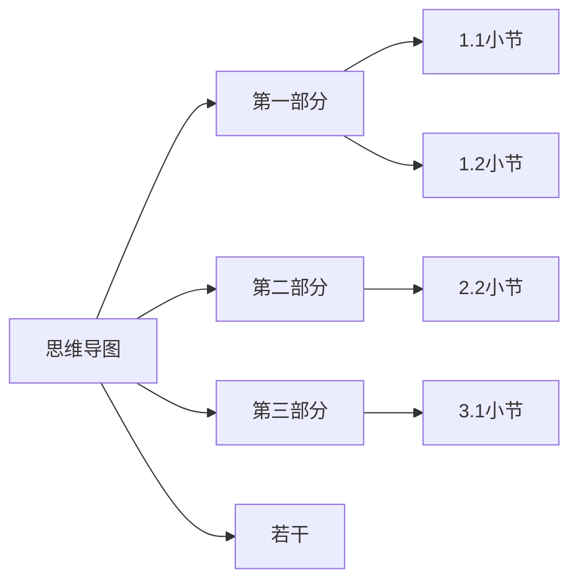

# Forth语言

```forth
2 2 .s
+ .s
.
2 1 - .
7 3 mod .
```

1+
1-

negate
abs

栈操作

dup 重制栈顶的元素
drop 丢弃栈顶的元素
over 将第二个元素复制一个放到栈顶
swap 交换栈顶和第二个元素
rot 用于旋转栈中的前3个元素。它将栈顶的第三个元素移到栈顶，栈顶的第二个元素移到第三个位置，栈顶的第一个元素移到第二个位置。
nip 删除栈中第二个元素
tuck 将栈顶元素复制一份，并将其插入到栈顶下面的第二个元素之后


