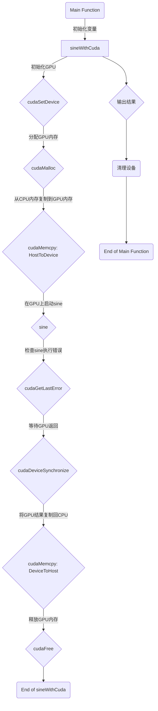

# 2023年的深度学习入门指南(27) - CUDA的汇编语言PTX与SASS

通过前面的学习，我们了解了在深度学习和大模型中，GPU的广泛应用。可以说，不用说没有GPU，就算是没有大显存和足够先进的架构，也没法开发大模型。

有的同学表示GPU很神秘，不知道它是怎么工作的。其实，GPU的工作原理和CPU是一样的，都是通过指令来控制硬件的。只不过，GPU的指令集和CPU不一样。下面我们就走进GPU的内部，看看如何用汇编来写GPU的程序。

## 初识PTX与SASS


从上图我们可以看到，CPU的架构是复杂的几个核组合在一起。而GPU的架构是大量的简单的核组合在一起。因为GPU的每个单元架构都很简单，所以我们需要用CPU去控制GPU的每个单元，让它们协同工作。CPU上的控制代码，我们称为host代码，而GPU每个单元上运行的代码，我们称为device代码。

CUDA的汇编语言分为两种，一种叫做Parallel Thread Execution，简称PTX，另一种叫做Streaming Assembly，简称SASS。PTX是一种中间语言，可以在不同的GPU上运行，而SASS是一种特定的汇编语言，只能在特定的GPU上运行。

下面我们看几个简单的例子来找找体感。

```cpp
__global__ void test(int& c){
    c= blockIdx.x;
}
```

编译成PTX代码：

```ptx
.visible .entry test(int&)(
        .param .u64 test(int&)_param_0
)
{

        ld.param.u64    %rd1, [test(int&)_param_0];
        cvta.to.global.u64      %rd2, %rd1;
        mov.u32         %r1, %ctaid.x;
        st.global.u32   [%rd2], %r1;
        ret;

}
```

PTX中间代码使用ld指令从内存中加载数据，用st指令将数据写入内存。mov用于在寄存器之间传递数据。cvta用于作地址转换。

因为要编译成真正的汇编代码，所以生成代码就要跟硬件架构相关了。我们来看一下sm值和架构的关系：
- sm50: Maxswell 麦克斯韦架构。比如sm52对应GTX 980.
- sm60: Pascal 帕斯卡架构。比如sm61对应GTX 1080. 
- sm70: Volta 伏特架构。比如sm70对应V100. 
- sm75: Turing 图灵架构。比如sm75对应RTX 2080, T4
- sm80: Ampere 安培架构。比如A100, RTX3080
- sm90: Hopper 哈珀架构。比如H100, RTX4080

下面我们将其编译成sm50架构的SASS代码：

```sass
test(int&):
 MOV R1, c[0x0][0x20] 
 MOV R2, c[0x0][0x140] 
 S2R R0, SR_CTAID.X         
 MOV R3, c[0x0][0x144] 
 STG.E [R2], R0 
 NOP 
 NOP 
 EXIT 
```

与PTX不同，麦克斯韦架构下读取内存没有用ld指令，而仍然是MOV指令。而读取特殊寄存器SR_CTAID有专门指令S2R。写全局内存有指令STG. 

我们再看sm60架构汇编：

```sass
test(int&):
 MOV R1, c[0x0][0x20] 
 MOV R2, c[0x0][0x140] 
 S2R R0, SR_CTAID.X         
 MOV R3, c[0x0][0x144] 
 STG.E [R2], R0 
 NOP 
 NOP 
 EXIT
```

跟sm50的没有什么区别。

再看sm70架构汇编：

```sass
test(int&):
 MOV R1, c[0x0][0x28] 
 @!PT SHFL.IDX PT, RZ, RZ, RZ, RZ 
 S2R R5, SR_CTAID.X 
 MOV R2, c[0x0][0x160] 
 MOV R3, c[0x0][0x164] 
 STG.E.SYS [R2], R5 
 EXIT
```

伏特架构的代码出现了线程同步指令SHFL.IDX，这是一种用于线程之间通信的指令，可以在一个线程中访问另一个线程的寄存器值。这里所有的源和目标寄存器都是RZ，这是一个特殊的寄存器，总是包含0。
@!PT表示这个指令只在谓词寄存器PT的值为false时执行，但是PT始终为true，所以这个SHFL.IDX指令不会执行任何实际操作。

继续看图灵架构的:

```sass
test(int&):
 MOV R1, c[0x0][0x28] 
 S2R R0, SR_CTAID.X 
 ULDC.64 UR4, c[0x0][0x160] 
 STG.E.SYS [UR4], R0 
 EXIT 
```

图灵架构增加了ULDC指令，它用来从常量内存中读取到通用寄存器中。

sm80架构sass:

```sass
test(int&):
 MOV R1, c[0x0][0x28] 
 S2R R5, SR_CTAID.X 
 MOV R2, c[0x0][0x160] 
 ULDC.64 UR4, c[0x0][0x118] 
 MOV R3, c[0x0][0x164] 
 STG.E [R2.64], R5 
 EXIT 
```

sm90架构sass:

```sass
test(int&):
 LDC R1, c[0x0][0x28] 
 S2R R5, SR_CTAID.X 
 LDC.64 R2, c[0x0][0x210] 
 ULDC.64 UR4, c[0x0][0x208] 
 STG.E desc[UR4][R2.64], R5 
 EXIT
```

sm80和90没有实质上的变化。

## 编译和反汇编工具

有了感性认识之后，我们就来让代码运行起来。然后再介绍如何用工具来查看PTX代码和进行sass反汇编。

我们先写一个可以运行起来的CUDA代码，流程如下：



首先是设备上的代码：

```cpp
__global__ void sine(double* a) {
    int i = threadIdx.x;
    a[i] = sin(a[i]);
}
```

然后我们加上CPU和GPU之间内存来回复制以及错误检查的代码：

```cpp
// Helper function for using CUDA to add vectors in parallel.
cudaError_t sineWithCuda(double* a, unsigned int size)
{
    double* dev_a = 0;
    cudaError_t cudaStatus;

    // Choose which GPU to run on, change this on a multi-GPU system.
    cudaStatus = cudaSetDevice(0);
    if (cudaStatus != cudaSuccess) {
        fprintf(stderr, "cudaSetDevice failed!  Do you have a CUDA-capable GPU installed?");
        goto Error;
    }

    cudaStatus = cudaMalloc((void**)&dev_a, size * sizeof(double));
    if (cudaStatus != cudaSuccess) {
        fprintf(stderr, "cudaMalloc failed!");
        goto Error;
    }

    // Copy input vectors from host memory to GPU buffers.
    cudaStatus = cudaMemcpy(dev_a, a, size * sizeof(double), cudaMemcpyHostToDevice);
    if (cudaStatus != cudaSuccess) {
        fprintf(stderr, "cudaMemcpy failed!");
        goto Error;
    }

    // Launch a kernel on the GPU with one thread for each element.
    sine << <1, size >> > (dev_a);

    // Check for any errors launching the kernel
    cudaStatus = cudaGetLastError();
    if (cudaStatus != cudaSuccess) {
        fprintf(stderr, "addKernel launch failed: %s\n", cudaGetErrorString(cudaStatus));
        goto Error;
    }

    // cudaDeviceSynchronize waits for the kernel to finish, and returns
    // any errors encountered during the launch.
    cudaStatus = cudaDeviceSynchronize();
    if (cudaStatus != cudaSuccess) {
        fprintf(stderr, "cudaDeviceSynchronize returned error code %d after launching addKernel!\n", cudaStatus);
        goto Error;
    }

    // Copy output vector from GPU buffer to host memory.
    cudaStatus = cudaMemcpy(a, dev_a, size * sizeof(double), cudaMemcpyDeviceToHost);
    if (cudaStatus != cudaSuccess) {
        fprintf(stderr, "cudaMemcpy failed!");
        goto Error;
    }

Error:
    cudaFree(dev_a);

    return cudaStatus;
}
```

最后写一个main函数来调用，以及释放设备：

```cpp
int main()
{
    const int arraySize = 5;

    double s1[arraySize] = { 1, 2, 3, 4, 5 };

    cudaError_t cudaStatus = sineWithCuda(s1, arraySize);
    if (cudaStatus != cudaSuccess) {
        fprintf(stderr, "sineWithCuda failed!");
        return 1;
    }

    for (int i0 = 0; i0 < arraySize; i0++) {
        std::cout << s1[i0] <<" ";
    }
    std::cout << std::endl;

    // cudaDeviceReset must be called before exiting in order for profiling and
    // tracing tools such as Nsight and Visual Profiler to show complete traces.
    cudaStatus = cudaDeviceReset();
    if (cudaStatus != cudaSuccess) {
        fprintf(stderr, "cudaDeviceReset failed!");
        return 1;
    }

    return 0;
}
```

将文件保存为kernel.cu，编译运行：

```
nvcc kernel.cu
```

如果是在Linux下，就生成a.out；在Windows下就生成a.exe. 

我们还可以通过gencode参数来指定编译成不同的架构的代码，比如：

```bash
nvcc kernel.cu -gencode=arch=compute_52,code=\"sm_52,compute_52\" -gencode=arch=compute_61,code=\"sm_61,compute_61\" -gencode=arch=compute_70,code=\"sm_70,compute_70\" -gencode=arch=compute_75,code=\"sm_75,compute_75\" -gencode=arch=compute_80,code=\"sm_80,compute_80\" -gencode=arch=compute_90,code=\"sm_90,compute_90\"
```

下面我们就可以通过cuobjdump工具来查看ptx和sass代码。

查看PTX代码，以Windows为例：
```bash
cuobjdump --dump-ptx a.exe
```

查看sass代码，还以Windows为例：
```bash
cuobjdump --dump-sass a.exe
```

通过cubin参数，NVCC可以生成cubin文件：
```bash
nvcc kernel.cu -gencode=arch=compute_90,code=sm_90 --cubin
```

注意，cubin只能支持单一一种架构。

我们可以使用nvdisasm来对cubin文件进行反汇编：

```bash
nvdisasm kernel.cubin
```

我们还可以输出cubin的流程图，通过dot工具转换成png格式：

```bash
nvdisasm -bbcfg kernel.cubin | dot -o1.png -Tpng
```

## 加法指令

下面我们在上面test的基础上，增加一个加法指令：

```cpp
__global__ void test1(int& c){
    c= blockIdx.x+1;
}
```

编译成PTX代码：

```ptx
.visible .entry test1(int&)(
        .param .u64 test1(int&)_param_0
)
{

        ld.param.u64    %rd1, [test1(int&)_param_0];
        cvta.to.global.u64      %rd2, %rd1;
        mov.u32         %r1, %ctaid.x;
        add.s32         %r2, %r1, 1;
        st.global.u32   [%rd2], %r2;
        ret;

}
```

增加了一条add.s32指令，用于32位有符号加法操作。

编译成sm50架构的SASS代码：

```sass
test1(int&):
 MOV R1, c[0x0][0x20] 
 MOV R2, c[0x0][0x140] 
 S2R R0, SR_CTAID.X         
 MOV R3, c[0x0][0x144] 
 IADD32I R0, R0, 0x1 
 STG.E [R2], R0 
 NOP 
 NOP 
 EXIT 
 ```

 add.s32指令被编译成了IADD32I指令。

 sm70的代码就比较有新意了，它使用加乘计算指令IMAD.MOV.U32来代替sm50,sm60的MOV. 计算时改用了三元计算的IADD3指令。当然，对于功能上没有什么影响。

 ```sass
 test1(int&):
 IMAD.MOV.U32 R1, RZ, RZ, c[0x0][0x28] 
 @!PT SHFL.IDX PT, RZ, RZ, RZ, RZ 
 S2R R5, SR_CTAID.X 
 MOV R2, c[0x0][0x160] 
 IMAD.MOV.U32 R3, RZ, RZ, c[0x0][0x164] 
 IADD3 R5, R5, 0x1, RZ 
 STG.E.SYS [R2], R5 
 EXIT
 ```

sm75的时候又变回来了,不过仍然使用IADD3. 

```sass
test1(int&):
 MOV R1, c[0x0][0x28] 
 S2R R0, SR_CTAID.X 
 ULDC.64 UR4, c[0x0][0x160] 
 IADD3 R0, R0, 0x1, RZ 
 STG.E.SYS [UR4], R0 
 EXIT 
```

## 数学函数

我们下面来求一个平方根。CUDA内置了很多数学函数，我们可以直接调用：

```cpp
__global__ void test2(float& f){
    f = blockIdx.x;
    f = sqrtf(f);
}
```

我们来看下PTX代码：

```ptx
.visible .entry test2(float&)(
        .param .u64 test2(float&)_param_0
)
{

        ld.param.u64    %rd1, [test2(float&)_param_0];
        cvta.to.global.u64      %rd2, %rd1;
        mov.u32         %r1, %ctaid.x;
        cvt.rn.f32.u32  %f1, %r1;
        sqrt.rn.f32     %f2, %f1;
        st.global.f32   [%rd2], %f2;
        ret;

}
```

我们可以看到，sqrtf被编译成了sqrt.rn.f32指令。

到了SASS代码，这一条指令就变得相当有趣了：

```sass
test2(float&):
 MOV R1, c[0x0][0x20] 
 S2R R0, SR_CTAID.X 
 I2F.F32.U32 R0, R0 
 IADD32I R3, R0, -0xd000000 
 MUFU.RSQ R2, R0         
 ISETP.GT.U32.AND P0, PT, R3, c[0x2][0x0], PT 
 @!P0 BRA `(.L_x_0) 
 CAL `($test2(float&)$__cuda_sm20_sqrt_rn_f32_slowpath) 
 MOV R0, R2 
 BRA `(.L_x_1)         
.L_x_0:
 FMUL.FTZ R3, R0, R2 
 FMUL.FTZ R2, R2, 0.5 
 FFMA R0, R3, -R3, R0 
 FFMA R0, R0, R2, R3 
.L_x_1:
 MOV R2, c[0x0][0x140] 
 MOV R3, c[0x0][0x144] 
 STG.E [R2], R0 
 EXIT 
$test2(float&)$__cuda_sm20_sqrt_rn_f32_slowpath:
 LOP.AND.NZ P0, RZ, R0, c[0x2][0x4] 
 @!P0 MOV R2, R0 
 @!P0 RET         
 FSETP.GEU.FTZ.AND P0, PT, R0, RZ, PT 
 @!P0 MOV32I R2, 0x7fffffff 
 @!P0 RET         
 FSETP.GTU.FTZ.AND P0, PT, |R0|, +INF , PT 
 @P0 FADD.FTZ R2, R0, 1 
 @P0 RET         
 FSETP.NEU.FTZ.AND P0, PT, |R0|, +INF , PT 
 @!P0 MOV R2, R0 
 @!P0 RET         
 FFMA R0, R0, 1.84467440737095516160e+19, RZ 
 MUFU.RSQ R2, R0 
 FMUL.FTZ R3, R0, R2 
 FMUL.FTZ R2, R2, 0.5 
 FADD.FTZ R5, -R3.reuse, -RZ 
 FFMA R5, R3, R5, R0 
 FFMA R2, R5, R2, R3 
 FMUL.FTZ R2, R2, 2.3283064365386962891e-10 
 RET  
```

首先，因为sqrtf要求输入是浮点数，所以用I2F.F32.U32指令将整数转换成浮点数。然后，sqrtf的实现是一个迭代算法，需要一个初始值。这里用IADD32I指令将初始值设为-0xd000000。然后，用MUFU.RSQ指令计算初始值的平方根的倒数。

slowpath这一分支主要用于处理异常情况，比如NaN, INF, 0等。
比如
```
FSETP.GTU.FTZ.AND P0, PT, |R0|, +INF , PT 
```
这一句就是用来计算输入是否是正无穷。

这部分代码从sm50到sm90都是一样的。

## 不能封装成一条指令的数学计算

求平方根可以用一条指令来搞定，但是对于大多数的数学计算来说，并没有这么多指令。最终的实现还是会以汇编序列的方式来实现。

我们先看一个相对简单的，求自然对数的：

```cpp
__global__ void testLog(float& f){
    f = logf(f);
}
```

下面开奖，我们看看翻译成PTX代码：

```ptx
.visible .entry testLog(float&)(
        .param .u64 testLog(float&)_param_0
)
{

        ld.param.u64    %rd2, [testLog(float&)_param_0];
        cvta.to.global.u64      %rd1, %rd2;
        ld.global.f32   %f5, [%rd1];
        setp.lt.f32     %p1, %f5, 0f00800000;
        mul.f32         %f6, %f5, 0f4B000000;
        selp.f32        %f1, %f6, %f5, %p1;
        selp.f32        %f7, 0fC1B80000, 0f00000000, %p1;
        mov.b32         %r1, %f1;
        add.s32         %r2, %r1, -1059760811;
        and.b32         %r3, %r2, -8388608;
        sub.s32         %r4, %r1, %r3;
        mov.b32         %f8, %r4;
        cvt.rn.f32.s32  %f9, %r3;
        mov.f32         %f10, 0f34000000;
        fma.rn.f32      %f11, %f9, %f10, %f7;
        add.f32         %f12, %f8, 0fBF800000;
        mov.f32         %f13, 0f3E1039F6;
        mov.f32         %f14, 0fBE055027;
        fma.rn.f32      %f15, %f14, %f12, %f13;
        mov.f32         %f16, 0fBDF8CDCC;
        fma.rn.f32      %f17, %f15, %f12, %f16;
        mov.f32         %f18, 0f3E0F2955;
        fma.rn.f32      %f19, %f17, %f12, %f18;
        mov.f32         %f20, 0fBE2AD8B9;
        fma.rn.f32      %f21, %f19, %f12, %f20;
        mov.f32         %f22, 0f3E4CED0B;
        fma.rn.f32      %f23, %f21, %f12, %f22;
        mov.f32         %f24, 0fBE7FFF22;
        fma.rn.f32      %f25, %f23, %f12, %f24;
        mov.f32         %f26, 0f3EAAAA78;
        fma.rn.f32      %f27, %f25, %f12, %f26;
        mov.f32         %f28, 0fBF000000;
        fma.rn.f32      %f29, %f27, %f12, %f28;
        mul.f32         %f30, %f12, %f29;
        fma.rn.f32      %f31, %f30, %f12, %f12;
        mov.f32         %f32, 0f3F317218;
        fma.rn.f32      %f35, %f11, %f32, %f31;
        setp.lt.u32     %p2, %r1, 2139095040;
        @%p2 bra        $L__BB3_2;

        mov.f32         %f33, 0f7F800000;
        fma.rn.f32      %f35, %f1, %f33, %f33;

$L__BB3_2:
        setp.eq.f32     %p3, %f1, 0f00000000;
        selp.f32        %f34, 0fFF800000, %f35, %p3;
        st.global.f32   [%rd1], %f34;
        ret;

}
```

这么复杂的逻辑不用翻译成SASS了，在PTX层就已经看晕了。

翻译成sm50架构的SASS代码感觉似乎还简单了点：

```sass
testLog(float&):
 MOV R1, c[0x0][0x20] 
 MOV R2, c[0x0][0x140] 
 MOV R3, c[0x0][0x144] 
 LDG.E R0, [R2] 
 MOV32I R7, 0x3e1039f6 
 FSETP.GEU.AND P0, PT, R0, 1.175494350822287508e-38, PT 
 @!P0 FMUL R0, R0, 8388608 
 IADD32I R4, R0, -0x3f2aaaab 
 ISETP.GE.U32.AND P1, PT, R0.reuse, c[0x2][0x28], PT 
 LOP32I.AND R5, R4, 0xff800000 
 IADD R4, R0, -R5 
 I2F.F32.S32 R5, R5         
 FADD R6, R4, -1 
 FFMA R4, R6.reuse, c[0x2][0x4], R7 
 FFMA R4, R6, R4, c[0x2][0x8] 
 FFMA R4, R6.reuse, R4, c[0x2][0xc] 
 FFMA R4, R6, R4, c[0x2][0x10] 
 FFMA R4, R6.reuse, R4, c[0x2][0x14] 
 FFMA R4, R6.reuse, R4, c[0x2][0x18] 
 FFMA R4, R6.reuse, R4, c[0x2][0x1c] 
 FFMA R7, R6, R4, c[0x2][0x20] 
 SEL R4, RZ, c[0x2][0x0], P0 
 FMUL R7, R6.reuse, R7 
 FFMA R4, R5, 1.1920928955078125e-07, R4 
 FFMA R7, R6, R7, R6 
 @P1 MOV32I R6, 0x7f800000 
 FFMA R7, R4, c[0x2][0x24], R7 
 @P1 FFMA R7, R0, +INF , R6 
 FCMP.NEU R7, R7, -INF , R0 
 STG.E [R2], R7 
 EXIT 
 ```
 
 一直到了sm90，都没有太大变化：

 ```sass
 testLog(float&):
 LDC R1, c[0x0][0x28] 
 LDC.64 R2, c[0x0][0x210] 
 ULDC.64 UR4, c[0x0][0x208] 
 LDG.E R0, desc[UR4][R2.64] 
 HFMA2.MMA R7, -RZ, RZ, 1.5048828125, 33.21875 
 FSETP.GEU.AND P0, PT, R0, 1.175494350822287508e-38, PT 
 @!P0 FMUL R0, R0, 8388608 
 IADD3 R4, R0.reuse, -0x3f2aaaab, RZ 
 ISETP.GE.U32.AND P1, PT, R0, 0x7f800000, PT 
 LOP3.LUT R5, R4, 0xff800000, RZ, 0xc0, !PT 
 IADD3 R4, R0, -R5, RZ 
 I2FP.F32.S32 R5, R5 
 FADD R6, R4, -1 
 FSEL R4, RZ, -23, P0 
 FSETP.NEU.AND P0, PT, R0, RZ, PT 
 FFMA R7, R6.reuse, -R7, 0.14084610342979431152 
 FFMA R4, R5, 1.1920928955078125e-07, R4 
 @P1 MOV R5, 0x7f800000 
 FFMA R7, R6, R7, -0.12148627638816833496 
 FFMA R7, R6, R7, 0.13980610668659210205 
 FFMA R7, R6, R7, -0.16684235632419586182 
 FFMA R7, R6, R7, 0.20012299716472625732 
 FFMA R7, R6, R7, -0.24999669194221496582 
 FFMA R7, R6, R7, 0.33333182334899902344 
 FFMA R7, R6, R7, -0.5 
 FMUL R7, R6, R7 
 FFMA R7, R6, R7, R6 
 FFMA R4, R4, 0.69314718246459960938, R7 
 @P1 FFMA R4, R0, R5, +INF  
 FSEL R5, R4, -INF , P0 
 STG.E desc[UR4][R2.64], R5 
 EXIT 
 ```

好，我们再看一个求正弦值的，我们这次换成双精度的计算：

```cpp
__global__ void testSin(double& d){
    d = sin(d);
}
```

我们看看PTX代码：

```ptx
.visible .entry testSin(double&)(
        .param .u64 testSin(double&)_param_0
)
{

        mov.u64         %SPL, __local_depot4;
        cvta.local.u64  %SP, %SPL;
        ld.param.u64    %rd3, [testSin(double&)_param_0];
        cvta.to.global.u64      %rd1, %rd3;
        add.u64         %rd4, %SP, 0;
        add.u64         %rd2, %SPL, 0;
        ld.global.f64   %fd1, [%rd1];
        {
        mov.b64         {%r4, %temp}, %fd1;
        }
        {
        mov.b64         {%temp, %r5}, %fd1;
        }
        and.b32         %r6, %r5, 2147483647;
        setp.eq.s32     %p1, %r6, 2146435072;
        setp.eq.s32     %p2, %r4, 0;
        and.pred        %p3, %p2, %p1;
        @%p3 bra        $L__BB4_3;
        bra.uni         $L__BB4_1;

$L__BB4_3:
        mov.f64         %fd22, 0d0000000000000000;
        mul.rn.f64      %fd38, %fd1, %fd22;
        mov.u32         %r12, 0;
        bra.uni         $L__BB4_4;

$L__BB4_1:
        mul.f64         %fd13, %fd1, 0d3FE45F306DC9C883;
        cvt.rni.s32.f64         %r12, %fd13;
        st.local.u32    [%rd2], %r12;
        cvt.rn.f64.s32  %fd14, %r12;
        neg.f64         %fd15, %fd14;
        mov.f64         %fd16, 0d3FF921FB54442D18;
        fma.rn.f64      %fd17, %fd15, %fd16, %fd1;
        mov.f64         %fd18, 0d3C91A62633145C00;
        fma.rn.f64      %fd19, %fd15, %fd18, %fd17;
        mov.f64         %fd20, 0d397B839A252049C0;
        fma.rn.f64      %fd38, %fd15, %fd20, %fd19;
        abs.f64         %fd21, %fd1;
        setp.ltu.f64    %p4, %fd21, 0d41E0000000000000;
        @%p4 bra        $L__BB4_4;

        { // callseq 0, 0
        st.param.f64    [param0+0], %fd1;
        st.param.b64    [param1+0], %rd4;
        call.uni (retval0), 
        __internal_trig_reduction_slowpathd, 
        (
        param0, 
        param1
        );
        ld.param.f64    %fd38, [retval0+0];
        } // callseq 0
        ld.local.u32    %r12, [%rd2];

$L__BB4_4:
        and.b32         %r8, %r12, 1;
        shl.b32         %r9, %r12, 3;
        and.b32         %r10, %r9, 8;
        setp.eq.s32     %p5, %r8, 0;
        selp.f64        %fd23, 0d3DE5DB65F9785EBA, 0dBDA8FF8320FD8164, %p5;
        mul.wide.s32    %rd6, %r10, 8;
        mov.u64         %rd7, __cudart_sin_cos_coeffs;
        add.s64         %rd8, %rd7, %rd6;
        ld.global.nc.f64        %fd24, [%rd8+8];
        mul.rn.f64      %fd6, %fd38, %fd38;
        fma.rn.f64      %fd25, %fd23, %fd6, %fd24;
        ld.global.nc.f64        %fd26, [%rd8+16];
        fma.rn.f64      %fd27, %fd25, %fd6, %fd26;
        ld.global.nc.f64        %fd28, [%rd8+24];
        fma.rn.f64      %fd29, %fd27, %fd6, %fd28;
        ld.global.nc.f64        %fd30, [%rd8+32];
        fma.rn.f64      %fd31, %fd29, %fd6, %fd30;
        ld.global.nc.f64        %fd32, [%rd8+40];
        fma.rn.f64      %fd33, %fd31, %fd6, %fd32;
        ld.global.nc.f64        %fd34, [%rd8+48];
        fma.rn.f64      %fd7, %fd33, %fd6, %fd34;
        fma.rn.f64      %fd40, %fd7, %fd38, %fd38;
        @%p5 bra        $L__BB4_6;

        mov.f64         %fd35, 0d3FF0000000000000;
        fma.rn.f64      %fd40, %fd7, %fd6, %fd35;

$L__BB4_6:
        and.b32         %r11, %r12, 2;
        setp.eq.s32     %p6, %r11, 0;
        @%p6 bra        $L__BB4_8;

        mov.f64         %fd36, 0d0000000000000000;
        mov.f64         %fd37, 0dBFF0000000000000;
        fma.rn.f64      %fd40, %fd40, %fd37, %fd36;

$L__BB4_8:
        st.global.f64   [%rd1], %fd40;
        ret;

}
```

而sass实现不负重望地又搞出来一个slowpath函数：
```sass
testSin(double&):
 LDC R1, c[0x0][0x28] 
 LDC.64 R12, c[0x0][0x210] 
 ULDC.64 UR4, c[0x0][0x208] 
 IADD3 R1, R1, -0x30, RZ 
 LDG.E.64 R10, desc[UR4][R12.64] 
 ULDC UR6, c[0x0][0x20] 
 IADD3 R14, R1, UR6, RZ 
 LOP3.LUT R0, R11, 0x7fffffff, RZ, 0xc0, !PT 
 ISETP.EQ.AND P1, PT, R10, RZ, PT 
 ISETP.NE.AND P0, PT, R0, 0x7ff00000, PT 
 @!P0 BRA P1, `(.L_x_0) 
 UMOV UR6, 0x6dc9c883 
 UMOV UR7, 0x3fe45f30 
 DSETP.GE.AND P0, PT, |R10|.reuse, 2.14748364800000000000e+09, PT 
 DMUL R4, R10, UR6 
 UMOV UR6, 0x54442d18 
 UMOV UR7, 0x3ff921fb 
 F2I.F64 R0, R4 
 I2F.F64 R6, R0 
 STL [R1], R0 
 DFMA R2, -R6, UR6, R10 
 UMOV UR6, 0x33145c00 
 UMOV UR7, 0x3c91a626 
 DFMA R2, -R6, UR6, R2 
 UMOV UR6, 0x252049c0 
 UMOV UR7, 0x397b839a 
 DFMA R2, -R6, UR6, R2 
 @!P0 BRA `(.L_x_1) 
 MOV R16, 0x1e0 
 CALL.REL.NOINC `($testSin(double&)$__internal_trig_reduction_slowpathd) 
 LDL R0, [R1] 
 BRA `(.L_x_1) 
.L_x_0:
 DMUL R2, RZ, R10 
 IMAD.MOV.U32 R0, RZ, RZ, RZ 
.L_x_1:
 IMAD.SHL.U32 R6, R0, 0x8, RZ 
 MOV R4, 32@lo(__cudart_sin_cos_coeffs) 
 MOV R5, 32@hi(__cudart_sin_cos_coeffs) 
 LOP3.LUT R19, R6, 0x8, RZ, 0xc0, !PT 
 IMAD.WIDE R18, R19, 0x8, R4 
 LDG.E.64.CONSTANT R20, desc[UR4][R18.64+0x8] 
 LDG.E.64.CONSTANT R16, desc[UR4][R18.64+0x10] 
 LDG.E.64.CONSTANT R14, desc[UR4][R18.64+0x18] 
 LDG.E.64.CONSTANT R10, desc[UR4][R18.64+0x20] 
 LDG.E.64.CONSTANT R4, desc[UR4][R18.64+0x28] 
 LDG.E.64.CONSTANT R6, desc[UR4][R18.64+0x30] 
 R2P PR, R0, 0x3 
 IMAD.MOV.U32 R22, RZ, RZ, 0x79785eba 
 DMUL R8, R2, R2 
 IMAD.MOV.U32 R0, RZ, RZ, 0x3de5db65 
 FSEL R22, -R22, 4.2945490664224492434e-19, !P0 
 FSEL R23, R0, -0.082518599927425384521, !P0 
 DFMA R20, R8, R22, R20 
 DFMA R16, R8, R20, R16 
 DFMA R14, R8, R16, R14 
 DFMA R10, R8, R14, R10 
 DFMA R4, R8, R10, R4 
 DFMA R4, R8, R4, R6 
 DFMA R2, R4, R2, R2 
 @P0 DFMA R2, R8, R4, 1 
 @P1 DFMA R2, R2, -1, RZ 
 STG.E.64 desc[UR4][R12.64], R2 
 EXIT 
$testSin(double&)$__internal_trig_reduction_slowpathd:
 SHF.R.U32.HI R0, RZ, 0x14, R11.reuse 
 IMAD.MOV.U32 R2, RZ, RZ, R10 
 IMAD.MOV.U32 R17, RZ, RZ, R11 
 LOP3.LUT R0, R0, 0x7ff, RZ, 0xc0, !PT 
 ISETP.NE.AND P0, PT, R0, 0x7ff, PT 
 @!P0 BRA `(.L_x_2) 
 IADD3 R0, R0, -0x400, RZ 
 CS2R R18, SRZ 
 IADD3 R7, R1, 0x8, RZ 
 SHF.R.U32.HI R3, RZ, 0x6, R0 
 LOP3.LUT P2, R15, R0, 0x3f, RZ, 0xc0, !PT 
 IADD3 R5, -R3, 0x10, RZ 
 IADD3 R4, -R3, 0x13, RZ 
 ISETP.GT.AND P0, PT, R5, 0xe, PT 
 IADD3 R6, -R3, 0xf, RZ 
 SEL R4, R4, 0x12, !P0 
 IMAD.MOV.U32 R9, RZ, RZ, R6 
 ISETP.GT.AND P0, PT, R5, R4, PT 
 @P0 BRA `(.L_x_3) 
 MOV R8, 32@lo(__cudart_i2opi_d) 
 IMAD.MOV R3, RZ, RZ, -R3 
 MOV R9, 32@hi(__cudart_i2opi_d) 
 IMAD.SHL.U32 R5, R2.reuse, 0x800, RZ 
 SHF.L.U64.HI R17, R2, 0xb, R17 
 IMAD.MOV.U32 R21, RZ, RZ, R7 
 ULDC.64 UR6, c[0x0][0x208] 
 IMAD.WIDE R8, R3, 0x8, R8 
 LOP3.LUT R17, R17, 0x80000000, RZ, 0xfc, !PT 
 IADD3 R0, P0, R8, 0x78, RZ 
 IMAD.X R23, RZ, RZ, R9, P0 
 IMAD.MOV.U32 R9, RZ, RZ, R6 
.L_x_4:
 IMAD.MOV.U32 R2, RZ, RZ, R0 
 IMAD.MOV.U32 R3, RZ, RZ, R23 
 LDG.E.64.CONSTANT R2, desc[UR6][R2.64] 
 IADD3 R9, R9, 0x1, RZ 
 IMAD.WIDE.U32 R18, P3, R2, R5, R18 
 IMAD R25, R2.reuse, R17.reuse, RZ 
 IMAD.HI.U32 R8, R2, R17, RZ 
 IADD3 R19, P0, R25, R19, RZ 
 IMAD R20, R3.reuse, R5.reuse, RZ 
 IMAD.HI.U32 R25, R3, R5, RZ 
 IADD3 R19, P1, R20, R19, RZ 
 IMAD.X R8, RZ, RZ, R8, P3 
 ISETP.GE.AND P3, PT, R9, R4, PT 
 IMAD.HI.U32 R2, R3, R17.reuse, RZ 
 STL.64 [R21], R18 
 IADD3.X R8, P0, R25, R8, RZ, P0, !PT 
 IMAD R3, R3, R17, RZ 
 IMAD.X R2, RZ, RZ, R2, P0 
 IADD3.X R8, P1, R3, R8, RZ, P1, !PT 
 IADD3 R0, P0, R0, 0x8, RZ 
 IMAD.X R3, RZ, RZ, R2, P1 
 IADD3 R21, R21, 0x8, RZ 
 IMAD.X R23, RZ, RZ, R23, P0 
 IMAD.MOV.U32 R18, RZ, RZ, R8 
 IMAD.MOV.U32 R19, RZ, RZ, R3 
 @!P3 BRA `(.L_x_4) 
.L_x_3:
 IMAD.IADD R6, R9, 0x1, -R6 
 IMAD R17, R6, 0x8, R7 
 STL.64 [R17], R18 
 LDL.64 R2, [R1+0x18] 
 @P2 LDL.64 R6, [R1+0x10] 
 LDL.64 R4, [R1+0x20] 
 @P2 IADD3 R0, -R15, 0x40, RZ 
 ULDC UR6, c[0x0][0x20] 
 @P2 SHF.L.U32 R9, R2, R15, RZ 
 @P2 SHF.R.U64 R10, R2, R0.reuse, R3 
 @P2 SHF.R.U64 R6, R6, R0.reuse, R7 
 @P2 SHF.L.U64.HI R8, R2, R15, R3 
 @P2 LOP3.LUT R2, R6, R9, RZ, 0xfc, !PT 
 @P2 SHF.L.U32 R9, R4, R15.reuse, RZ 
 @P2 SHF.R.U32.HI R7, RZ, R0, R7 
 IMAD.SHL.U32 R6, R2, 0x4, RZ 
 @P2 SHF.L.U64.HI R15, R4, R15, R5 
 @P2 SHF.R.U32.HI R0, RZ, R0, R3 
 @P2 LOP3.LUT R4, R9, R10, RZ, 0xfc, !PT 
 @P2 LOP3.LUT R3, R7, R8, RZ, 0xfc, !PT 
 @P2 LOP3.LUT R5, R15, R0, RZ, 0xfc, !PT 
 IMAD.SHL.U32 R17, R4, 0x4, RZ 
 SHF.L.U64.HI R7, R2, 0x2, R3.reuse 
 SHF.R.U32.HI R2, RZ, 0x1e, R3 
 IADD3 RZ, P0, RZ, -R6, RZ 
 LOP3.LUT R0, RZ, R7, RZ, 0x33, !PT 
 LOP3.LUT R17, R2, R17, RZ, 0xfc, !PT 
 SHF.L.U64.HI R8, R4, 0x2, R5 
 IADD3.X R4, P0, RZ, R0, RZ, P0, !PT 
 LOP3.LUT R2, RZ, R17, RZ, 0x33, !PT 
 LOP3.LUT R3, RZ, R8, RZ, 0x33, !PT 
 IADD3.X R2, P0, RZ, R2, RZ, P0, !PT 
 SHF.R.U32.HI R0, RZ, 0x1d, R5 
 IMAD.X R3, RZ, RZ, R3, P0 
 LOP3.LUT P1, RZ, R0.reuse, 0x1, RZ, 0xc0, !PT 
 LOP3.LUT R0, R0, 0x1, RZ, 0xc0, !PT 
 SEL R3, R8, R3, !P1 
 SEL R17, R17, R2, !P1 
 ISETP.NE.U32.AND P0, PT, R3, RZ, PT 
 SEL R4, R7, R4, !P1 
 SEL R8, R17, R3, !P0 
 @P1 IMAD.MOV R6, RZ, RZ, -R6 
 LEA.HI R0, R5, R0, RZ, 0x2 
 FLO.U32 R8, R8 
 IMAD.MOV R5, RZ, RZ, -R0 
 IADD3 R9, -R8.reuse, 0x1f, RZ 
 IADD3 R2, -R8, 0x3f, RZ 
 @P0 IMAD.MOV R2, RZ, RZ, R9 
 ISETP.NE.U32.AND P0, PT, R2.reuse, RZ, PT 
 IADD3 R7, -R2, 0x40, RZ 
 ISETP.NE.AND.EX P0, PT, RZ, RZ, PT, P0 
 SHF.L.U32 R9, R17.reuse, R2.reuse, RZ 
 SHF.R.U64 R6, R6, R7, R4 
 SHF.L.U64.HI R15, R17, R2, R3 
 SHF.R.U32.HI R4, RZ, R7, R4 
 IMAD.MOV.U32 R7, RZ, RZ, RZ 
 @P0 LOP3.LUT R17, R6, R9, RZ, 0xfc, !PT 
 @P0 LOP3.LUT R3, R4, R15, RZ, 0xfc, !PT 
 IMAD.WIDE.U32 R8, R17, 0x2168c235, RZ 
 IMAD.MOV.U32 R6, RZ, RZ, R9 
 IADD3 RZ, P0, R8, R8, RZ 
 IMAD.HI.U32 R4, R3, -0x36f0255e, RZ 
 IMAD.WIDE.U32 R6, R17, -0x36f0255e, R6 
 IMAD R9, R3.reuse, -0x36f0255e, RZ 
 IMAD.WIDE.U32 R6, P2, R3, 0x2168c235, R6 
 IMAD.X R3, RZ, RZ, R4, P2 
 IADD3 R4, P2, R9, R7, RZ 
 IADD3.X RZ, P0, R6, R6, RZ, P0, !PT 
 ISETP.GT.U32.AND P3, PT, R4.reuse, RZ, PT 
 IMAD.X R3, RZ, RZ, R3, P2 
 IADD3.X R7, P2, R4, R4, RZ, P0, !PT 
 ISETP.GT.AND.EX P0, PT, R3.reuse, RZ, PT, P3 
 IMAD.X R6, R3, 0x1, R3, P2 
 LOP3.LUT P2, RZ, R11, 0x80000000, RZ, 0xc0, !PT 
 SEL R7, R7, R4, P0 
 SEL R4, R6, R3, P0 
 IMAD.MOV.U32 R6, RZ, RZ, RZ 
 IADD3 R3, P3, R7, 0x1, RZ 
 IADD3 R7, R14, -UR6, RZ 
 LOP3.LUT R11, R11, 0x80000000, RZ, 0xc0, !PT 
 IMAD.X R4, RZ, RZ, R4, P3 
 @P2 IMAD.MOV.U32 R0, RZ, RZ, R5 
 SEL R5, RZ, 0x1, !P0 
 SHF.R.U64 R3, R3, 0xa, R4 
 STL [R7], R0 
 IMAD.IADD R5, R5, 0x1, R2 
 IADD3 R3, P2, R3, 0x1, RZ 
 @P1 LOP3.LUT R11, R11, 0x80000000, RZ, 0x3c, !PT 
 LEA.HI.X R4, R4, RZ, RZ, 0x16, P2 
 SHF.R.U64 R3, R3, 0x1, R4.reuse 
 SHF.R.U32.HI R4, RZ, 0x1, R4 
 IADD3 R2, P0, P2, R3, RZ, -R6 
 IMAD.SHL.U32 R3, R5, 0x100000, RZ 
 IADD3.X R4, R4, 0x3fe00000, ~R3, P0, P2 
 LOP3.LUT R17, R4, R11, RZ, 0xfc, !PT 
.L_x_2:
 IMAD.MOV.U32 R3, RZ, RZ, R17 
 IMAD.MOV.U32 R17, RZ, RZ, 0x0 
 RET.REL.NODEC R16 `(testSin(double&)) 
```

## 小结

这一节，我们勇敢地走进了PTX和SASS的世界。我们学习了看PTX代码和SASS反汇编的工具cuobjdump和nvdisasm，并且观看了普通计算和数学函数在GPU上是怎样的逻辑。
