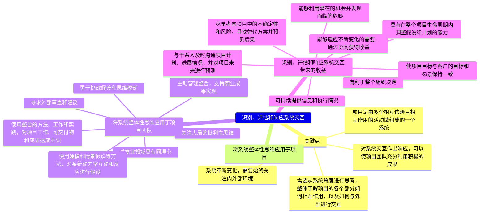
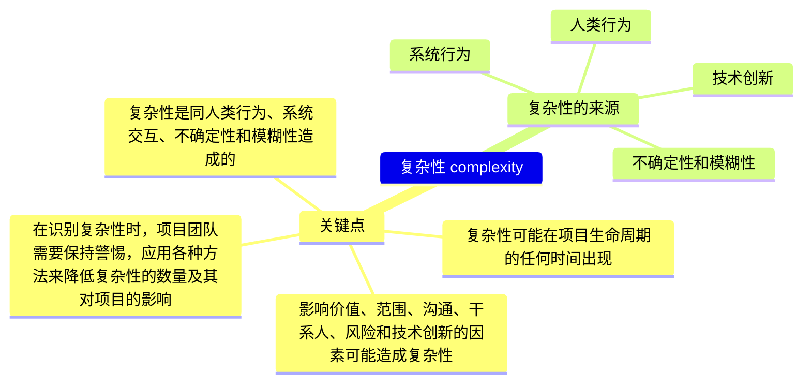

# PMP的智慧(2) - 系统性思考及复杂性

在2021年推出的第七版《管理专业知识体系指南》中，PMI在传统的过程和ITTO的基础上，重新增加了12大项目管理原则。

- 管家式管理 stewardship
- 团队 team
- 干系人 stakeholders
- 价值 value
- 系统思考 system thinking
- 领导力 leadership
- 裁剪 tailoring
- 质量 quality
- 复杂性  complexity
- 风险 risk
- 适应性和韧性 adaptability and resiliency
- 变革 change

那么，对比之前的十大管理：
- 项目整合管理
- 项目范围管理
- 项目进度管理
- 项目成本管理
- 项目质量管理
- 项目资源管理
- 项目沟通管理
- 项目风险管理
- 项目采购管理
- 项目干系人管理

我们可以看到，干系人，质量，风险这三项原封不动从管理过程变成了管理原则。管家式管理、价值、团队、领导力这三种可以对应为整合管理、资源管理、沟通管理等内容。裁剪是第6版引入的概念，第7版中被提升为原则。系统思考、复杂性、适应性和韧性、变革这四项是第7版中比较新的内容。

下面我们就来重点看看这些新增的原则。

## 项目管理标准

首先我们来一张大图，项目管理标准部分包括两大部分，分别是价值交付系统和项目管理原则。

## 系统思考

首先我们来看看系统思考。这个话题其实在过去十年的商业书籍中非常常见。

我们看下在十二大管理原则中是如何定义System Thinking的。

图看不清的话我们看文字版：
- 识别、评估和响应系统交互
    - 关键点
        - 项目是由多个相互依赖且相互作用的活动域组成的一个系统
        - 需要从系统角度进行思考，整体了解项目的各个部分如何相互作用，以及如何与外部进行交互
        - 系统不断变化，需要始终关注内外部环境
        - 对系统交互作出响应，可以使项目团队充分利用积极的成果
    - 将系统整体性思维应用于项目
    - 将系统整体性思维应用于项目团队
        - 对商业领域具有同理心
        - 关注大局的批判性思维
        - 勇于挑战假设和思维模式
        - 寻求外部审查和建议
        - 使用整合的方法、工作和实践，对项目工作、可交付物和成果达成共识
        - 使用建模和情景假设等方法，对系统动力学互动和反应进行假设
        - 主动管理整合，支持商业成果实现
    - 识别、评估和响应系统交互带来的收益
        - 尽早考虑项目中的不确定性和风险，寻找替代方案并预见后果
        - 具有在整个项目生命周期内调整假设和计划的能力
        - 可持续提供信息和执行情况
        - 与干系人及时沟通项目计划、进展情况，并对项目未来进行预测
        - 使项目目标与客户的目标和愿景保持一致
        - 能够适应不断变化的需要，通过协同获得收益
        - 能够利用潜在的机会并发现面临的危胁
        - 有利于整个组织决定

系统思考有很多著作，比如下面这本《系统之美》，想必很多同学都看过或者听说过。

更像教材一点的，是这本《系统化思给导论》：

系统思考会造成什么呢？一个重要的东西就是想的多了，复杂性就指数级涨上来了。所以我们下面要处理的就是复杂性。

## 驾驭复杂性

我们来看下PMBOK中如何驾驭复杂性。

- 复杂性  complexity
    - 关键点
        - 复杂性是同人类行为、系统交互、不确定性和模糊性造成的
        - 复杂性可能在项目生命周期的任何时间出现
        - 影响价值、范围、沟通、干系人、风险和技术创新的因素可能造成复杂性
        - 在识别复杂性时，项目团队需要保持警惕，应用各种方法来降低复杂性的数量及其对项目的影响
    - 复杂性的来源
        - 人类行为
        - 系统行为
        - 不确定性和模糊性
        - 技术创新    

复杂性科学是一门研究各种复杂系统的跨学科领域，它涉及大数据、人工智能、复杂网络、统计物理等多种方法和技术。复杂系统的例子包括生命、社会、经济、物理、化学等领域的现象和问题。

复杂性科学的入门书经常是一个书单了。

比较有名的同名著作就是这本《Complex: A Guided Tour》:

还有这本前几年很流行的《规模》：

## 小结

系统思考和复杂性是PMBOK第七版中新增的两个内容，这两个内容总结了最近十年间的很多前沿性研究。我们不能停留在对于书上非常干的几句话的理解，而是要去看看这些内容的原著，去看看这些内容的前沿研究，去看看这些内容的应用案例。
