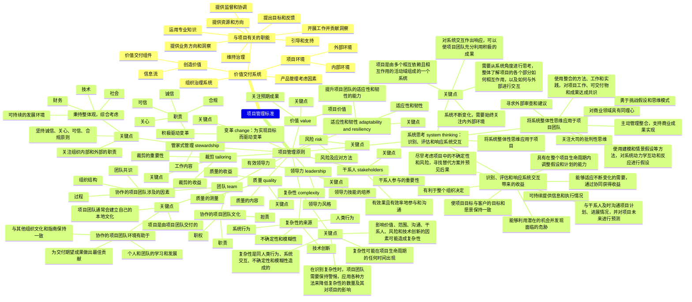
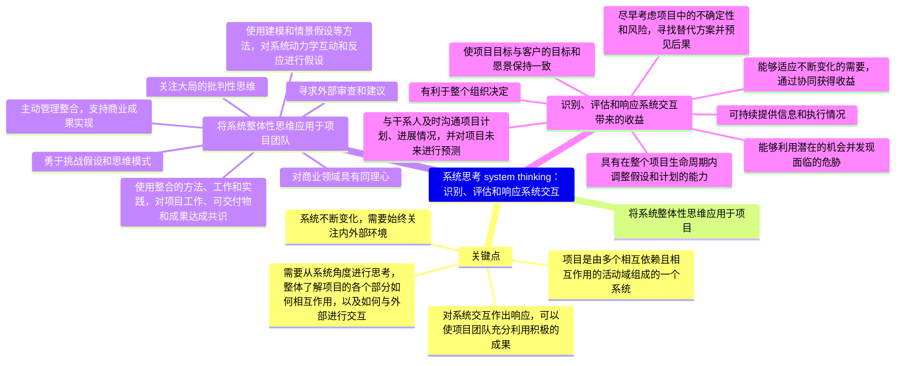
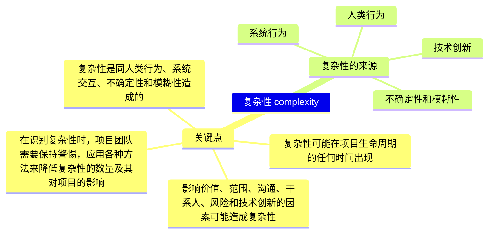

# PMBOK　第7版

```mermaid
mindmap
    项目管理标准
        价值交付系统
            创造价值
                价值交付组件
                信息流
            组织治理系统
            与项目有关的职能
                提供监督和协调
                提出目标和反馈
                引导和支持
                开展工作并贡献洞察
                运用专业知识
                提供业务方向和洞察
                提供资源和方向
                维持治理
            项目环境
                内部环境
                外部环境
            产品管理考虑因素
        项目管理原则
            管家式管理 stewardship
                关键点
                    关注组织内部和外部的职责
                    坚持诚信、关心、可信、合规原则
                    秉持整体观，综合考虑
                        财务
                        社会
                        技术
                        可持续的发展环境
                工作内容
                职责
                    诚信
                    关心
                    可信
                    合规
            团队 team
                关键点
                    项目是由项目团队交付的
                    项目团队通常会建立自己的本地文化
                    协作的项目团队环境有助于
                        与其他组织文化和指南保持一致
                        个人和团队的学习和发展
                        为交付期望成果做出最佳贡献
                协作的项目团队涉及的因素
                    团队共识
                    组织结构
                    过程
                协作的项目团队文化
                    职权
                    担责
                    职责
            干系人 stakeholders
                关键点
                干系人参与的重要性
                有效果且有效率地参与和沟通
            价值 value
                关键点
                项目价值
                关注预期成果
            系统思考 system thinking：识别、评估和响应系统交互
                关键点
                    项目是由多个相互依赖且相互作用的活动域组成的一个系统
                    需要从系统角度进行思考，整体了解项目的各个部分如何相互作用，以及如何与外部进行交互
                    系统不断变化，需要始终关注内外部环境
                    对系统交互作出响应，可以使项目团队充分利用积极的成果
                将系统整体性思维应用于项目
                将系统整体性思维应用于项目团队
                    对商业领域具有同理心
                    关注大司的批判性思维
                    勇于挑战假设和思维模式
                    寻求外部审查和建议
                    使用整合的方法、工作和实践，对项目工作、可交付物和成果达成共识
                    使用建模和情景假设等方法，对系统动力学互动和反应进行假设
                    主动管理整合，支持商业成果实现
                识别、评估和响应系统交互带来的收益
                    尽早考虑项目中的不确定性和风险，寻找替代方案并预见后果
                    具有在整个项目生命周期内调整假设和计划的能力
                    可持续提供信息和执行情况
                    与干系人及时沟通项目计划、进展情况，并对项目未来进行预测
                    使项目目标与客户的目标和愿景保持一致
                    能够适应不断变化的需要，通过协同获得收益
                    能够利用潜在的机会并发现面临的危胁
                    有利于整个组织决定
            领导力 leadership
                关键点
                有效领导力
                领导力风格
                领导力技能的培养
            裁剪 tailoring
                关键点
                裁剪的重要性
                裁剪的收益
            质量 quality
                关键点
                质量的内容
                质量的测量
                质量的收益
            复杂性  complexity
                关键点
                    复杂性是同人类行为、系统交互、不确定性和模糊性造成的
                    复杂性可能在项目生命周期的任何时间出现
                    影响价值、范围、沟通、干系人、风险和技术创新的因素可能造成复杂性
                    在识别复杂性时，项目团队需要保持警惕，应用各种方法来降低复杂性的数量及其对项目的影响
                复杂性的来源
                    人类行为
                    系统行为
                    不确定性和模糊性
                    技术创新
            风险 risk
                关键点
                风险及应对方法
            适应性和韧性 adaptability and resiliency
                关键点
                适应性和韧性
                提升项目团队的适应性和韧性的能力
            变革 change：为实现目标而驱动变革
                关键点
                积极驱动变革
```

```mermaid
mindmap
    项目管理知识体系指南
```

```mermaid
mindmap
系统思考 system thinking：识别、评估和响应系统交互
    关键点
        项目是由多个相互依赖且相互作用的活动域组成的一个系统
        需要从系统角度进行思考，整体了解项目的各个部分如何相互作用，以及如何与外部进行交互
        系统不断变化，需要始终关注内外部环境
        对系统交互作出响应，可以使项目团队充分利用积极的成果
    将系统整体性思维应用于项目
    将系统整体性思维应用于项目团队
        对商业领域具有同理心
        关注大局的批判性思维
        勇于挑战假设和思维模式
        寻求外部审查和建议
        使用整合的方法、工作和实践，对项目工作、可交付物和成果达成共识
        使用建模和情景假设等方法，对系统动力学互动和反应进行假设
        主动管理整合，支持商业成果实现
    识别、评估和响应系统交互带来的收益
        尽早考虑项目中的不确定性和风险，寻找替代方案并预见后果
        具有在整个项目生命周期内调整假设和计划的能力
        可持续提供信息和执行情况
        与干系人及时沟通项目计划、进展情况，并对项目未来进行预测
        使项目目标与客户的目标和愿景保持一致
        能够适应不断变化的需要，通过协同获得收益
        能够利用潜在的机会并发现面临的危胁
        有利于整个组织决定
```

```mermaid
mindmap
            复杂性  complexity
                关键点
                    复杂性是同人类行为、系统交互、不确定性和模糊性造成的
                    复杂性可能在项目生命周期的任何时间出现
                    影响价值、范围、沟通、干系人、风险和技术创新的因素可能造成复杂性
                    在识别复杂性时，项目团队需要保持警惕，应用各种方法来降低复杂性的数量及其对项目的影响
                复杂性的来源
                    人类行为
                    系统行为
                    不确定性和模糊性
                    技术创新    
```
